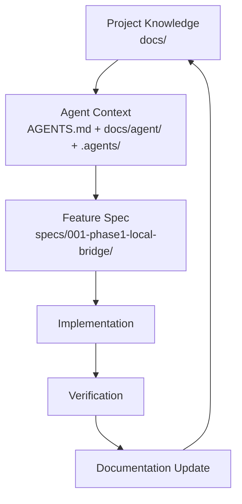

# SWUFE WebVPN Bridge

> An Electron desktop app for macOS / Windows: after the user completes the official Wengine WebVPN login (CAS/MFA) inside the app, requests to allowlisted hosts are rewritten by the **local bridge** into WebVPN URLs carrying the WebVPN session, so the machine's own browser can open and operate the academic affairs site `jwxt.swufe.edu.cn`. It is not a real VPN.
>
> The Chinese version is the source of truth: [README.md](README.md).

## Status

| Item | Value |
| --- | --- |
| Stage | Phase 1: M1–M4 delivered and **the macOS-side acceptance, including the academic-affairs browser acceptance, fully passes** — after the `KI-011` fix ([ADR-0007](docs/architecture/adr/ADR-0007-gateway-owned-namespaces-and-native-mode-promotion.md)) the 2026-09-21 re-verification passes TC-G01/TC-G02; spec 001 is `Implemented`. Not done: the Windows real-machine items are deferred (`KI-001`) and `KI-013` (TUN interference) and `KI-014` (CAS theme assets truncated by the server) are unresolved, so the spec is not `Verified` yet (`KI-007`, the automatic CA install, was fixed on 2026-09-21 — see [ADR-0008](docs/architecture/adr/ADR-0008-ca-trust-authorization-in-app-session.en.md); see [verification.md](specs/001-phase1-local-bridge/verification.md)) |
| Repository type | Documentation-first: [docs/](docs/README.en.md) + [specs/](specs/README.en.md); plus the bridge implementation ([swufe_bridge/](swufe_bridge/wrd_codec.py), [tests/](tests/l0/test_wrd_codec.py)) and the desktop app ([app/](app/README.md)) |
| Phase 1 feature | [specs/001-phase1-local-bridge/](specs/001-phase1-local-bridge/spec.md) |
| Owner | cherrchen |
| License | [MIT](LICENSE) |
| Documentation version | 1.0 |
| Initialised | 2026-09-20 |

The repository is **documentation-first** (`docs/` holds long-lived project facts, `specs/` records individual features end to end) and already contains the M1–M4 implementation (bridge core, desktop orchestration, experience polish and the acceptance fixes): without any desktop shell you can start the bridge with `uv run python -m swufe_bridge.sidecar --config <bridge-config.json>` (see the [bridge control protocol](docs/api/bridge-control-protocol.en.md)).

## 1. What problem it solves

Off-campus access to campus web resources depends on the Wengine WebVPN `webvpn.swufe.edu.cn`; unified identity goes through `authserver.swufe.edu.cn` (CAS, optionally with MFA).

The WebVPN is an **application-layer reverse proxy**, not an SSLVPN/TUN, so a normal local browser or application cannot reach campus HTTP/HTTPS services transparently under their real internal hostnames.

The local bridge fills exactly that gap: the user logs in officially first, then requests from the local browser to allowlisted hosts are rewritten into WebVPN URLs carrying the WebVPN session (**WRD request rewriting**, implemented by WrdCodec); campus absolute URLs inside `Location`, `Set-Cookie` and HTML/JS/JSON responses are mapped back by **response reverse rewriting**. The client side always uses the real hostname — only upstream traffic goes through the WebVPN; there are two exceptions ([ADR-0007](docs/architecture/adr/ADR-0007-gateway-owned-namespaces-and-native-mode-promotion.md)): gateway-owned root namespaces (`/wengine-vpn/`, `/authserver/`) take no token and come straight from the gateway root, and an HTML document matching the gateway client shim (`__vpn_*` + `/wengine-vpn/js/main.js`) bootstrap predicate is promoted to the gateway-native URL space (`https://webvpn.swufe.edu.cn/<scheme>/<token>/…`), where that host is then handled by the gateway's own rewriting runtime (the address bar is no longer the original hostname); other allowlisted hosts are unaffected.

See [project overview](docs/overview/project-overview.md), [goals and non-goals](docs/overview/goals-and-non-goals.md), [glossary](docs/overview/glossary.md) and [architecture overview](docs/architecture/overview.md).

## 2. Phase 1 scope and acceptance

- **Platforms**: macOS and Windows first; Linux is out of scope for Phase 1.
- **Acceptance**: the local browser can open and operate the academic affairs site `jwxt.swufe.edu.cn`. On first entry to that host the browser is promoted to the WebVPN-native URL space (see [ADR-0007](docs/architecture/adr/ADR-0007-gateway-owned-namespaces-and-native-mode-promotion.md)); the macOS side passed on 2026-09-21 (TC-G01/TC-G02), the Windows side is deferred (`KI-001`).
- **Experience goal**: at most 3 clicks from "already logged in" to "academic affairs site open in the browser" (excluding CAS itself).
- **Security goals**: no passwords stored; the MITM CA can be uninstalled in one action; no leftover system proxy after shutdown.

Explicitly out of scope for Phase 1: SSH / databases / SMB / arbitrary TCP·UDP; replacing the school SSLVPN or a TUN-level real VPN (TUN / sing-box is a later stage); chained coexistence with the system proxy of Clash / mihomo / sing-box and friends (if the system proxy is already in use at start-up, the bridge refuses to start and says so); Linux.

The complete non-goal list (NG-001..NG-008) plus goals (G-001..G-004) and requirements (PR-001..PR-005, REQ-001..REQ-011, NFR-001..NFR-007) are defined only in [goals and non-goals](docs/overview/goals-and-non-goals.md) and [docs/requirements/](docs/requirements/README.en.md); other documents reference the IDs only.

## 3. Documentation system

| Layer | Name | Location | Responsibility |
| ----- | ---- | -------- | -------------- |
| 1 | Project Knowledge | [docs/](docs/README.en.md) | Long-lived facts: goals, requirements, architecture, API, conventions |
| 2 | Agent Context | [AGENTS.md](AGENTS.md), [docs/agent/](docs/agent/README.en.md), [.agents/](.agents/README.md) | What to read, what may be changed, what is forbidden |
| 3 | Feature Specs | [specs/](specs/README.en.md) | What/Why/How/Plan/Tasks/Verification per feature |
| 4 | Governance / Verification | [scripts/](scripts), [.github/](.github), [ADR](docs/architecture/adr/README.en.md), [verification](docs/verification/README.en.md) | Checks, review, decision records, definition of done |



## 4. Directory layout

```text
.
├── AGENTS.md              # Layer 2: first entry point for coding agents (router)
├── README.md              # this file: positioning, scope, documentation system
├── CONTRIBUTING.md        # contribution flow for humans and agents
├── docs/                  # Layer 1: long-lived knowledge base
│   ├── overview/          #   what the project is, goals/non-goals, glossary
│   ├── requirements/      #   product, functional and non-functional requirements
│   ├── architecture/      #   architecture, components, data flow, data model, interfaces, ADRs
│   ├── api/  ui-ux/       #   interface contracts and UI conventions
│   ├── development/       #   workflow, conventions, testing, docs rules, dependency policy
│   ├── agent/             #   agent workflow, context routing, session handoff
│   ├── verification/      #   verification strategy and definition of done
│   ├── security/  operations/  planning/
│   └── archive/           #   archived historical design material (not a source of truth)
├── swufe_bridge/          # M1 bridge implementation: WRD codec, allowlist, config, response reverse rewriting, mitmproxy addon, sidecar entry, CA generation entry
├── app/                   # M2 desktop app (Electron): Main/preload/renderer, platform adapters (system proxy/certificate), unit tests and verification fixtures
├── tests/                 #   L0/L1/L2 tests (codec/allowlist/config, addon behaviour, real sidecar + fake upstream)
├── specs/                 # Layer 3: feature specs
│   ├── 001-phase1-local-bridge/   # Phase 1 local bridge: spec/design/plan/tasks/verification
│   └── _template/         #   spec skeleton
├── .agents/               # Layer 2: agent skills and temporary notes
│   ├── skills/            #   platform-neutral Markdown skill instructions
│   └── notes/             #   temporary context (never a source of truth)
├── scripts/               # Layer 4: documentation checks (Node.js + TypeScript)
└── .github/               # CI, PR template, issue templates
```

## 5. Where a new session / agent starts

```text
AGENTS.md
  ↓
docs/overview/project-overview.md
  ↓
Read per task class (docs/agent/context-routing.en.md)
```

| Task | Start here |
| ---- | ---------- |
| Phase 1 feature (implementation / verification) | [specs/001-phase1-local-bridge/](specs/001-phase1-local-bridge/spec.md) (spec → design → plan → tasks → verification) |
| Requirements | [docs/requirements/](docs/requirements/README.en.md), [goals and non-goals](docs/overview/goals-and-non-goals.md) |
| Architecture / components / data flow / data model | [docs/architecture/](docs/architecture/README.en.md) |
| Interface contracts | [docs/api/](docs/api/README.en.md) |
| UI and interaction | [docs/ui-ux/](docs/ui-ux/README.en.md) |
| Testing and acceptance | [testing-strategy](docs/development/testing-strategy.md), [docs/verification/](docs/verification/README.en.md) |
| Security | [docs/security/](docs/security/README.en.md) |
| Plans and milestones | [roadmap](docs/planning/roadmap.md), [milestones](docs/planning/milestones/README.en.md) |
| Taking over someone else's work | [session-handoff](docs/agent/session-handoff.md), [.agents/notes/](.agents/notes/README.en.md) |

**Never load all of `docs/` by default**: classify the task first, then read the minimum sufficient context.

## 6. Local checks

```bash
npm install
npm run docs:check   # links + bilingual pairs + spec structure in one run

# Desktop app (app/): type check and unit tests
npm --prefix app install
npm --prefix app run typecheck
npm --prefix app run test:unit
```

Individual commands: `npm run docs:links`, `npm run docs:i18n`, `npm run spec:check`, `npm run typecheck` (each reads Markdown / TypeScript only; none of them builds the application).

CI lives in [.github/workflows/](.github/workflows): `docs-check.yml` (documentation checks) and `python-tests.yml` (Python L0) run on `pull_request` and pushes to `main`, and `app-tests.yml` type-checks the app and runs its unit tests. None of them deploy or release.

## 7. Language rules

- `foo.md` is the Chinese primary document and the **source of truth**;
- `foo.en.md` is the English counterpart and must stay **semantically in sync**: structure, conclusions and constraints must not conflict (word-for-word translation is not required);
- Exempt from pairing: `specs/_template/`, `**/template.md`, session notes and research records under `.agents/notes/`, `docs/archive/`, `.github/`, generated reports;
- The Phase 1 feature spec under `specs/001-phase1-local-bridge/` is a delivery record; it is Chinese by default and does not require an `.en.md`.

See [documentation-rules.md](docs/development/documentation-rules.md) for details.

## 8. License

[MIT](LICENSE) © 2026 cherrchen.
