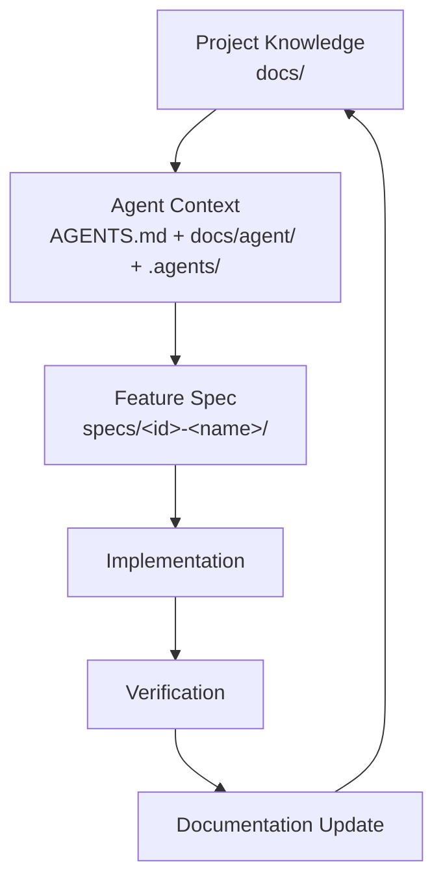

# <PROJECT_NAME>

> **Documentation and collaboration scaffold for AI / Vibe Coding projects (GitHub Template Repository)**
>
> The Chinese version is the source of truth: [README.md](README.md).

This repository is a **documentation and process template**, not a runnable application. It lets a human developer or a coding agent reconstruct the project's intent, constraints, architecture, current work and verification strategy without replaying chat history.

> Design principle: **Chat is the process; the repository is the long-term memory.**

Every `<PROJECT_NAME>`, `<DESCRIPTION>`, `<OWNER>`, `<DATE>`, `<LINK>` and `TBD` placeholder must be replaced with real project facts.
**Never invent project facts to make the docs look complete** — see the mandatory rules in [AGENTS.md](AGENTS.md) (English: [AGENTS.en.md](AGENTS.en.md)).

---

## 1. What this is

**Documentation + Agent Context + Development Process Template.**

It solves four problems at once:

1. **Project Knowledge Base** — long-lived knowledge: goals, scope, requirements, architecture, data model, API, UI/UX, security, testing, conventions, operations, release, roadmap, ADRs, glossary.
2. **Agent Runtime Context** — [AGENTS.md](AGENTS.md) is the first entry point for every coding agent. It is a **router, not a documentation dump**.
3. **Spec-driven Development** — a feature flows `Idea → Requirement → Spec → Design → Plan → Tasks → Implementation → Verification → Documentation Update → Archive`, with artifacts under [specs/](specs/README.md).
4. **Governance / Verification** — `scripts/` checks, GitHub Actions, ADRs and a verification matrix prevent documentation drift.

## 2. What this is not

- Not a framework, runtime or language scaffold;
- Not an application template (no business code, database, API or deployment design);
- Not a documentation website (no Docusaurus / MkDocs);
- Not an agent runtime, MCP server, RAG pipeline or orchestrator;
- It does not generate business documents or modify code automatically.

## 3. Four-layer model

| Layer | Name | Location | Responsibility |
| ----- | ---- | -------- | -------------- |
| 1 | Project Knowledge | [`docs/`](docs/README.en.md) | Long-lived facts: goals, requirements, architecture, API, conventions |
| 2 | Agent Context | [AGENTS.md](AGENTS.md), [docs/agent/](docs/agent/README.en.md), [.agents/](.agents/README.md) | What to read, what may be changed, what is forbidden |
| 3 | Feature Specs | [`specs/`](specs/README.en.md) | What/Why/How/Plan/Tasks/Verification per feature |
| 4 | Governance / Verification | [`scripts/`](scripts), [.github/](.github), [ADR](docs/architecture/adr/README.en.md), [verification](docs/verification/README.en.md) | Checks, review, decision records, definition of done |



## 4. Directory layout

```text
.
├── AGENTS.md              # First entry point for coding agents (router)
├── CONTRIBUTING.md        # Contribution flow for humans and agents
├── docs/                  # Layer 1: long-lived knowledge base
│   ├── overview/          #   what the project is, goals/non-goals, glossary
│   ├── requirements/      #   product, functional and non-functional requirements
│   ├── architecture/      #   architecture, components, data flow, data model, interfaces, ADRs
│   ├── api/  ui-ux/       #   interface contracts and UI conventions
│   ├── development/       #   workflow, conventions, testing, docs rules, dependency policy
│   ├── agent/             #   agent workflow, context routing, session handoff
│   ├── verification/      #   verification strategy and definition of done
│   ├── security/  operations/  planning/  archive/
├── specs/                 # Layer 3: feature specs
│   └── _template/         #   spec/design/plan/tasks/verification templates
├── .agents/               # Layer 2: agent skills and temporary notes
│   ├── skills/            #   platform-neutral Markdown skill instructions
│   └── notes/             #   temporary context (never a source of truth)
├── scripts/               # Layer 4: documentation checks (Node.js + TypeScript)
└── .github/               # CI, PR template, issue templates
```

## 5. How to use this template

1. Click **Use this template** on GitHub (or copy this directory structure).
2. Replace `<PROJECT_NAME>`, `<OWNER>`, `<DATE>`, `<LINK>` and other placeholders.
3. Fill in [docs/overview/project-overview.md](docs/overview/project-overview.md).
4. Fill in [docs/overview/goals-and-non-goals.md](docs/overview/goals-and-non-goals.md).
5. Fill in the requirement documents under [docs/requirements/](docs/requirements/README.md).
6. Fill in [docs/architecture/overview.md](docs/architecture/overview.md).
7. Adapt [AGENTS.md](AGENTS.md) to the project (Project Identity and Context Routing in particular).
8. Copy [specs/_template/](specs/_template/README.md) into `specs/001-<feature-name>/` and start the first feature.

The template itself uses Node.js + TypeScript for documentation checks, but the **target project does not have to be a Node project**; the checks only read Markdown.

## 6. Language rules (bilingual)

- `foo.md` is the Chinese primary document and the **source of truth**;
- `foo.en.md` is the English counterpart and must stay **semantically in sync** (not word-for-word, but structure, conclusions and constraints must not conflict);
- Template files are paired too. Exempt from pairing: `**/_template/**`, `**/template.md`, `.agents/notes/**`, `docs/archive/**`, `.github/**`, session notes and generated reports.

See [docs/development/documentation-rules.md](docs/development/documentation-rules.md) for details.

## 7. Local checks

```bash
npm install
npm run docs:check   # links + bilingual pairs + spec structure in one run
```

Individual commands: `npm run docs:links`, `npm run docs:i18n`, `npm run spec:check`, `npm run typecheck`.
CI lives in [.github/workflows/docs-check.yml](.github/workflows/docs-check.yml) and only runs documentation checks on `pull_request` and pushes to `main`; it never deploys or releases.

## 8. Principles

- **Git-native**: only `Git + Markdown + Node.js + GitHub Actions`; no SaaS dependency. Notion / Linear / Jira / Confluence are optional integrations at best.
- **Markdown-first**: core knowledge is plain Markdown — diffable, portable, human readable, agent friendly.
- **AI vendor neutral**: documents say "coding agent", never "you must use tool X".
- **One fact, one source of truth**: define a fact once, reference it elsewhere instead of copying.
- **Read the minimum sufficient context**: classify the task first, then read only the relevant documents.
- **Simple first**: no complex parsers, AST compilers, databases or CLI frameworks.

## 9. Non-goals (current)

Project generator CLI, web UI, documentation website, Docusaurus, MkDocs, AI agent runtime, MCP server, vector database, RAG, agent orchestrator, automatic document generation, automatic code modification and automatic releases are all **out of scope**; they may be added later.

## 10. License

[MIT](LICENSE); copyright and authorship use the `<OWNER>` placeholder.
