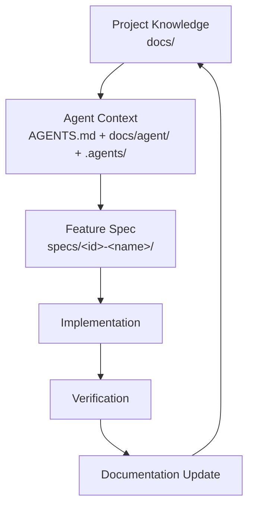

# <PROJECT_NAME>

> **AI Coding / Vibe Coding 项目文档与协作脚手架（GitHub Template Repository）**
>
> 中文版本是 Source of Truth；英文版本见 [README.en.md](README.en.md)。

本仓库是一个**文档与协作模板**，不是可运行的应用。它让「人类开发者 + Coding Agent」在进入一个项目后，能够快速重建项目的意图、约束、架构、当前工作与验证策略，而不依赖聊天记录。

> 设计理念：**Chat 是过程，Repository 才是长期记忆。**

模板中所有 `<PROJECT_NAME>`、`<DESCRIPTION>`、`<OWNER>`、`<DATE>`、`<LINK>`、`TBD` 都必须由真实项目事实替换。
**不要为了让文档看起来完整而编造项目事实**，强制规则见 [AGENTS.md](AGENTS.md)。

---

## 1. 这是什么

**Documentation + Agent Context + Development Process Template。**

它同时解决四类问题：

1. **Project Knowledge Base** —— 长期存在的项目知识：目标、边界、需求、架构、数据模型、API、UI/UX、安全、测试、规范、运维、发布、Roadmap、ADR、Glossary。
2. **Agent Runtime Context** —— 根目录 [AGENTS.md](AGENTS.md) 作为所有 Coding Agent 的第一入口。它是 **Router，不是 Documentation Dump**。
3. **Spec-driven Development** —— 单个 Feature 走 `Idea → Requirement → Spec → Design → Plan → Tasks → Implementation → Verification → Documentation Update → Archive`，产物落在 [specs/](specs/README.md)。
4. **Governance / Verification** —— `scripts/` 检查 + GitHub Actions + ADR + Verification 矩阵，防止文档漂移。

## 2. 这不是什么

- 不是 Framework、Runtime 或语言脚手架；
- 不是 Application Template（不含业务代码、数据库、API、部署方案）；
- 不是 Documentation Website / Docusaurus / MkDocs；
- 不是 Agent Runtime / MCP Server / RAG / 编排器；
- 不自动生成业务文档，也不自动修改业务代码。

## 3. 四层模型

| Layer | 名称 | 位置 | 职责 |
| ----- | ---- | ---- | ---- |
| 1 | Project Knowledge | [`docs/`](docs/README.md) | 长期事实：目标、需求、架构、API、规范 |
| 2 | Agent Context | [AGENTS.md](AGENTS.md)、[docs/agent/](docs/agent/README.md)、[.agents/](.agents/README.md) | 告诉 Agent 读什么、能改什么、禁止什么 |
| 3 | Feature Specs | [`specs/`](specs/README.md) | 单个 Feature 的 What/Why/How/Plan/Tasks/Verification |
| 4 | Governance / Verification | [`scripts/`](scripts)、[.github/](.github)、[ADR](docs/architecture/adr/README.md)、[verification](docs/verification/README.md) | 检查、评审、决策记录、完成标准 |



## 4. 目录结构

```text
.
├── AGENTS.md              # Coding Agent 第一入口（Router）
├── CONTRIBUTING.md        # 人类与 Agent 共用的贡献流程
├── docs/                  # Layer 1：长期项目知识库
│   ├── overview/          #   项目是什么、目标与非目标、术语
│   ├── requirements/      #   产品/功能/非功能需求
│   ├── architecture/      #   架构、组件、数据流、数据模型、接口、ADR
│   ├── api/  ui-ux/       #   接口契约与界面规范
│   ├── development/       #   流程、编码规范、测试策略、文档规则、依赖策略
│   ├── agent/             #   Agent 工作流、上下文路由、Session 交接
│   ├── verification/      #   验证策略与完成标准
│   ├── security/  operations/  planning/  archive/
├── specs/                 # Layer 3：Feature Spec
│   └── _template/         #   spec/design/plan/tasks/verification 模板
├── .agents/               # Layer 2：Agent Skills 与临时 Notes
│   ├── skills/            #   平台无关的 Markdown 技能指令
│   └── notes/             #   临时上下文（不是 Source of Truth）
├── scripts/               # Layer 4：文档检查（Node.js + TypeScript）
└── .github/               # CI、PR 模板、Issue 模板
```

## 5. 如何使用这个模板

1. 在 GitHub 上点击 **Use this template**（或直接复制本仓库目录结构）。
2. 全局替换 `<PROJECT_NAME>`、`<OWNER>`、`<DATE>`、`<LINK>` 等占位符。
3. 填写 [docs/overview/project-overview.md](docs/overview/project-overview.md)。
4. 填写 [docs/overview/goals-and-non-goals.md](docs/overview/goals-and-non-goals.md)。
5. 填写 [docs/requirements/](docs/requirements/README.md) 下的需求文档。
6. 填写 [docs/architecture/overview.md](docs/architecture/overview.md)。
7. 按项目实际情况改写 [AGENTS.md](AGENTS.md)（尤其是 Project Identity 与 Context Routing）。
8. 从 [specs/_template/](specs/_template/README.md) 复制出第一个 `specs/001-<feature-name>/`，开始第一个 Feature。

模板自身使用 Node.js + TypeScript 做文档检查，但**目标项目不必是 Node 项目**；检查脚本只读取 Markdown 文件。

## 6. 语言规则（中英双语）

- `foo.md` 为中文主版本，是 **Source of Truth**；
- `foo.en.md` 为英文对应版本，必须与中文版**语义同步**（不要求逐字翻译，但结构、结论、约束不得冲突）；
- 模板文件同样成对存在；例外（不强制双语）：`**/_template/**`、`**/template.md`、`.agents/notes/**`、`docs/archive/**`、`.github/**`、session notes、自动生成报告。

规则细节见 [docs/development/documentation-rules.md](docs/development/documentation-rules.md)。

## 7. 本地校验

```bash
npm install
npm run docs:check   # 链接 + 双语配对 + spec 结构，一次跑完
```

单项命令：`npm run docs:links`、`npm run docs:i18n`、`npm run spec:check`、`npm run typecheck`。
CI 配置见 [.github/workflows/docs-check.yml](.github/workflows/docs-check.yml)，仅在 `pull_request` 与 `push` 到 `main` 时执行文档检查，不做部署与发布。

## 8. 设计原则

- **Git-native**：只用 `Git + Markdown + Node.js + GitHub Actions`，不依赖任何 SaaS；Notion / Linear / Jira / Confluence 只能是可选集成。
- **Markdown-first**：核心知识是普通 Markdown，可 diff、可迁移、对人可读、对 Agent 友好。
- **AI Vendor Neutral**：文档只使用「Coding Agent」这一通用概念，不绑定 Claude Code / Codex / Cursor / Copilot 等任一工具。
- **One Fact, One Source of Truth**：同一事实只在一个文档中定义，其它文档引用而非复制。
- **Read the minimum sufficient context**：Agent 先分类任务，再读相关文档，而不是加载整个 `docs/`。
- **Simple first**：不使用复杂 parser、AST compiler、数据库或 CLI 框架。

## 9. 非目标（当前）

项目生成 CLI、Web UI、Documentation Website、Docusaurus、MkDocs、AI Agent Runtime、MCP Server、Vector Database、RAG、Agent Orchestrator、自动生成业务文档、自动修改代码、自动发布 Release —— 均**不在本次范围内**，未来可能追加。

## 10. License

[MIT](LICENSE)，版权与作者信息使用 `<OWNER>` 占位符。
