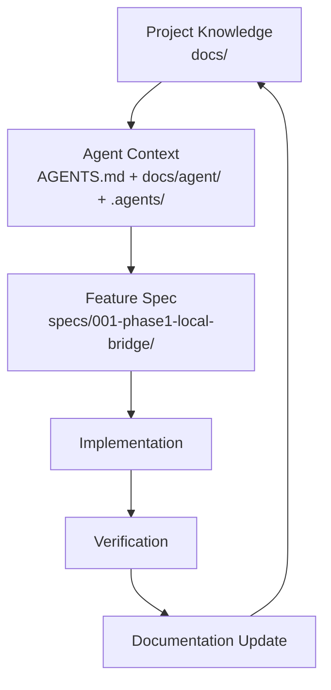

# SWUFE WebVPN Bridge

> macOS / Windows 上的 Electron 桌面应用：用户在 App 内完成官方网瑞达 WebVPN（CAS/MFA）登录后，本机 HTTP/HTTPS 流量中命中 allowlist 的请求由**本机桥**改写为 WebVPN URL 并携带会话，使本机浏览器能打开并操作教务 `jwxt.swufe.edu.cn`。它不是真 VPN。
>
> 中文版本是 Source of Truth；英文版本见 [README.en.md](README.en.md)。

## 现状

| 项 | 值 |
| --- | --- |
| 阶段 | Phase 1 的 macOS 与 Windows 真机验收已通过（含教务浏览器操作）；Spec 001 为 `Implemented`。`KI-014` 的应用外资源截断已接受并以重载登录窗规避；`KI-019` 的经桥偶发挂起尚未区分本地与外部成因，因此未到 `Verified`。详见 [verification.md](specs/001-phase1-local-bridge/verification.md)。 |
| 仓库类型 | 文档优先（Documentation-first）：[docs/](docs/README.md) + [specs/](specs/README.md)；含桥实现（[bridges/python/](bridges/python/swufe_bridge/wrd_codec.py)、[tests](bridges/python/tests/l0/test_wrd_codec.py)）与桌面应用（[apps/desktop/](apps/desktop/README.md)） |
| 第一期 Feature | [specs/001-phase1-local-bridge/](specs/001-phase1-local-bridge/spec.md) |
| 第二期 Feature（M6 界面重构） | [specs/002-desktop-ui-multiwindow/](specs/002-desktop-ui-multiwindow/spec.md)（`Implemented`：React 19 + Ant Design 6 的四窗口渲染层，主窗口 720×560 零滚动，捕获/日志/Allowlist 为二级窗口） |
| Owner | cherrchen |
| License | [MIT](LICENSE) |
| 文档版本 | 1.0 |
| 初始化日期 | 2026-09-20 |

本仓库以**文档为主体**（`docs/` 记录长期项目事实，`specs/` 记录单个 Feature 的完整过程），并含 M1–M6 交付的实现（桥核心、桌面编排、体验打磨、验收修复、界面重构）：桌面应用 `pnpm start`（先 `pnpm install`）；无桌面壳时也可用 `uv run --directory bridges/python python -m swufe_bridge.sidecar --config <bridge-config.json>` 直接起桥（见 [桥控制协议](docs/api/bridge-control-protocol.md)）。

## 1. 它解决什么问题

校外访问校内 Web 资源依赖网瑞达（Wengine）WebVPN `webvpn.swufe.edu.cn`；统一身份认证经 `authserver.swufe.edu.cn`（CAS，可含 MFA）。

WebVPN 是**应用层反向代理**，不是 SSLVPN/TUN，因此用户无法让本机普通浏览器或应用以「真实内网主机名」透明访问校内 HTTP/HTTPS 服务。

本机桥补上的就是这一段：用户先完成官方登录，之后本机浏览器对 allowlist 内主机的请求由本机桥改写为 WebVPN URL 并携带 WebVPN 会话（**WRD 请求改写**，由 WrdCodec 实现）；响应中的 `Location`、`Set-Cookie` 以及 HTML/JS/JSON 里的校内绝对 URL 再经**响应反向改写**还原。客户端侧始终使用真实主机名，只有上行流量改走 WebVPN；两条例外见 [ADR-0007](docs/architecture/adr/ADR-0007-gateway-owned-namespaces-and-native-mode-promotion.md)：网关自有根命名空间（`/wengine-vpn/`、`/authserver/`）不经 token、直接取自网关根；命中网关客户端 shim（`__vpn_*` + `/wengine-vpn/js/main.js`）引导页判据的 HTML 文档会被升级到网关原生 URL 形态（`https://webvpn.swufe.edu.cn/<scheme>/<token>/…`），此后该主机由网关自己的改写运行时接管（地址栏不再是原主机名），其它 allowlist 主机不受影响。

相关事实见[项目概览](docs/overview/project-overview.md)、[目标与非目标](docs/overview/goals-and-non-goals.md)、[术语表](docs/overview/glossary.md)、[架构总览](docs/architecture/overview.md)。

## 2. 第一期范围与验收

- **平台**：macOS 与 Windows 优先；Linux 不在第一期范围。
- **验收**：本机浏览器能打开并操作教务 `jwxt.swufe.edu.cn` 页面。首次进入该主机时浏览器会被升级到 WebVPN 原生 URL 形态（见 [ADR-0007](docs/architecture/adr/ADR-0007-gateway-owned-namespaces-and-native-mode-promotion.md)）；macOS 侧已于 2026-09-21 通过（TC-G01/TC-G02），Windows 侧延期（`KI-001`）。
- **体验目标**：从「已登录」到「浏览器打开教务」≤ 3 次点击（不含 CAS 本身）。
- **安全目标**：不存密码；MITM CA 可一键卸载；关闭后不留残留系统代理。

第一期明确不做：SSH / 数据库 / SMB / 任意 TCP·UDP；替代学校 SSLVPN 或 TUN 级真 VPN（TUN / sing-box 属后续阶段）；与 Clash / mihomo / sing-box 等对系统代理的链式共存（启动前检测到系统代理已被占用即拒绝启动并提示）；Linux。

完整非目标清单（NG-001..NG-008）与目标（G-001..G-004）、需求（PR-001..PR-005、REQ-001..REQ-011、NFR-001..NFR-007）只在[目标与非目标](docs/overview/goals-and-non-goals.md)与 [docs/requirements/](docs/requirements/README.md) 定义，其它文档只引用 ID。

## 3. 文档体系

| Layer | 名称 | 位置 | 职责 |
| ----- | ---- | ---- | ---- |
| 1 | Project Knowledge | [docs/](docs/README.md) | 长期事实：目标、需求、架构、API、规范 |
| 2 | Agent Context | [AGENTS.md](AGENTS.md)、[docs/agent/](docs/agent/README.md)、[.agents/](.agents/README.md) | 告诉 Agent 读什么、能改什么、禁止什么 |
| 3 | Feature Specs | [specs/](specs/README.md) | 单个 Feature 的 What/Why/How/Plan/Tasks/Verification |
| 4 | Governance / Verification | [scripts/](scripts)、[.github/](.github)、[ADR](docs/architecture/adr/README.md)、[verification](docs/verification/README.md) | 检查、评审、决策记录、完成标准 |



## 4. 目录结构

```text
.
├── AGENTS.md              # Layer 2：Coding Agent 第一入口（Router）
├── README.md              # 本文件：项目定位、范围与文档体系
├── CONTRIBUTING.md        # 人类与 Agent 共用的贡献流程
├── docs/                  # Layer 1：长期项目知识库
│   ├── overview/          #   项目是什么、目标与非目标、术语
│   ├── requirements/      #   产品 / 功能 / 非功能需求
│   ├── architecture/      #   架构、组件、数据流、数据模型、接口、ADR
│   ├── api/  ui-ux/       #   接口契约与界面规范
│   ├── development/       #   流程、编码规范、测试策略、文档规则、依赖策略
│   ├── agent/             #   Agent 工作流、上下文路由、Session 交接
│   ├── verification/      #   验证策略与完成标准
│   ├── security/  operations/  planning/
│   └── archive/           #   归档的历史设计资料（不是当前事实来源）
├── apps/                  # 应用：每个应用一个目录
│   └── desktop/           #   Electron 桌面应用（Main/preload/renderer、平台适配（系统代理/证书）、单元测试与验证 fixture）
├── bridges/               # 桥实现：每个实现一个目录
│   └── python/            #   Python 桥（WRD codec、allowlist、配置、响应反向改写、mitmproxy addon、sidecar 入口、CA 生成入口、L0/L1/L2 测试）
├── specs/                 # Layer 3：Feature Spec
│   ├── 001-phase1-local-bridge/   # 第一期本机桥：spec/design/plan/tasks/verification
│   └── _template/         #   Spec 模板骨架
├── .agents/               # Layer 2：Agent Skills 与临时 Notes
│   ├── skills/            #   平台无关的 Markdown 技能指令
│   └── notes/             #   临时上下文（不是 Source of Truth）
├── scripts/               # Layer 4：文档检查（Node.js + TypeScript）
└── .github/               # CI、PR 模板、Issue 模板
```

顶层布局（`apps/` 应用 + `bridges/` 桥实现）的决策见 [ADR-0009](docs/architecture/adr/ADR-0009-monorepo-layout.md)。

## 5. 新 Session / 新 Agent 从哪读起

```text
AGENTS.md
  ↓
docs/overview/project-overview.md
  ↓
按任务分类读取（docs/agent/context-routing.md）
```

| 任务 | 从哪读起 |
| ---- | -------- |
| 第一期 Feature（实现 / 验证） | [specs/001-phase1-local-bridge/](specs/001-phase1-local-bridge/spec.md)（spec → design → plan → tasks → verification） |
| 需求 | [docs/requirements/](docs/requirements/README.md)、[目标与非目标](docs/overview/goals-and-non-goals.md) |
| 架构 / 组件 / 数据流 / 数据模型 | [docs/architecture/](docs/architecture/README.md) |
| 接口契约 | [docs/api/](docs/api/README.md) |
| 界面与交互 | [docs/ui-ux/](docs/ui-ux/README.md) |
| 测试与验收 | [testing-strategy](docs/development/testing-strategy.md)、[docs/verification/](docs/verification/README.md) |
| 安全 | [docs/security/](docs/security/README.md) |
| 计划与里程碑 | [roadmap](docs/planning/roadmap.md)、[milestones](docs/planning/milestones/README.md) |
| 接手他人工作 | [session-handoff](docs/agent/session-handoff.md)、[.agents/notes/](.agents/notes/README.md) |

**不要默认加载整个 `docs/`**：先分类任务，再读最小充分上下文。

## 6. 本地校验

```bash
pnpm install          # 安装全部 workspace 项目（根 + apps/desktop）
pnpm run docs:check   # 链接 + 双语配对 + spec 结构，一次跑完

# 桌面应用（apps/desktop/）：类型检查与单元测试
pnpm --filter swufe-webvpn-bridge run typecheck
pnpm --filter swufe-webvpn-bridge run test:unit
pnpm --filter swufe-webvpn-bridge run test:ui   # 渲染层组件测试（vitest + jsdom）

# 桌面应用：构建与启动（根目录别名，等价于 apps/desktop/ 的 build / start）
pnpm run build        # 编译 Main(tsc) + 渲染层四入口(vite) + 打包 preload
pnpm run dev          # build + 启动（pnpm start 同义）
pnpm start --user-data-dir=/tmp/swufe-dev   # 参数原样传给 Electron
```

单项命令：`pnpm run docs:links`、`pnpm run docs:i18n`、`pnpm run spec:check`、`pnpm run typecheck`（各自只读 Markdown / TypeScript，不构建应用）。

CI 配置见 [.github/workflows/](.github/workflows)：`docs-check.yml`（文档检查）与 `python-tests.yml`（Python L0）在 `pull_request` 与 push 到 `main` 时执行；`app-tests.yml` 执行 App 的类型检查、单元测试与渲染层组件测试（vitest + jsdom）。均不做部署与发布。

## 7. 语言规则

- `foo.md` 是中文主文档，也是 **Source of Truth**；
- `foo.en.md` 是英文对应版本，必须与中文版**语义同步**：结构、结论、约束不得冲突（不要求逐字翻译）；
- 不强制配对的例外：`specs/_template/`、`**/template.md`、`.agents/notes/` 下的 session notes 与调研记录、`docs/archive/`、`.github/`、自动生成报告；
- `specs/001-phase1-local-bridge/` 的 Feature Spec 是交付记录，默认中文，不强制 `.en.md`。

规则细节见 [documentation-rules.md](docs/development/documentation-rules.md)。

## 8. License

[MIT](LICENSE) © 2026 cherrchen。
