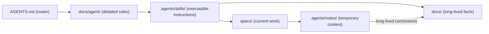

# Agent Documentation

> Status: Draft ｜ Owner: <OWNER> ｜ Last Reviewed: <DATE>
>
> Chinese source of truth: [README.md](README.md)

**Purpose**: this directory is the detailed part of **Layer 2 — Agent Context**: how a coding agent works, what it reads, and how a session hands off.
The root [AGENTS.md](../../AGENTS.md) is the entry router; this directory expands it.

## Files

| File | Question it answers |
| ---- | ------------------- |
| [agent-workflow.md](agent-workflow.md) | The full loop from receiving a task to delivering it |
| [context-routing.md](context-routing.md) | Minimum sufficient context per task type |
| [session-handoff.md](session-handoff.md) | How to record state when a session ends or is interrupted |

## Vendor neutrality

- Everything here uses the generic concept "coding agent" and **binds to no specific tool** (Claude Code, Codex, Cursor, GitHub Copilot, DeepSeek Harness, … can all read it);
- Skill instructions live in [.agents/skills/](../../.agents/README.md) as plain Markdown;
- No proprietary runtime, plugin or MCP service is required.

## Relationship to the other layers

## Not stored here

- Project facts (→ [docs/](../README.md))
- Per-feature plans (→ [specs/](../../specs/README.md))
- Temporary records (→ [.agents/notes/](../../.agents/notes/README.md))
