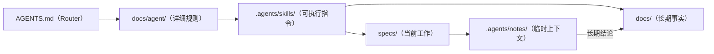

# Agent 文档

> Status: Draft ｜ Owner: <OWNER> ｜ Last Reviewed: <DATE>

**用途**：本目录是 **Layer 2 — Agent Context** 的详细部分，规定 Coding Agent 如何工作、读什么、Session 结束时如何交接。
根目录 [AGENTS.md](../../AGENTS.md) 是入口 Router；本目录是其展开说明。

## 文件

| 文件 | 回答的问题 |
| ---- | ---------- |
| [agent-workflow.md](agent-workflow.md) | Agent 从接收任务到交付的完整循环 |
| [context-routing.md](context-routing.md) | 不同任务类型应读取哪些最小充分上下文 |
| [session-handoff.md](session-handoff.md) | Session 结束/中断时如何记录状态 |

## 平台无关原则

- 本目录所有指令使用「Coding Agent」这一通用概念，**不绑定**任何具体工具（Claude Code / Codex / Cursor / GitHub Copilot / DeepSeek Harness 等均可读取）；
- 技能指令位于 [.agents/skills/](../../.agents/README.md)，格式为普通 Markdown；
- 不要求任何专有运行时、插件或 MCP 服务。

## 与其它层的关系

## 不放在这里的内容

- 项目事实（→ [docs/](../README.md)）
- 单个 Feature 的计划（→ [specs/](../../specs/README.md)）
- 临时记录（→ [.agents/notes/](../../.agents/notes/README.md)）
