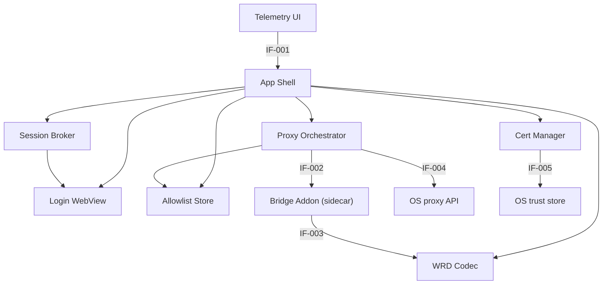

# Components

> Status: Draft ｜ Owner: cherrchen ｜ Last Reviewed: 2026-09-21
>
> Chinese source of truth: [components.md](components.md)

**Purpose**: list the system's constituent units (modules, services, packages, processes, tasks) with their responsibilities, boundaries and dependency directions.
**Do not write**: interface fields (→ [interfaces.md](interfaces.md)), data entities (→ [data-model.md](data-model.md)).

---

## Component list

> "Code location" is the real path of landed implementations; components that are not implemented yet stay `TBD（实现首个任务确定）`.
> M1 (bridge core) implemented WRD Codec, Bridge Addon (including the config surface and the sidecar entry) and the library layer of Allowlist Store; M2 landed every Electron-side component (`app/src/`), with the Windows adapters implemented and their real-machine verification deferred to M4; M3 completed the capture modes (process capture), the allowlist editing UI and the debug log panel; M5 ([ADR-0007](adr/ADR-0007-gateway-owned-namespaces-and-native-mode-promotion.md)) added gateway-owned namespace passthrough and bootstrap document promotion to the Bridge Addon.

| Component | Type | Responsibility (one line) | Code location | Status |
| --------- | ---- | ------------------------- | ------------- | ------ |
| App Shell | In-process module (Electron Main) | Windows/tray (optional), config persistence, and the Main-side orchestration entry exposing preload IPC | `app/src/main/index.ts` (composition root, single-instance lock, quit cleanup in `shutdown.ts`), `app/src/main/ipc.ts` (IF-001), `app/src/main/windows.ts`, `app/src/main/store.ts` | Implemented (M2; no tray yet) |
| Login WebView | In-process module (Electron Renderer / BrowserWindow) | Hosts the official WebVPN / CAS login and guarantees anti-loop | `app/src/main/session-broker.ts` (`openLogin`, `persist:swufe-login` partition + `setProxy({mode:'direct'})`) | Implemented (M2) |
| Session Broker | In-process module (Electron Main) | Cookie extraction, storage and expiry detection | `app/src/main/session-broker.ts` (capture/clear/monitor), `app/src/main/session-probe.ts` (expiry-signal classification, pure functions) | Implemented (M2; Q-001's other two signals remain M3/M4) |
| Proxy Orchestrator | In-process module (Electron Main) | Start/stop the mitm sidecar, set/clear the system proxy, switch between the two capture modes ("system proxy / selected apps"), detect proxy conflicts | `app/src/main/orchestrator.ts`, `app/src/main/state-machine.ts`, `app/src/main/sidecar.ts`, `app/src/main/platform/` (`exec.ts`, `parse.ts` and the darwin/win32 adapters) | Implemented (M2; Windows real-machine verification deferred to M4) |
| WRD Codec | In-process library (shared by the App and the sidecar) | Hostname encryption/decryption and URL conversion (pure functions, no IO) | `swufe_bridge/wrd_codec.py` | Implemented (M1) |
| Bridge Addon | Separate process (addon inside the mitmproxy sidecar) | Request rewrite, response reverse-rewrite and Cookie injection; gateway-owned root namespace passthrough; HTML that matches the gateway bootstrap predicate is promoted to the gateway-native URL space | `swufe_bridge/addon.py` (pure reverse-rewrite functions and the bootstrap predicate in `swufe_bridge/rewrite.py`; config surface in `swufe_bridge/config.py`; process entry `swufe_bridge/sidecar.py`) | Implemented (M1; M5 added passthrough and promotion) |
| Cert Manager | In-process module (Electron Main) | Install/uninstall and query the local MITM CA | `app/src/main/platform/darwin/cert.ts`, `app/src/main/platform/win32/cert.ts`, `app/src/main/platform/ca-files.ts`; CA generation entry `swufe_bridge/ca.py` | Implemented (M2; the real trust-store write still needs a human, see the [M2 completion record](../planning/milestones/M2-desktop-orchestration.en.md)) |
| Allowlist Store | In-process module (Electron Main) | Read/write host list and wildcard option (single source for routing decisions) | `app/src/main/store.ts` (read/write and validation of `<userData>/config.json`) + `swufe_bridge/allowlist.py` (matching semantics and validation) + `swufe_bridge/config.py` (`AllowlistStore`) | Implemented (M2; the editing UI landed in M3) |
| Telemetry UI | In-process module (Electron Renderer) | Capture-mode selection, allowlist editing, status display and the debug log panel | `app/src/renderer/renderer.ts`, `app/static/{index.html,styles.css}`, `app/src/preload/index.ts` | Implemented (M3: status bar, bridge switch, certificate, proxy status, debug switch + the capture-mode section, allowlist editing and the log panel) |

## Component relationships

Arrow direction means "depends on / calls"; dependencies are strictly one-way and the diagram contains no reverse dependency.

Description: Telemetry UI is a leaf (it only calls App Shell through preload IPC) and App Shell is the composition root on the Main side; Session Broker reads the Login WebView session and is the only Cookie reader; Proxy Orchestrator depends on Allowlist Store as the routing source and drives the Bridge Addon inside the sidecar through the local control port (including overlaying/removing the local capture mode at runtime); WrdCodec has no IO, is not reverse-depended on by anything, and is shared by Bridge Addon and App Shell.

## Component detail

### App Shell

- Responsibility: window and tray (tray optional) lifecycle, config persistence, the Main-side orchestration entry, exposing the preload interface `window.swufeBridge`.
- Not responsible for: traffic rewriting (Bridge Addon); allowlist matching logic (Allowlist Store); calling OS-specific APIs directly (centralised in Cert Manager and Proxy Orchestrator).
- Input: IPC calls from the Renderer through `window.swufeBridge`; launch arguments and the user-data directory.
- Output: IPC responses (`BridgeStatus`, `AllowlistConfig`, CA status, …); `onDebugLog` events.
- Dependencies: Session Broker, Proxy Orchestrator, Cert Manager, Allowlist Store, WrdCodec, Login WebView.
- Depended on by: Telemetry UI, Login WebView (via preload).
- Key invariants: app exit must clear the system proxy (see [data-model.md](data-model.md) INV-002).
- Related tests: TC-H01, TC-D02.
- Related spec / ADR: [specs/001-phase1-local-bridge](../../specs/001-phase1-local-bridge/spec.md), [ADR-0003](adr/ADR-0003-electron-gui-for-phase-1.md).

### Login WebView

- Responsibility: host the official WebVPN / CAS login flow (including MFA) and expose the resulting session to Session Broker.
- Not responsible for: parsing or autofilling passwords; traffic rewriting; allowlist decisions.
- Input: `webvpnBase`; user interaction.
- Output: the logged-in session (Cookies) and login state.
- Dependencies: App Shell (window host).
- Depended on by: App Shell, Session Broker.
- Key invariants: login traffic must bypass the bridge, and `webvpn.swufe.edu.cn` / `authserver.swufe.edu.cn` must never be wrapped again (anti-loop, see INV-004).
- Related tests: TC-D01, TC-D04.
- Related spec / ADR: [specs/001-phase1-local-bridge](../../specs/001-phase1-local-bridge/spec.md), [ADR-0003](adr/ADR-0003-electron-gui-for-phase-1.md).

### Session Broker

- Responsibility: Cookie extraction, storage and expiry detection.
- Not responsible for: URL rewriting; holding student IDs/passwords; allowlist decisions.
- Input: the Login WebView session partition; responses from probe URLs (expiry signals).
- Output: `SessionState` (Cookie set), login/expiry state; consumed by Proxy Orchestrator when pushing to the sidecar.
- Dependencies: the Login WebView session.
- Depended on by: App Shell, Proxy Orchestrator.
- Key invariants: the only Cookie reader; Cookies must never enter logs (see INV-001).
- Related tests: TC-D01, TC-D02, TC-D03, TC-D04.
- Related spec / ADR: [specs/001-phase1-local-bridge](../../specs/001-phase1-local-bridge/spec.md).

### Proxy Orchestrator

- Responsibility: start/stop the mitm sidecar, set/clear the system proxy, manage process capture (local capture) and the capture mode (`captureMode`), detect proxy conflicts.
- Not responsible for: traffic rewriting; CA management (Cert Manager); reading Cookies directly (goes through Session Broker).
- Input: `startBridge` / `stopBridge` / `setCaptureMode` / `setCaptureProcesses` IPC; the current OS proxy settings; `captureMode` and `captureProcesses`.
- Output: `BridgeStatus` (including `localCaptureEnabled` and `captureError`); the system proxy target; the `{allowlist, cookies, debug, capture}` config pushed to the sidecar.
- Dependencies: Allowlist Store, OS proxy API (IF-004), mitm sidecar control port (IF-002).
- Depended on by: App Shell.
- Key invariants: clear the system proxy only when the "set by this app" marker exists (INV-002); the bridge state machine is fixed at `idle → starting → running`, `running → stopping → idle`, `starting → error → idle`.
- Capture modes are mutually exclusive (ADR-0006): `system-proxy` and `selected-apps` are never in effect at the same time — in `selected-apps` this app sets no system proxy and revokes the one it previously set (clearing the `systemProxyManagedByApp` marker), letting local mode take over the selected applications only; in `system-proxy` local capture stays off (the runtime config's `capture.processes` is always empty) and the system proxy covers all traffic. Switching modes revokes/restores the proxy according to the target mode; the bridge port (the regular listener) stays available in both modes.
- Pre-switch check: before switching to `selected-apps` the system proxy is checked; if another application occupies it (it does not point at this bridge) the switch is refused with `PROXY_CONFLICT` and nothing is persisted (consistent with ADR-0004's "refuse rather than half-work").
- Capture candidate enumeration: macOS uses `ps -Ao pid=,comm=`, Windows uses `tasklist /fo csv /nh`; applications are collapsed into one row per `.app` bundle path (main process and Helper share one pattern), while non-applications use the full executable path as the mitmproxy intercept pattern.
- A capture failure never puts the bridge into the `error` state: the bridge keeps `running` and the reason is only written to `BridgeStatus.captureError`; `localCaptureEnabled` is true only when "bridge `running` + `captureMode = 'selected-apps'` + the sidecar reported `enabled: true`".
- Related tests: TC-C01, TC-C02, TC-C03, TC-C04, TC-D03, TC-G04.
- Related spec / ADR: [specs/001-phase1-local-bridge](../../specs/001-phase1-local-bridge/spec.md), [ADR-0006](adr/ADR-0006-local-capture-mode-and-mutual-exclusion.md), [ADR-0004](adr/ADR-0004-refuse-start-when-system-proxy-in-use.md), [ADR-0002](adr/ADR-0002-reuse-mitmproxy-for-tls.md).

### WRD Codec

- Responsibility: hostname encryption/decryption and ordinary URL ↔ WebVPN URL conversion (AES-128-CFB, `segment_size=128`).
- Not responsible for: any IO; allowlist decisions; HTTP-layer rewriting.
- Input: host, ordinary/WebVPN URL, optional `key`/`iv`.
- Output: encrypted token, WebVPN URL, ordinary URL.
- Dependencies: none.
- Depended on by: Bridge Addon, App Shell.
- Key invariants: only the hostname is encrypted while path/query stay plaintext; the implementation must match the verified `wrd_codec.py` vectors (NFR-002).
- Related tests: TC-A01, TC-A02, TC-A03, TC-A04, TC-A05.
- Related spec / ADR: [specs/001-phase1-local-bridge](../../specs/001-phase1-local-bridge/spec.md), [ADR-0001](adr/ADR-0001-wrd-rewrite-in-mitm-layer.md), [ADR-0005](adr/ADR-0005-builtin-wrd-key-with-override.md).

### Bridge Addon

- Responsibility: WRD-rewrite allowlisted requests and inject Cookies; reverse-rewrite responses; gateway-owned root namespaces (`/wengine-vpn/`, `/authserver/`) take no token and are fetched straight from the gateway root, and their responses are not reverse-rewritten; HTML documents that match the gateway bootstrap predicate are promoted to the gateway-native URL space with `302`; emit debug log events; overlay/remove the local capture mode from the runtime config and report the capture state.
- Not responsible for: UI; reading/writing user config directly (it only receives pushed config); depending on the Renderer/UI; session capture.
- Input: HTTP/HTTPS requests and responses through the local bridge; the pushed `{allowlist, cookies, debug, capture}` config.
- Output: upstream requests rewritten into WebVPN form; reverse-rewritten responses; debug log events (host + rewrite result); `swufe-capture` diagnostic lines.
- Dependencies: WrdCodec.
- Depended on by: Proxy Orchestrator (through the control port).
- Key invariants: traffic outside the allowlist stays direct and unrewritten (C-004); `webvpn.swufe.edu.cn` and `authserver.swufe.edu.cn` are hard-coded exclusions (INV-004); logs never contain Cookies or bodies (INV-001).
- Gateway-owned namespaces and promotion ([ADR-0007](adr/ADR-0007-gateway-owned-namespaces-and-native-mode-promotion.md)): only paths that **begin with** `GATEWAY_ROOT_PREFIXES` (`/wengine-vpn/`, `/authserver/`) are passed through (site-owned paths such as `/xtgl/wengine-vpn/x` still get token rewriting); promotion applies only to already WRD-rewritten `GET`/`HEAD` responses and only to documents for which `is_gateway_bootstrap_html` is true, and it changes only the response's `Location` semantics (it never rewrites the page content); after promotion those pages no longer go through the bridge, and `webvpn.swufe.edu.cn` remains `not-allowlisted`.
- Capture mechanics (ADR-0006): the sidecar starts with `--mode regular@<port>` and **never** passes `--listen-port` (a global `listen_port` would make the `local:<spec>` added at runtime collide with `regular` on the same listen address); at runtime it overlays `local:<spec>` onto the same mitmproxy instance, the regular listener stays in place and the bridge port remains available, and `swufe-ready`'s `listen_port` is derived from the regular mode.
- Capture reporting: the `swufe-capture {"enabled":bool,"processes":string[],"error":string|null}` diagnostic line (its keys are fixed to `enabled` / `processes` / `error`), emitted on the first apply and on every config change; after a failure there is no automatic retry until the runtime config is rewritten (the UI's "retry" button pushes the config again). Process capture is optional, so that line never takes part in the readiness decision and a failure does not change the bridge state.
- Related tests: TC-F01, TC-F02, TC-F03, TC-F04, TC-D04, TC-G01, TC-G02.
- Related spec / ADR: [specs/001-phase1-local-bridge](../../specs/001-phase1-local-bridge/spec.md), [ADR-0006](adr/ADR-0006-local-capture-mode-and-mutual-exclusion.md), [ADR-0007](adr/ADR-0007-gateway-owned-namespaces-and-native-mode-promotion.md), [ADR-0001](adr/ADR-0001-wrd-rewrite-in-mitm-layer.md), [ADR-0002](adr/ADR-0002-reuse-mitmproxy-for-tls.md), [ADR-0005](adr/ADR-0005-builtin-wrd-key-with-override.md).

### Cert Manager

- Responsibility: generate/install/uninstall the local MITM CA and query its status.
- Not responsible for: building its own PKI (it reuses mitmproxy's CA mechanism); setting the system proxy.
- Input: `installCa` / `uninstallCa` / `getCaStatus` IPC; the mitmproxy-specific confdir.
- Output: `{ok, message}`, CA status (installed / trusted).
- Dependencies: OS trust store (IF-005).
- Depended on by: App Shell, Proxy Orchestrator (CA availability check before starting the bridge).
- Key invariants: the CA private key stays local and is never uploaded (REQ-010, NFR-003).
- Related tests: TC-E01, TC-E02, TC-E03.
- Related spec / ADR: [specs/001-phase1-local-bridge](../../specs/001-phase1-local-bridge/spec.md), [ADR-0002](adr/ADR-0002-reuse-mitmproxy-for-tls.md).

### Allowlist Store

- Responsibility: read/write the host list and the `*.swufe.edu.cn` wildcard option, and provide the matching semantics for routing decisions.
- Not responsible for: HTTP-layer rewriting; system proxy or CA management.
- Input: `setAllowlist` IPC and matching queries.
- Output: `AllowlistConfig`; match results.
- Dependencies: none (local JSON).
- Depended on by: App Shell, Proxy Orchestrator.
- Key invariants: hosts are stored lowercase and matched exactly; `jwxt.swufe.edu.cn` is always included by default (INV-003).
- Related tests: TC-B01, TC-B02, TC-B03, TC-B04, TC-B05.
- Related spec / ADR: [specs/001-phase1-local-bridge](../../specs/001-phase1-local-bridge/spec.md).

### Telemetry UI

- Responsibility: the top-level "capture mode" choice (system proxy / selected apps, including the process-capture state, the macOS authorisation guidance and retry), the editable allowlist (add/remove hosts + the `*.swufe.edu.cn` checkbox), the status bar and the log panel, plus the CA / debug-logging interfaces (Renderer).
- Not responsible for: calling OS APIs directly; rewriting; holding plaintext Cookies.
- Input: `BridgeStatus` (including `localCaptureEnabled` / `captureError`), `DebugLogEvent`, `AllowlistConfig`, `AppSettingsView` (`captureMode` / `captureProcesses`), `CaptureCandidate[]`, CA status.
- Output: IPC calls corresponding to user actions.
- Dependencies: App Shell (via preload IPC).
- Depended on by: none (leaf).
- Key invariants: errors must not be conveyed by colour alone (accessibility); the log panel is hidden by default with the "debug logging" switch, keeps at most the latest 200 entries and has only the time / host / result columns, never bodies or Cookies; allowlist edits and capture-mode switches take effect immediately (no restart).
- Related tests: TC-H01, TC-H02, TC-F04, TC-B05.
- Related spec / ADR: [specs/001-phase1-local-bridge](../../specs/001-phase1-local-bridge/spec.md), [ADR-0003](adr/ADR-0003-electron-gui-for-phase-1.md).

## Dependency rules

| Rule | Description |
| ---- | ----------- |
| WRD Codec is a pure, IO-free function library | Shared by Bridge Addon and the App (App Shell); it depends on no other component and performs no network/file access |
| Bridge Addon must not depend on the Renderer/UI | The addon only depends on WrdCodec and the pushed config; it must not reference Electron/UI code, so the sidecar can run standalone |
| Session Broker is the only Cookie reader | Other components (including Bridge Addon) may only use the session through the Cookies pushed by Orchestrator, never by reading the login session themselves |
| OS differences are concentrated in Cert Manager and Proxy Orchestrator | No other component may call OS-specific APIs (proxy, trust store, process enumeration) directly |
| Allowlist Store is the single routing data source | Whether a request is rewritten is decided only by it (and its matching semantics); no second host list may be built in the addon or UI |
| One-way dependencies | The Renderer/UI may only call Main through preload IPC; Main must not depend on the Renderer; no reverse dependency is allowed in the component diagram |

## Boundaries and ownership

| Component | Owner | Must confirm before changing |
| --------- | ----- | ---------------------------- |
| App Shell | cherrchen | Whether the IPC boundary stays in sync with [interfaces.md](interfaces.md) and [api/electron-ipc.md](../api/electron-ipc.md) |
| Login WebView | cherrchen | Whether the anti-loop strategy (INV-004) still holds |
| Session Broker | cherrchen | Whether the Cookie strategy and the "only reader" constraint are preserved |
| Proxy Orchestrator | cherrchen | Whether the proxy-conflict and clearing policy and the capture-mode mutual exclusion (ADR-0004, ADR-0006, INV-002) change |
| WRD Codec | cherrchen | Whether codec vectors (NFR-002) and default key/iv semantics (ADR-0005) are affected |
| Bridge Addon | cherrchen | Whether the rewrite strategy, allowlist semantics, log minimisation (C-004, INV-001, INV-004) and the gateway-owned namespace passthrough / bootstrap promotion rules (ADR-0007) are affected |
| Cert Manager | cherrchen | Whether the CA / trust model (ADR-0002, REQ-010) changes |
| Allowlist Store | cherrchen | Whether the defaults and wildcard semantics (INV-003) change |
| Telemetry UI | cherrchen | Whether new IPC is introduced or sensitive data is displayed |
