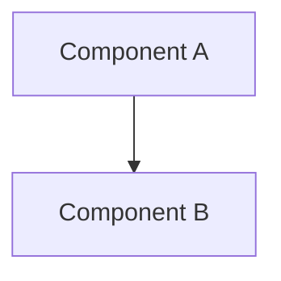

# Components

> Status: TBD ｜ Owner: <OWNER> ｜ Last Reviewed: <DATE>
>
> Chinese source of truth: [components.md](components.md)

**Purpose**: list the building blocks (modules, services, packages, processes, jobs) with their responsibilities, boundaries and dependency direction.
**Do not write**: interface fields (→ [interfaces.md](interfaces.md)), data entities (→ [data-model.md](data-model.md)).

---

## Component list

| Component | Type | Responsibility (one line) | Code location | Status |
| --------- | ---- | ------------------------- | ------------- | ------ |
| TBD | module / service / package / process | TBD | TBD | TBD |

## Component relationships



> Dependency direction must match the dependency rules below; no reverse edges are allowed.

## Component detail template

```markdown
### <component>

- Responsibility: …
- Not responsible for: …
- Inputs: …
- Outputs: …
- Depends on: …
- Depended on by: …
- Key invariants: …
- Related tests: …
- Related spec / ADR: …
```

## Dependency rules

| Rule | Description |
| ---- | ----------- |
| TBD | e.g. upper layers may depend on lower layers, never the reverse |

## Boundaries and ownership

| Component | Owner | Must confirm before changing |
| --------- | ----- | ---------------------------- |
| TBD | <OWNER> | TBD |
