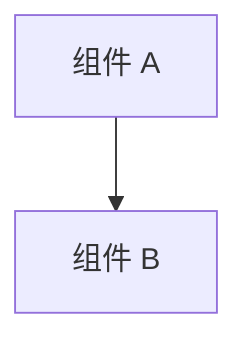

# 组件

> Status: TBD ｜ Owner: <OWNER> ｜ Last Reviewed: <DATE>

**用途**：列出系统的构成单元（模块、服务、包、进程、任务），说明各自职责、边界与依赖方向。
**不写**：接口字段（→ [interfaces.md](interfaces.md)）、数据实体（→ [data-model.md](data-model.md)）。

---

## 组件清单

| 组件 | 类型 | 职责（一句话） | 代码位置 | 状态 |
| ---- | ---- | -------------- | -------- | ---- |
| TBD | 模块 / 服务 / 包 / 进程 | TBD | TBD | TBD |

## 组件关系



> 依赖方向必须与下方「依赖规则」一致；图中不允许出现反向依赖。

## 组件详情模板

```markdown
### <组件名>

- 职责：……
- 不负责：……
- 输入：……
- 输出：……
- 依赖：……
- 被谁依赖：……
- 关键不变式：……
- 相关测试：……
- 相关 Spec / ADR：……
```

## 依赖规则

| 规则 | 说明 |
| ---- | ---- |
| TBD | 例如：上层可依赖下层，反向依赖禁止 |

## 边界与所有权

| 组件 | 负责人 | 修改前必须确认 |
| ---- | ------ | -------------- |
| TBD | <OWNER> | TBD |
