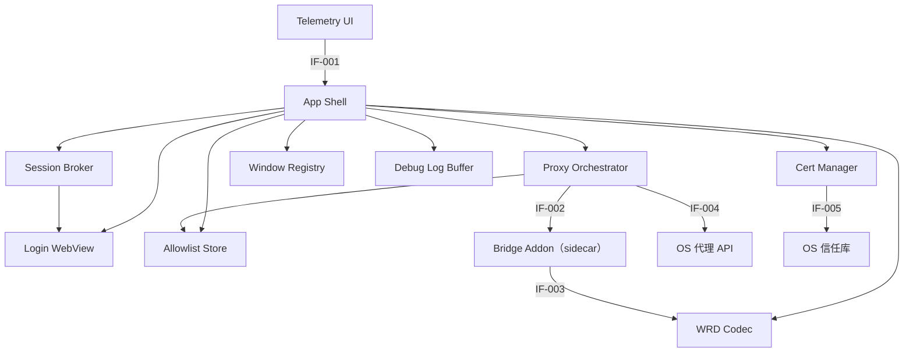

# 组件

> Status: Draft ｜ Owner: cherrchen ｜ Last Reviewed: 2026-09-23

**用途**：列出系统的构成单元（模块、服务、包、进程、任务），说明各自职责、边界与依赖方向。
**不写**：接口字段（→ [interfaces.md](interfaces.md)）、数据实体（→ [data-model.md](data-model.md)）。

---

## 组件清单

> 「代码位置」为已落地实现的真实路径；尚未实现的组件仍为 `TBD（实现首个任务确定）`。
> M1（桥核心）已实现 WRD Codec、Bridge Addon（含配置面与 sidecar 入口）与 Allowlist Store 的库层；M2 已落地 Electron 侧全部组件
> （`apps/desktop/src/`），Windows 平台适配已实现、真机验证待 M4；M3 补齐捕获方式（进程捕获）、allowlist 增删界面与调试日志面板；M5（[ADR-0007](adr/ADR-0007-gateway-owned-namespaces-and-native-mode-promotion.md)）给 Bridge Addon 增加网关自有命名空间直通与 bootstrap 文档升级；M6（[ADR-0012](adr/ADR-0012-react-antd-multiwindow-renderer.md)）把渲染层迁移到 React 19 + Ant Design 6 的四窗口结构，并新增 Window Registry 与 Debug Log Buffer。

| 组件 | 类型 | 职责（一句话） | 代码位置 | 状态 |
| ---- | ---- | -------------- | -------- | ---- |
| App Shell | 进程内模块（Electron Main） | 窗口/托盘（可选）、配置持久化，并作为 Main 侧编排入口暴露 preload IPC | `apps/desktop/src/main/index.ts`（组合根、单实例锁、退出清理 `shutdown.ts`）、`apps/desktop/src/main/ipc.ts`（IF-001）、`apps/desktop/src/main/store.ts`、窗口注册表 `apps/desktop/src/main/window-registry.ts` 与窗口策略 `apps/desktop/src/main/window-policy.ts` | Implemented (M2；托盘未实现) |
| Login WebView | 进程内模块（Electron Renderer / BrowserWindow） | 承载官方 WebVPN / CAS 登录并保证防环 | `apps/desktop/src/main/session-broker.ts`（`openLogin`，`persist:swufe-login` 分区 + `setProxy({mode:'direct'})`） | Implemented (M2) |
| Session Broker | 进程内模块（Electron Main） | Cookie 的提取、存储与按票据过期时间失效 | `apps/desktop/src/main/session-broker.ts`（采集/清除/本地到点）、`apps/desktop/src/main/session-probe.ts`（真实流量上的 `302 → /login` 分类，纯函数） | Implemented (M2；不再定时探测门户；Q-001 的另两个信号仍开放) |
| Proxy Orchestrator | 进程内模块（Electron Main） | 启停 mitm sidecar、设置/清除系统代理、在「系统代理 / 指定应用」两种捕获方式间切换、代理冲突检测 | `apps/desktop/src/main/orchestrator.ts`、`apps/desktop/src/main/state-machine.ts`、`apps/desktop/src/main/sidecar.ts`、`apps/desktop/src/main/platform/`（`exec.ts`、`parse.ts` 与 darwin/win32 适配） | Implemented (M2；Windows 真机验证待 M4) |
| WRD Codec | 进程内库（App 与 sidecar 共享） | hostname 加解密与 URL 互转（纯函数，无 IO） | `bridges/python/swufe_bridge/wrd_codec.py` | Implemented (M1) |
| Bridge Addon | 独立进程（mitmproxy sidecar 内的 addon） | 请求改写、响应反向改写与 Cookie 注入；网关自有根命名空间直通；命中网关 bootstrap 判据的 HTML 升级到网关原生 URL 空间 | `bridges/python/swufe_bridge/addon.py`（响应反向改写纯函数与 bootstrap 判据 `bridges/python/swufe_bridge/rewrite.py`；配置面 `bridges/python/swufe_bridge/config.py`；进程入口 `bridges/python/swufe_bridge/sidecar.py`） | Implemented (M1；M5 增加直通与升级) |
| Cert Manager | 进程内模块（Electron Main） | 本机 MITM CA 的安装/卸载与状态查询 | `apps/desktop/src/main/platform/darwin/cert.ts`、`apps/desktop/src/main/platform/win32/cert.ts`、`apps/desktop/src/main/platform/ca-files.ts`；CA 生成入口 `bridges/python/swufe_bridge/ca.py` | Implemented (M2；系统信任库写入的真机验证待人工，见 [M2 完成记录](../planning/milestones/M2-desktop-orchestration.md)) |
| Allowlist Store | 进程内模块（Electron Main） | 主机列表与通配选项的读写（路由判定唯一数据源） | `apps/desktop/src/main/store.ts`（`<userData>/config.json` 读写与校验）+ `bridges/python/swufe_bridge/allowlist.py`（匹配语义与校验）+ `bridges/python/swufe_bridge/config.py`（`AllowlistStore`） | Implemented (M2；编辑界面已在 M3 落地) |
| Telemetry UI | 进程内模块（Electron Renderer，React 19 + Ant Design 6） | 四窗口界面：主窗口（状态条、登录/重新登录、桥接开关、捕获方式与进程捕获状态、allowlist 摘要、CA、诊断）与捕获 / 日志 / Allowlist 三个二级窗口 | 四个入口 `apps/desktop/src/renderer/{main,capture,logs,allowlist}.html` → `entry/{main,capture,logs,allowlist}.tsx` → `windows/{main,capture,logs,allowlist}/`；共享库 `apps/desktop/src/renderer/lib/`（`AppShell.tsx`、`ErrorBoundary.tsx`、`theme.ts`、`bridge-api.ts`、`hooks.ts`、`log-batch.ts`、`log-format.ts`、`messages.ts`、`app.css`）；`apps/desktop/src/preload/index.ts` | Implemented (M6：迁移到 React + 四窗口；旧裸 DOM 渲染层 `renderer.ts` / `static/` 已删除) |
| Window Registry | 进程内模块（Electron Main） | 四窗口的创建 / 复用聚焦 / 关闭与跨窗口广播 | `apps/desktop/src/main/window-registry.ts`、`apps/desktop/src/main/window-policy.ts`（尺寸与动作策略，无 Electron 依赖，可单测） | Implemented (M6) |
| Debug Log Buffer | 进程内模块（Electron Main） | 调试日志的最近 200 条环形缓冲（窗口关闭不丢历史） | `apps/desktop/src/main/debug-log-buffer.ts`、容量常量 `apps/desktop/src/shared/limits.ts` | Implemented (M6) |

## 组件关系

箭头方向表示「依赖 / 调用」方向；依赖严格单向，图中不存在反向依赖。

说明：Telemetry UI 是叶子（只经 preload IPC 调用 App Shell），App Shell 是 Main 侧的组合根；Session Broker 读取 Login WebView 的 session，是 Cookie 的唯一读取点；Proxy Orchestrator 依赖 Allowlist Store 作为路由数据源，并经本地控制口驱动 sidecar 内的 Bridge Addon（含运行时叠加 / 移除 local 捕获模式）；WrdCodec 无 IO、不被任何组件反向依赖，由 Bridge Addon 与 App Shell 共同使用。Window Registry 与 Debug Log Buffer 是 Main 内部模块：由组合根创建并注入 IPC 层，前者承载窗口生命周期（渲染层只能经 `openCaptureWindow` / `openLogWindow` / `openAllowlistWindow` 触达），后者承载调试日志缓冲（渲染层只能经 `getDebugLogs` / `clearDebugLogs` 读取与清空）。

## 组件详情

### App Shell

- 职责：窗口与托盘（托盘非必须）生命周期、配置持久化、Main 侧编排入口，并暴露 preload 接口 `window.swufeBridge`。
- 不负责：不做流量改写（Bridge Addon）；不实现 allowlist 匹配逻辑（Allowlist Store）；不直接调用 OS 专有 API（集中在 Cert Manager 与 Proxy Orchestrator）。
- 输入：Renderer 经 `window.swufeBridge` 的 IPC 调用；启动参数与用户数据目录。
- 输出：IPC 响应（`BridgeStatus`、`AllowlistConfig`、CA 状态等）；`onDebugLog` / `onStatus` / `onSessionExpired` 事件（广播到全部存活窗口）。
- 依赖：Session Broker、Proxy Orchestrator、Cert Manager、Allowlist Store、WrdCodec、Login WebView、Window Registry、Debug Log Buffer。
- 被谁依赖：Telemetry UI、Login WebView（经 preload）。
- 关键不变式：应用退出必须触发系统代理清除（见 [data-model.md](data-model.md) INV-002）。
- 相关测试：TC-H01、TC-D02。
- 相关 Spec / ADR：[specs/001-phase1-local-bridge](../../specs/001-phase1-local-bridge/spec.md)、[ADR-0003](adr/ADR-0003-electron-gui-for-phase-1.md)。

### Login WebView

- 职责：承载官方 WebVPN / CAS 登录流程（含 MFA），把登录后的 session 暴露给 Session Broker。
- 不负责：不解析或自动填写密码；不参与流量改写；不做 allowlist 判定。
- 输入：`webvpnBase`；用户交互。
- 输出：登录后的会话（Cookie）与登录状态。
- 依赖：App Shell（窗口宿主）。
- 被谁依赖：App Shell、Session Broker。
- 关键不变式：登录流量必须 bypass 本桥，`webvpn.swufe.edu.cn` / `authserver.swufe.edu.cn` 不得被二次包装（防环，见 INV-004）。
- 相关测试：TC-D01、TC-D04。
- 相关 Spec / ADR：[specs/001-phase1-local-bridge](../../specs/001-phase1-local-bridge/spec.md)、[ADR-0003](adr/ADR-0003-electron-gui-for-phase-1.md)。

### Session Broker

- 职责：Cookie 的提取、存储与失效检测。
- 不负责：不做 URL 改写；不持有学号/密码；不做 allowlist 判定。
- 输入：登录 WebView 的 session partition（票据 cookie 及其过期时间）；sidecar 在真实流量上报告的 `swufe-session expired`。
- 输出：`SessionState`（Cookie 集合）、登录/过期状态；供 Proxy Orchestrator 推送 sidecar。
- 依赖：Login WebView 的 session。
- 被谁依赖：App Shell、Proxy Orchestrator。
- 关键不变式：Cookie 的唯一读取点；Cookie 不得进入日志（见 INV-001）；没有票据不算已登录；`expiresAt` 只取票据，到点本地失效，不再定时请求门户。
- 相关测试：TC-D01、TC-D02、TC-D03、TC-D04。
- 相关 Spec / ADR：[specs/001-phase1-local-bridge](../../specs/001-phase1-local-bridge/spec.md)。

### Proxy Orchestrator

- 职责：启停 mitm sidecar、设置/清除系统代理、管理进程捕获（local capture）与捕获方式（`captureMode`）、代理冲突检测。
- 不负责：不做流量改写；不管理 CA（Cert Manager）；不直接读取 Cookie（经 Session Broker）。
- 输入：`startBridge` / `stopBridge` / `setCaptureMode` / `setCaptureProcesses` IPC；OS 当前代理设置；`captureMode` 与 `captureProcesses`。
- 输出：`BridgeStatus`（含 `localCaptureEnabled` 与 `captureError`）；系统代理指向；推送给 sidecar 的 `{allowlist, cookies, debug, capture}` 配置。
- 依赖：Allowlist Store、OS 代理 API（IF-004）、mitm sidecar 控制口（IF-002）。
- 被谁依赖：App Shell。
- 关键不变式：设置系统代理前先持久化 `systemProxyManagedByApp`；仅在系统代理清理成功后清除标记，失败时保留以便下次启动重试（INV-002）；桥状态机固定为 `idle → starting → running`，`running → stopping → idle`，`starting → error → idle`。
- 捕获方式互斥（ADR-0006）：`system-proxy` 与 `selected-apps` 不同时生效——`selected-apps` 时本 App 不设置系统代理，并撤销此前由自己设置过的（清 `systemProxyManagedByApp` 标记），改由 local 模式接管所选应用的流量；`system-proxy` 时不启用 local 捕获（运行时配置里 `capture.processes` 恒为空），由系统代理覆盖全部流量。切换方式在 OS 操作成功后才保存目标设置；若代理写入及回滚均失败，停桥以终止 local 捕获。桥端口（regular 监听）在两种方式下始终可用。
- 切换前检查：切到 `selected-apps` 之前先检查系统代理，被其它软件占用（非指向本桥）则拒绝并返回 `PROXY_CONFLICT`，设置不落盘（与 ADR-0004 的「拒绝而不是半工作」一致）。
- 开桥前 fake-ip 预检：系统代理冲突检查之后、端口探测之前，解析当前配置的网关主机（`settings.webvpnBase`，默认 `webvpn.swufe.edu.cn`）；任一地址落在 `198.18.0.0/15`（Clash / mihomo / sing-box 的 fake-ip）时以 `PROXY_CONFLICT` 拒绝启动，避免开桥后上游静默挂起；解析失败或超时不阻断（fail open）——判据与后果见 [ADR-0011](adr/ADR-0011-refuse-start-on-fake-ip-dns.md)。
- 候选应用枚举：macOS 用 `ps -Ao pid=,comm=`、Windows 用 `tasklist /fo csv /nh`；应用按 `.app` 包路径归并为一行（主进程与 Helper 合并为同一 pattern），非应用用可执行文件全路径，作为 mitmproxy intercept pattern。
- 进程捕获失败不进入桥的 `error` 状态：桥继续 `running`，原因只写入 `BridgeStatus.captureError`；`localCaptureEnabled` 仅在「桥 `running` + `captureMode = 'selected-apps'` + sidecar 上报 `enabled: true`」时为真。
- 相关测试：TC-C01、TC-C02、TC-C03、TC-C04、TC-D03、TC-G04。
- 相关 Spec / ADR：[specs/001-phase1-local-bridge](../../specs/001-phase1-local-bridge/spec.md)、[ADR-0006](adr/ADR-0006-local-capture-mode-and-mutual-exclusion.md)、[ADR-0004](adr/ADR-0004-refuse-start-when-system-proxy-in-use.md)、[ADR-0002](adr/ADR-0002-reuse-mitmproxy-for-tls.md)。

### WRD Codec

- 职责：hostname 加解密与普通 URL ↔ WebVPN URL 互转（AES-128-CFB，`segment_size=128`）。
- 不负责：不做 IO；不做 allowlist 判定；不做 HTTP 层改写。
- 输入：host、普通/WebVPN URL、可选 `key`/`iv`。
- 输出：加密 token、WebVPN URL、普通 URL。
- 依赖：无。
- 被谁依赖：Bridge Addon、App Shell。
- 关键不变式：仅加密 hostname，path/query 明文；实现必须与已验证原型 `wrd_codec.py` 的向量一致（NFR-002）。
- 相关测试：TC-A01、TC-A02、TC-A03、TC-A04、TC-A05。
- 相关 Spec / ADR：[specs/001-phase1-local-bridge](../../specs/001-phase1-local-bridge/spec.md)、[ADR-0001](adr/ADR-0001-wrd-rewrite-in-mitm-layer.md)、[ADR-0005](adr/ADR-0005-builtin-wrd-key-with-override.md)。

### Bridge Addon

- 职责：对命中 allowlist 的请求做 WRD 改写与 Cookie 注入；对响应做反向改写；网关自有根命名空间（`/wengine-vpn/`、`/authserver/`）不经 token、直接取自网关根且其响应不反向改写；命中网关 bootstrap 判据的 HTML 文档以 `302` 升级到网关原生 URL 空间；产出调试日志事件；按运行时配置叠加 / 移除 local 捕获模式并回报捕获状态。
- 不负责：不做 UI；不直接读写用户配置（只接受下发的配置）；不依赖 Renderer/UI；不做会话采集。
- 输入：经本机桥的 HTTP/HTTPS 请求与响应；下发的 `{allowlist, cookies, debug, capture}` 配置。
- 输出：改写到 WebVPN 形态的上行请求；反向改写后的响应；调试日志事件（域名 + 是否改写成功）；`swufe-capture` 诊断行。
- 依赖：WrdCodec。
- 被谁依赖：Proxy Orchestrator（经控制口）。
- 关键不变式：非 allowlist 流量直连不改写（C-004）；`webvpn.swufe.edu.cn` 与 `authserver.swufe.edu.cn` 硬编码排除（INV-004）；日志不含 Cookie 与正文（INV-001）。
- 网关自有命名空间与升级（[ADR-0007](adr/ADR-0007-gateway-owned-namespaces-and-native-mode-promotion.md)）：只有路径**以** `GATEWAY_ROOT_PREFIXES`（`/wengine-vpn/`、`/authserver/`）开头才直通（站点自有路径如 `/xtgl/wengine-vpn/x` 仍走 token 改写）；升级只对已 WRD 改写的 `GET`/`HEAD` 响应、且只对 `is_gateway_bootstrap_html` 为真的文档生效，并只改响应的 `Location` 语义（不回写页面内容）；升级后这些页面不再经桥改写，`webvpn.swufe.edu.cn` 仍为 `not-allowlisted`。
- 捕获机制（ADR-0006）：sidecar 以 `--mode regular@<port>` 启动并**不传** `--listen-port`（全局 `listen_port` 会让运行时新增的 `local:<spec>` 与 `regular` 被判为同一监听地址而报错）；运行时把 `local:<spec>` 叠加到同一个 mitmproxy 实例，regular 监听保留、桥端口始终可用，`swufe-ready` 的 `listen_port` 由 regular 模式推导。
- 捕获回报：`swufe-capture {"enabled":bool,"processes":string[],"error":string|null}` 诊断行（键固定为 `enabled` / `processes` / `error` 三个），首次应用与配置变更时上报；失败后不自动重试，直到运行时配置被重写（界面「重试」按钮即再次下发配置）。进程捕获是可选能力，该行不参与就绪判定，失败也不改变桥状态。
- 相关测试：TC-F01、TC-F02、TC-F03、TC-F04、TC-D04、TC-G01、TC-G02。
- 相关 Spec / ADR：[specs/001-phase1-local-bridge](../../specs/001-phase1-local-bridge/spec.md)、[ADR-0006](adr/ADR-0006-local-capture-mode-and-mutual-exclusion.md)、[ADR-0007](adr/ADR-0007-gateway-owned-namespaces-and-native-mode-promotion.md)、[ADR-0001](adr/ADR-0001-wrd-rewrite-in-mitm-layer.md)、[ADR-0002](adr/ADR-0002-reuse-mitmproxy-for-tls.md)、[ADR-0005](adr/ADR-0005-builtin-wrd-key-with-override.md)。

### Cert Manager

- 职责：本机 MITM CA 的生成/安装/卸载与状态查询。
- 不负责：不自研 PKI（复用 mitmproxy 的 CA 机制）；不做系统代理设置。
- 输入：`installCa` / `uninstallCa` / `getCaStatus` IPC；mitmproxy 专用 confdir。
- 输出：`{ok, message}`、CA 状态（installed / trusted）。
- 依赖：OS 信任库（IF-005）。
- 被谁依赖：App Shell、Proxy Orchestrator（开桥前检查 CA 可用性）。
- 关键不变式：CA 私钥仅本机、不上传；信任状态与卸载目标按本地 CA 证书指纹精确识别，不按通用名称匹配（REQ-010、NFR-003）。
- 相关测试：TC-E01、TC-E02、TC-E03。
- 相关 Spec / ADR：[specs/001-phase1-local-bridge](../../specs/001-phase1-local-bridge/spec.md)、[ADR-0002](adr/ADR-0002-reuse-mitmproxy-for-tls.md)。

### Allowlist Store

- 职责：主机列表与 `*.swufe.edu.cn` 通配选项的读写，并提供路由判定所需的匹配语义。
- 不负责：不做 HTTP 层改写；不做系统代理或 CA 管理。
- 输入：`setAllowlist` IPC 与匹配查询。
- 输出：`AllowlistConfig`；匹配结果。
- 依赖：无（本地 JSON）。
- 被谁依赖：App Shell、Proxy Orchestrator。
- 关键不变式：主机以小写存储、精确匹配；默认必含 `jwxt.swufe.edu.cn`（INV-003）。
- 相关测试：TC-B01、TC-B02、TC-B03、TC-B04、TC-B05。
- 相关 Spec / ADR：[specs/001-phase1-local-bridge](../../specs/001-phase1-local-bridge/spec.md)。

### Telemetry UI

- 职责：四个窗口的界面——主窗口（状态条、登录/重新登录、桥接开关、捕获方式单选与进程捕获状态行、allowlist 摘要、CA 安装/卸载、系统代理只读行、调试日志开关、消息行；720×560 固定、`resizable: false`、零滚动）与三个二级窗口（捕获：应用筛选与复选选择；日志：时间 / 域名 / 结果三列，最新在前、≤200；Allowlist：增删主机与 `*.swufe.edu.cn` 勾选）。四窗口共用 `AppShell`（`ErrorBoundary` + antd `ConfigProvider` / `App`），各窗口自持状态并经 preload IPC 读写 Main。
- 不负责：不直接调用 OS API；不做改写；不持有 Cookie 明文；不持有窗口生命周期（Window Registry）与日志缓冲（Debug Log Buffer）。
- 输入：`BridgeStatus`（含 `localCaptureEnabled` / `captureError`）、`DebugLogEvent`、`AllowlistConfig`、`AppSettingsView`（`captureMode` / `captureProcesses`）、`CaptureCandidate[]`、CA 状态。
- 输出：用户操作对应的 IPC 调用（含 `openCaptureWindow` / `openLogWindow` / `openAllowlistWindow` / `getDebugLogs` / `clearDebugLogs`）。
- 依赖：App Shell（经 preload IPC）。
- 被谁依赖：无（叶子）。
- 关键不变式：渲染层无 Node 集成——四窗口 `webPreferences` 均为 `contextIsolation: true` + `nodeIntegration: false` + `sandbox: true` 且共用同一个 preload；错误不得仅靠颜色表达（无障碍）；日志表格只有时间 / 域名 / 结果三列，不含正文与 Cookie；allowlist 修改与捕获方式切换立即生效（无需重启）。
- 相关测试：TC-H01、TC-H02、TC-F04、TC-B05。
- 相关 Spec / ADR：[specs/001-phase1-local-bridge](../../specs/001-phase1-local-bridge/spec.md)、[specs/002-desktop-ui-multiwindow](../../specs/002-desktop-ui-multiwindow/spec.md)、[ADR-0003](adr/ADR-0003-electron-gui-for-phase-1.md)、[ADR-0012](adr/ADR-0012-react-antd-multiwindow-renderer.md)。

### Window Registry

- 职责：四窗口的创建参数、复用聚焦、关闭与跨窗口广播（`openMain()` / `open(kind)` / `close(kind)` / `closeAll()` / `broadcast(channel, payload?)` / `count(kind)` / `mainWindow()`）。
- 不负责：不做业务编排（App Shell / Proxy Orchestrator）；不持有日志缓冲（Debug Log Buffer）；不决定界面内容（Telemetry UI）。
- 输入：`createWindowRegistry({ appRoot, devServerUrl?, onMainClosed })`；窗口动作调用。
- 输出：`BrowserWindow`；经 `webContents.send` 的广播（`onStatus` / `onDebugLog` / `onSessionExpired`）。
- 依赖：`window-policy.ts`（`WINDOW_SPECS`、`decideWindowAction`、`mainWindowSize`、`clampZoomFactor`，无 Electron 依赖）。
- 被谁依赖：App Shell（组合根创建并注入 IPC 层）。
- 关键不变式：每类窗口单实例（已存在则 `restore()` / `show()` / `focus()`；`decideWindowAction` 只返回 `create` 或 `focus`）；二级窗口不设 `parent`（非模态，主窗口仍可操作）；主窗口 `closed` → `onMainClosed()`（组合根中即 `app.quit()`）；四个窗口一律 `show: false` + `ready-to-show` 再显示，`did-fail-load` 打日志；加载路径二选一——`devServerUrl` 存在时 `loadURL('<url>/<entry>.html')`，否则 `loadFile('<appRoot>/dist/renderer/<entry>.html')`。
- 相关测试：`apps/desktop/test/window-policy.test.ts`。
- 相关 Spec / ADR：[specs/002-desktop-ui-multiwindow](../../specs/002-desktop-ui-multiwindow/spec.md)、[ADR-0012](adr/ADR-0012-react-antd-multiwindow-renderer.md)。

### Debug Log Buffer

- 职责：保存调试日志的最近 200 条（`push(event)` / `snapshot()` / `clear()` / `size()`），供日志窗口挂载时恢复历史。
- 不负责：不落盘；不裁剪字段（`DebugLogEvent` 键集合固定）；不做渲染层的合并渲染（合并窗口是渲染层 `log-batch.ts` 的职责）。
- 输入：`DebugLogEvent`；容量（默认 `MAX_DEBUG_LOG_ENTRIES`）。
- 输出：`snapshot()` 返回的 `DebugLogEvent[]` 副本。
- 依赖：`shared/limits.ts` 的 `MAX_DEBUG_LOG_ENTRIES`。
- 被谁依赖：App Shell（组合根创建并注入 IPC 层）、IPC 层（`onDebugLog` 写入、`getDebugLogs` 读取、`clearDebugLogs` 与 `setDebugLogging(false)` 清空）。
- 关键不变式：容量 ≤ `MAX_DEBUG_LOG_ENTRIES`（200）、最新在前、超容量丢最旧；**仅内存、不落盘**（NFR-003）；`snapshot()` 返回副本，调用方改动不影响缓冲。
- 相关测试：`apps/desktop/test/debug-log-buffer.test.ts`。
- 相关 Spec / ADR：[specs/002-desktop-ui-multiwindow](../../specs/002-desktop-ui-multiwindow/spec.md)、[ADR-0012](adr/ADR-0012-react-antd-multiwindow-renderer.md)。

## 依赖规则

| 规则 | 说明 |
| ---- | ---- |
| WRD Codec 为纯函数、无 IO | 被 Bridge Addon 与 App（App Shell）共同使用；不依赖任何其它组件，也不做网络/文件访问 |
| Bridge Addon 不得依赖 Renderer/UI | addon 只依赖 WrdCodec 与下发配置；不得引用 Electron/界面代码，保证 sidecar 可独立运行 |
| Session Broker 是 Cookie 唯一读取点 | 其它组件（含 Bridge Addon）只能通过 Orchestrator 下发的 Cookie 使用会话，不得自行读取登录 session |
| OS 差异集中在 Cert Manager 与 Proxy Orchestrator | 其余组件不得直接调用 OS 专有 API（代理、信任库、进程枚举） |
| Allowlist Store 是路由判定的唯一数据源 | 请求改写与否只由它（及其匹配语义）决定，禁止在 addon/UI 中另建主机名单 |
| 单向依赖 | Renderer/UI 只能经 preload IPC 调用 Main；Main 不得反向依赖 Renderer；组件图中不允许反向依赖 |

## 边界与所有权

| 组件 | 负责人 | 修改前必须确认 |
| ---- | ------ | -------------- |
| App Shell | cherrchen | IPC 边界与 [interfaces.md](interfaces.md)、[api/electron-ipc.md](../api/electron-ipc.md) 是否同步 |
| Login WebView | cherrchen | 防环策略（INV-004）是否仍成立 |
| Session Broker | cherrchen | Cookie 策略与「唯一读取点」约束是否保持 |
| Proxy Orchestrator | cherrchen | 代理冲突与清除策略、捕获方式互斥（ADR-0004、ADR-0006、INV-002）是否改变 |
| WRD Codec | cherrchen | codec 向量（NFR-002）与默认 key/iv 语义（ADR-0005）是否受影响 |
| Bridge Addon | cherrchen | 改写策略、allowlist 语义、日志最小化（C-004、INV-001、INV-004）与网关自有命名空间直通 / bootstrap 升级规则（ADR-0007）是否受影响 |
| Cert Manager | cherrchen | CA / 信任模型（ADR-0002、REQ-010）是否改变 |
| Allowlist Store | cherrchen | 默认值与通配语义（INV-003）是否改变 |
| Telemetry UI | cherrchen | 是否引入新的 IPC 或展示敏感数据 |
| Window Registry | cherrchen | 单实例复用、二级窗口非模态、主窗口关闭即退出（ADR-0012）是否改变 |
| Debug Log Buffer | cherrchen | 容量上限与「仅内存不落盘」（NFR-003）是否改变 |
