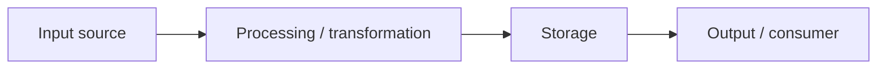

# Data Flow

> Status: TBD ｜ Owner: <OWNER> ｜ Last Reviewed: <DATE>
>
> Chinese source of truth: [data-flow.md](data-flow.md)

**Purpose**: describe how data moves through the system, how it is transformed and where it lands — for impact analysis and debugging.
**Do not write**: entity definitions (→ [data-model.md](data-model.md)), interface signatures (→ [interfaces.md](interfaces.md)).

---

## Primary flows

## Flow list

| ID | Flow | Trigger | Input | Key transformations | Output | Persistence | Detail |
| -- | ---- | ------- | ----- | ------------------- | ------ | ----------- | ------ |
| DF-001 | TBD | TBD | TBD | TBD | TBD | TBD | TBD |

## Data lifecycle

| Stage | Description | Retention |
| ----- | ----------- | --------- |
| Ingest | TBD | TBD |
| Validate | TBD | TBD |
| Store | TBD | TBD |
| Use / derive | TBD | TBD |
| Archive / delete | TBD | TBD |

## Consistency requirements

| Flow | Consistency requirement | Failure behaviour |
| ---- | ----------------------- | ----------------- |
| DF-001 | TBD (strong / eventual / idempotent) | TBD |

## Failure paths

| Scenario | Expected behaviour | Observable signal |
| -------- | ------------------ | ----------------- |
| TBD | TBD | TBD |
