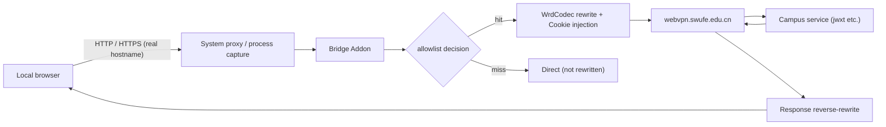

# Data Flow

> Status: Draft ｜ Owner: cherrchen ｜ Last Reviewed: 2026-09-20
>
> Chinese source of truth: [data-flow.md](data-flow.md)

**Purpose**: describe how data travels, transforms and lands in the system; used to assess impact and for troubleshooting.
**Do not write**: entity definitions (→ [data-model.md](data-model.md)), interface signatures (→ [interfaces.md](interfaces.md)).

---

## Main flow

Description: requests from the local browser enter the bridge through the system proxy or process capture, and Bridge Addon decides against the allowlist; a hit means WrdCodec builds the WebVPN URL and attaches the WebVPN Cookie before the request goes to `webvpn.swufe.edu.cn` and on to the campus service, whose response is reverse-rewritten (`Location`, `Set-Cookie`, absolute URLs inside HTML/JS/JSON) back to the browser; a miss goes direct and unrewritten. The client side always uses the real hostname, and only the upstream leg goes through WebVPN. The two capture paths are mutually exclusive (ADR-0006): the system proxy covers all traffic, while "selected apps" lets mitmproxy's local mode take over the chosen applications only, in which case this app sets no system proxy (see DF-005 / DF-007).

## Flow list

| ID | Flow | Trigger | Input | Key transformation | Output | Persistence | Detail |
| -- | ---- | ------- | ----- | ------------------ | ------ | ----------- | ------ |
| DF-001 | Request rewrite | A request hitting the allowlist enters the bridge | Original HTTP/HTTPS request with the real hostname | Exact allowlist decision → WrdCodec builds the WebVPN URL → upstream host becomes `webvpn.swufe.edu.cn` → attach the WebVPN Cookie → minimally adjust `Host`/`Origin`/`Referer` as needed | Rewritten upstream request | none | [components.md](components.md), [api/wrd-codec-library.md](../api/wrd-codec-library.md) |
| DF-002 | Response reverse-rewrite | The WebVPN upstream returns a response | WebVPN-form response | Rewrite in priority order: `Location` → `Set-Cookie` Domain/Path → absolute URLs in `text/html` / `application/javascript` / `application/json`; other content types are left unwritten by default | Response with real-hostname semantics | none | [components.md](components.md), [interfaces.md](interfaces.md) |
| DF-003 | Session acquisition and expiry detection | The user finishes CAS/MFA login; or an expiry signal fires | Cookies from the Login WebView session; probe URL responses | Export via the same strategy or copy a whitelist of Cookies → inject into the bridge; expiry signals (probe returns a login-page marker / `Set-Cookie` clears the session / repeated 302 to CAS after rewriting) trigger the stop-bridge flow | `SessionState` or expiry handling | `userData/session.bin` (encrypted) or an Electron persistent session partition | [data-model.md](data-model.md), [api/electron-ipc.md](../api/electron-ipc.md) |
| DF-004 | CA install and uninstall | The user clicks install/uninstall | The MITM CA in the mitmproxy-specific confdir | Generate/read the CA → call the OS trust store to install or uninstall | CA status (installed / trusted) | mitmproxy-specific confdir | [components.md](components.md), [api/electron-ipc.md](../api/electron-ipc.md), [security/](../security/README.md) |
| DF-005 | System proxy set and clear | Start bridge / stop bridge / session expiry / exit / capture-mode switch | Current OS proxy settings; `captureMode` | Read the OS proxy → if enabled and not this bridge, refuse to start (`PROXY_CONFLICT`) → in `system-proxy` set `127.0.0.1:<bridge_port>` and record the "set by this app" marker; in `selected-apps` set nothing and revoke a proxy previously set by this app (clearing the marker) → clear only when the marker exists | System proxy pointing at the bridge, or restored | `AppSettings.systemProxyManagedByApp` (runtime marker) | [components.md](components.md), [api/electron-ipc.md](../api/electron-ipc.md), [ADR-0006](adr/ADR-0006-local-capture-mode-and-mutual-exclusion.md) |
| DF-006 | Allowlist read/write | UI adds/removes hosts / toggles wildcard / app start | `AllowlistConfig` | Lowercase hosts + exact match; optional swufe wildcard (apex or `.swufe.edu.cn` suffix); hard-coded exclusion of `webvpn.swufe.edu.cn` and `authserver.swufe.edu.cn` | Routing decision | `userData/config.json` | [data-model.md](data-model.md), [api/electron-ipc.md](../api/electron-ipc.md) |
| DF-007 | Capture-mode switch and process capture | The user picks "selected apps / system proxy" or adds/removes candidate applications; the config is pushed when the bridge starts | `captureMode`, `captureProcesses` (intercept patterns), the OS process list | Enumerate capture candidates (macOS `ps -Ao pid=,comm=`, Windows `tasklist /fo csv /nh`) → collapse each application into one row per `.app` bundle path, non-applications use the full executable path → write `capture.processes` in `bridge-config.json` as a whole-set overwrite (always `[]` in `system-proxy`) → the sidecar polls the config once per second, overlays `local:<spec>` onto the same mitmproxy instance (removing it when switching back to the system proxy) and reports `swufe-capture` | `localCaptureEnabled` / `BridgeStatus.captureError`; the captured applications' traffic enters the local bridge | `userData/config.json` (`settings.captureMode` / `captureProcesses`) and `userData/bridge-config.json` (`capture.processes`) | [components.md](components.md), [api/bridge-control-protocol.md](../api/bridge-control-protocol.md), [ADR-0006](adr/ADR-0006-local-capture-mode-and-mutual-exclusion.md) |

## Data lifecycle

| Stage | Description | Retention policy |
| ----- | ----------- | ---------------- |
| Collection / receipt | DF-003 collects WebVPN session Cookies from the Login WebView session | Only the Cookies needed for the session plus minimal ancillary state; passwords are never collected |
| Validation | DF-003 expiry detection: login-page marker, `Set-Cookie` clearing, repeated 302 to CAS after rewriting | Continuous while the bridge runs; a hit triggers the stop-bridge flow |
| Storage | `userData/config.json` (settings + allowlist, settings holding `captureMode` / `captureProcesses`), `userData/bridge-config.json` (the runtime config pushed to the sidecar), `userData/session.bin` (encrypted) or an Electron persistent session partition, CA in the mitmproxy-specific confdir | The runtime config is written as a whole-file overwrite on every bridge start / settings change; Cookies live in the user directory with tightened permissions; the CA private key stays local |
| Use / derivation | DF-001/DF-002 use the Cookies and allowlist; DF-005 uses the "set by this app" marker; DF-007 uses `captureMode` / `captureProcesses` and reports the capture state | Session and marker are only valid while the bridge runs, and the marker expires with the clearing action; process capture is only in effect while the bridge is `running` and the capture mode is `selected-apps` |
| Archival / deletion | Logout clears Cookies; uninstalling the CA removes trust; stopping/exiting clears the system proxy set by this app | No historical sessions kept; no cloud account system |

## Consistency requirements

| Flow | Consistency requirement | Failure behaviour |
| ---- | ----------------------- | ----------------- |
| DF-005 | Strong: the `systemProxyManagedByApp` marker and the proxy state must agree (marker present ⇔ proxy set by this app) | On mismatch, never clear a proxy this app did not set; keeping the user's own setting is preferable to wrongly clearing it |
| DF-004 / DF-005 | After shutdown there must be no residue: no half-open system proxy; the CA can be uninstalled at any time | If residue is detected after stopping/expiring/exiting, enter the error state and expose an observable signal (`BRIDGE_CRASH`) |
| DF-006 | Idempotent: exact allowlist matching is idempotent, the same host always yields the same result; repeated `setAllowlist` calls give the same result | An uncertain match conservatively counts as a miss (direct, unrewritten) |
| DF-003 | Session-expiry handling must complete all three steps together (stop the bridge, clear the system proxy, stop process capture); no half-open state | If not all three complete, treat it as an error state exposing `SESSION_EXPIRED` |
| DF-002 | URL semantics are stable before and after rewriting: the client side always presents the real hostname, only the upstream leg goes through WebVPN | Unstable semantics cause navigation to unreachable addresses, surfacing as abnormal rewrite results (see R1) |
| DF-001 | Rewriting applies only to allowlist hosts; `webvpn.swufe.edu.cn` / `authserver.swufe.edu.cn` are never wrapped twice | Violation creates a loop, login and bridge traffic self-loop (`SESSION_EXPIRED` or login failure) |
| DF-007 | Mutual exclusion: in `captureMode = 'selected-apps'` no system proxy is set and one previously set by this app is revoked; in `captureMode = 'system-proxy'` `capture.processes` is always empty; a process-capture failure must not change the bridge state (it stays `running`) | Violating the exclusion makes a captured application's `CONNECT` go through the system proxy into the transparent layer and hard-fail (silent half-broken); a capture failure only updates `captureError` and `localCaptureEnabled` |

## Exception paths

| Scenario | Expected behaviour | Observable signal |
| -------- | ------------------ | ----------------- |
| `PROXY_CONFLICT` | Refuse to start, the bridge never reaches `running`; prompt to close Clash / mihomo / sing-box first | `BridgeStatus.error.code = PROXY_CONFLICT` |
| `CA_MISSING` | The HTTPS rewrite path is unavailable; guide the user to install the CA | Error code `CA_MISSING`; `getCaStatus().installed = false` |
| `NOT_LOGGED_IN` | Refuse to start the bridge; guide the user to log in | Error code `NOT_LOGGED_IN`; `BridgeStatus.loggedIn = false` |
| `SESSION_EXPIRED` | Stop the bridge → clear the system proxy → stop process capture → modal re-login | State machine `running → stopping → idle`; error code `SESSION_EXPIRED` |
| `BRIDGE_CRASH` | The mitm sidecar exits; the bridge enters `error` then `idle`; prompt to check logs or restart | Error code `BRIDGE_CRASH`; the sidecar process disappears |
| `ALLOWLIST_EMPTY` | No host to rewrite; block start and prompt to add hosts | Error code `ALLOWLIST_EMPTY` |
| Session expiry (signal hit) | Same path as `SESSION_EXPIRED`: stop the bridge automatically and prompt re-login | Probe returns a login-page marker / `Set-Cookie` clears the session / repeated 302 to CAS after rewriting |
| Process-capture failure (system extension not authorised / timeout / invalid intercept spec) | The bridge stays `running` and the UI shows the reason in place, plus the macOS authorisation guidance and a "retry" button; there is no automatic retry until the runtime config is rewritten | `BridgeStatus.captureError` non-empty, `localCaptureEnabled = false`; the sidecar's stderr `swufe-capture {"enabled":false,…}` |
