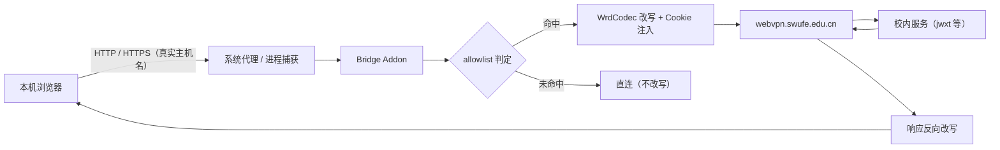

# 数据流

> Status: Draft ｜ Owner: cherrchen ｜ Last Reviewed: 2026-09-23

**用途**：描述数据在系统中的流转路径、变换与落点，用于评估影响面与排障。
**不写**：实体定义（→ [data-model.md](data-model.md)）、接口签名（→ [interfaces.md](interfaces.md)）。

---

## 主流程

说明：来自本机浏览器的请求先经系统代理或进程捕获进入本机桥，由 Bridge Addon 做 allowlist 判定；命中则用 WrdCodec 生成 WebVPN URL、附加 WebVPN Cookie 后发往 `webvpn.swufe.edu.cn`，再由校内服务返回，响应经反向改写（`Location`、`Set-Cookie`、HTML/JS/JSON 内绝对 URL）回到浏览器；未命中则直连且不改写。客户端侧始终使用真实主机名，仅上行改走 WebVPN；两条例外（[ADR-0007](adr/ADR-0007-gateway-owned-namespaces-and-native-mode-promotion.md)）：路径以 `/wengine-vpn/`、`/authserver/` 开头时不经 token、直接取自网关根（其响应不反向改写）；命中网关 bootstrap 判据（`text/html` + ≤ 8192 B + 同时含 `__vpn_` 与 `/wengine-vpn/js/main.js`）的 HTML 文档由 Bridge Addon 以 `302` 升级到网关原生 URL 空间（`https://webvpn.swufe.edu.cn/<scheme>/<token>/…`），该主机此后不再经本桥改写。两种接管方式互斥（ADR-0006）：系统代理覆盖全部流量；「指定应用」由 mitmproxy local 模式只接管所选应用，此时本 App 不设置系统代理（见 DF-005 / DF-007）。

下表 DF-001–DF-009 延续桌面 Phase 1 的流转；其中会话失效信号只描述桌面桥规则。iOS 插件另有 Gateway Session Store 与 direct Gateway request 分类注入流程，见 DF-010、[Spec 003](../../specs/003-ios-proxy-client-plugins/architecture.md) 与 [ADR-0015](adr/ADR-0015-session-realm-and-proxy-reuse.md)。iOS 中 CAS 页面/redirect 不能单独作为 Gateway Session 失效证据。

## 流程清单

| ID | 流程 | 触发 | 输入 | 关键变换 | 输出 | 持久化 | 详见 |
| -- | ---- | ---- | ---- | -------- | ---- | ------ | ---- |
| DF-001 | 请求改写 | 命中 allowlist 的请求进入本机桥 | 真实主机名的原始 HTTP/HTTPS 请求 | allowlist 精确判定 → WrdCodec 生成 WebVPN URL → 上游主机改为 `webvpn.swufe.edu.cn` → 附加 WebVPN Cookie → 按需最小调整 `Host`/`Origin`/`Referer` | 改写后的上行请求 | 无 | [components.md](components.md)、[api/wrd-codec-library.md](../api/wrd-codec-library.md) |
| DF-002 | 响应反向改写与 bootstrap 升级 | WebVPN 上游返回响应 | WebVPN 形态响应 | 网关自有命名空间的响应原样透传；其余按优先级改写：`Location` → `Set-Cookie` 的 Domain/Path → `text/html` / `application/javascript` / `application/json` 中绝对 URL，其它内容类型默认不改写；命中 bootstrap 判据的 HTML（`GET`/`HEAD`）改以 `302` + `Cache-Control: no-store` 升级到同一 URL 的 WRD 形态 | 真实主机名语义的响应，或指向网关原生 URL 空间的 `302` | 无 | [components.md](components.md)、[interfaces.md](interfaces.md)、[ADR-0007](adr/ADR-0007-gateway-owned-namespaces-and-native-mode-promotion.md) |
| DF-003 | 会话获取与失效检测 | 用户完成 CAS/MFA 登录；或票据到期；或真实流量出现失效信号 | 登录 WebView session 的 Cookie（票据过期时间） | 同策略导出或白名单拷贝 Cookie → 注入桥；本地时钟到 `expiresAt`，或改写响应 `302 → /login` / `Set-Cookie` 清空票据，触发停桥。不再定时探测门户 | `SessionState` 或过期处理 | Electron Session 持久分区 | [data-model.md](data-model.md)、[api/electron-ipc.md](../api/electron-ipc.md) |
| DF-004 | CA 安装与卸载 | 用户点击安装/卸载 | mitmproxy 专用 confdir 中的 MITM CA | 生成/读取 CA → 调用 OS 信任库安装或卸载 | CA 状态（installed / trusted） | mitmproxy 专用 confdir | [components.md](components.md)、[api/electron-ipc.md](../api/electron-ipc.md)、[security/](../security/README.md) |
| DF-005 | 系统代理设置与清除 | 开桥 / 关桥 / 会话过期 / 退出 / 切换捕获方式 | OS 当前代理设置；`captureMode` | 读 OS 代理 → 已启用且非本桥则拒绝启动（`PROXY_CONFLICT`）→ 解析配置的网关主机，落在 fake-ip 段（`198.18.0.0/15`）同样以 `PROXY_CONFLICT` 拒绝（[ADR-0011](adr/ADR-0011-refuse-start-on-fake-ip-dns.md)）→ `system-proxy` 时设 `127.0.0.1:<bridge_port>` 并记「由本 App 设置」标记；`selected-apps` 时不设置，并在切换时撤销此前由本 App 设置过的（清标记）→ 关闭时仅在标记存在时清除 | 系统代理指向本桥或恢复原状 | `AppSettings.systemProxyManagedByApp`（运行时标记） | [components.md](components.md)、[api/electron-ipc.md](../api/electron-ipc.md)、[ADR-0006](adr/ADR-0006-local-capture-mode-and-mutual-exclusion.md) |
| DF-006 | allowlist 读写 | UI 增删主机 / 切换通配 / App 启动 | `AllowlistConfig` | 主机小写化 + 精确匹配；可选 swufe 通配（apex 或 `.swufe.edu.cn` 后缀）；硬编码排除 `webvpn.swufe.edu.cn` 与 `authserver.swufe.edu.cn` | 路由判定结果 | `userData/config.json` | [data-model.md](data-model.md)、[api/electron-ipc.md](../api/electron-ipc.md) |
| DF-007 | 捕获方式切换与进程捕获 | 用户选择「指定应用 / 系统代理」或增删候选应用；开桥时下发配置 | `captureMode`、`captureProcesses`（intercept pattern）、OS 进程列表 | 枚举候选应用（macOS `ps -Ao pid=,comm=`、Windows `tasklist /fo csv /nh`）→ 应用按 `.app` 包路径归并为一行、非应用用可执行文件全路径 → 整体覆盖写入 `bridge-config.json` 的 `capture.processes`（`system-proxy` 下恒为 `[]`）→ sidecar 每秒轮询配置，把 `local:<spec>` 叠加到同一个 mitmproxy 实例（切回系统代理则移除）并回报 `swufe-capture` | `localCaptureEnabled` / `BridgeStatus.captureError`；被捕获应用的流量进入本机桥 | `userData/config.json`（`settings.captureMode` / `captureProcesses`）与 `userData/bridge-config.json`（`capture.processes`） | [components.md](components.md)、[api/bridge-control-protocol.md](../api/bridge-control-protocol.md)、[ADR-0006](adr/ADR-0006-local-capture-mode-and-mutual-exclusion.md) |
| DF-008 | 窗口打开（二级窗口） | 主窗口点 `[选择应用…]` / `[管理…]`，或打开「调试日志」开关（日志窗口由开关关闭后重开同样走此路径） | Renderer 的 `openCaptureWindow` / `openLogWindow` / `openAllowlistWindow` 调用 | Main 查窗口注册表：已存在则 `restore()` / `show()` / `focus()`；否则按 `WINDOW_SPECS` 创建（生产 `loadFile('<appRoot>/dist/renderer/<entry>.html')`，开发期 `loadURL('<devServerUrl>/<entry>.html')`）并 `ready-to-show` 后显示 → 新窗口挂载后自行经 preload 拉取初始状态（`getStatus` / `getSettings` / `getAllowlist` / `getCaStatus` / `listCaptureCandidates` / `getDebugLogs`） | 窗口出现且显示与 Main 一致的当前状态 | 无 | [components.md](components.md)（Window Registry）、[api/electron-ipc.md](../api/electron-ipc.md) |
| DF-009 | 广播到全部窗口 | 桥状态变化 / 调试日志产生 / 会话过期 / `setAllowlist` 成功 | `BridgeStatus`、`DebugLogEvent` | Main 遍历**全部存活窗口** `webContents.send`（`onStatus` / `onDebugLog` / `onSessionExpired`；M2/M3 只投递主窗口）；调试日志事件**先写入 Main 环形缓冲（≤200、最新在前、仅内存）再广播**；渲染层按常规 100ms 合并渲染（饱和且 >50 条/秒时 250ms） | 各窗口刷新状态条 / 日志表格 / 会话过期模态 | 环形缓冲仅驻留内存（不落盘） | [components.md](components.md)（Debug Log Buffer）、[api/electron-ipc.md](../api/electron-ipc.md)、[ADR-0012](adr/ADR-0012-react-antd-multiwindow-renderer.md) |
| DF-010 | iOS 插件 Gateway Session 复用（Spec 003） | Safari 登录流量经过 Stash/Loon；另一 App/WKWebView 请求 Gateway | Gateway host request、request Cookie、Plugin Gateway Session Store | 先本地终结 Settings Namespace，再分类 Gateway Request Kind；request 已带核心 ticket 时保留并 capture/refresh 后 PASS；无 ticket 时仅对获准 kind、无 login intent 且 stored Session schema/host/ticket/expiry 可用的请求注入。raw authserver 与普通源站不注入。 | 仅发往 webvpn.swufe.edu.cn 的 Gateway request | Stash/Loon persistent store 的 swufe.session.v1；仅 webvpn-gateway Realm | [Spec 003](../../specs/003-ios-proxy-client-plugins/architecture.md)、[ADR-0015](adr/ADR-0015-session-realm-and-proxy-reuse.md) |

## 数据生命周期

| 阶段 | 说明 | 保留策略 |
| ---- | ---- | -------- |
| 采集 / 接收 | DF-003 从登录 WebView 的 session 采集 WebVPN 会话 Cookie | 仅采集会话所需 Cookie 及最小附属状态；不采集密码 |
| 校验（桌面桥） | DF-003 失效检测：探测登录页标记、`Set-Cookie` 清空、连续改写后 302 到 CAS | 每次桥运行期间持续进行；命中即触发停桥流程 |
| 存储 | `userData/config.json`（settings + allowlist，settings 含 `captureMode` / `captureProcesses`）、`userData/bridge-config.json`（下发 sidecar 的运行时配置）、`userData/session.bin`（加密）或 Electron Session 持久分区、CA 用 mitmproxy 专用 confdir | 运行时配置随每次开桥 / 设置变更整体覆盖写入；Cookie 存用户目录且权限收紧；CA 私钥仅本机；调试日志环形缓冲只驻留 Main 内存（≤200 条、最新在前），不落盘 |
| 使用 / 派生 | DF-001/DF-002 使用 Cookie 与 allowlist；DF-005 使用「由本 App 设置」标记；DF-007 使用 `captureMode` / `captureProcesses` 并回报捕获状态；DF-008/DF-009 用窗口注册表与环形缓冲把状态、日志与过期通知投递到全部存活窗口 | 会话与标记只在桥运行期间有效，标记随清除动作失效；进程捕获只在桥 `running` 且捕获方式为 `selected-apps` 时生效 |
| 归档 / 删除 | 退出登录清 Cookie；卸载 CA 移除信任；关闭/退出清除本 App 设置的系统代理 | 不保留历史会话；无云端账号体系 |

## 一致性要求

| 流程 | 一致性要求 | 失败行为 |
| ---- | ---------- | -------- |
| DF-005 | 强一致：`systemProxyManagedByApp` 标记与代理状态必须一致（标记存在 ⇔ 代理由本 App 设置） | 不一致时不得清除非本 App 设置的代理；宁可保留也不误清用户自有设置 |
| DF-004 / DF-005 | 关闭后必须无残留：不留半开系统代理；CA 可随时一键卸载 | 关闭/过期/退出后若检测到残留，进入错误状态并给出可观测信号（`BRIDGE_CRASH`） |
| DF-006 | 幂等：allowlist 精确匹配为幂等判定，同一主机多次判定结果稳定；`setAllowlist` 重复调用结果一致 | 匹配不确定即视为不命中的保守行为（直连不改写） |
| DF-003 | 会话失效处理的三步（停桥、清系统代理、停进程捕获）必须同时完成，不出现半开状态 | 未完成全部三步即视为错误状态，暴露 `SESSION_EXPIRED` |
| DF-002 | 改写前后 URL 语义稳定：客户端侧始终呈现真实主机名，仅上行改走 WebVPN；例外只允许两处——网关自有根命名空间直通与命中判据的 bootstrap 文档升级（ADR-0007），且升级只改变入口文档的地址（不改变页面内容） | 语义不稳定会导致跳转到不可达地址，暴露为改写结果异常（见 R1）；判据误命中会把普通页面也升级，靠「≤8192 B + 双标记」与 L1 用例兜住 |
| DF-001 | 改写只作用于 allowlist 主机；`webvpn.swufe.edu.cn` / `authserver.swufe.edu.cn` 永不二次包装 | 违反即形成环路，登录与桥流量出现自环（`SESSION_EXPIRED` 或登录失败） |
| DF-007 | 互斥：`captureMode = 'selected-apps'` 时不设置系统代理，并撤销此前由本 App 设置过的；`captureMode = 'system-proxy'` 时 `capture.processes` 恒为空；进程捕获失败不得改变桥状态（仍 `running`） | 违反互斥会让被捕获应用的 `CONNECT` 经系统代理进入 transparent 层并硬失败（静默半坏）；捕获失败只更新 `captureError` 与 `localCaptureEnabled` |
| DF-008 | 单实例：同一类窗口至多存在一个（重复触达入口即聚焦已有窗口）；二级窗口不设 `parent`、不阻塞主窗口；主窗口关闭即退出 | 违反即出现重复窗口或主窗口被模态阻塞（对应 AC2-008 的单实例口径） |
| DF-009 | 顺序与有界：调试日志先写入 Main 环形缓冲再广播（重开窗口的历史与推流不重不漏）；缓冲 ≤200 条且最新在前；广播只发给存活窗口 | 顺序颠倒会让重开窗口的历史与推流错位；缓冲不设界即内存无上限（NFR-003） |

## 异常路径

| 场景 | 期望行为 | 可观测信号 |
| ---- | -------- | ---------- |
| `PROXY_CONFLICT` | 拒绝启动，桥不进入 `running`；提示先关闭 Clash / mihomo / sing-box 等——包括系统代理被占用、以及网关主机解析到 fake-ip 段（TUN 模式，[ADR-0011](adr/ADR-0011-refuse-start-on-fake-ip-dns.md)）两种情况 | `BridgeStatus.error.code = PROXY_CONFLICT` |
| `CA_MISSING` | HTTPS 改写路径不可用；引导用户安装 CA | 错误码 `CA_MISSING`；`getCaStatus().installed = false` |
| `NOT_LOGGED_IN` | 拒绝开桥；引导去登录 | 错误码 `NOT_LOGGED_IN`；`BridgeStatus.loggedIn = false` |
| `SESSION_EXPIRED` | 停桥 → 清系统代理 → 停进程捕获 → 弹窗重登 | 状态机 `running → stopping → idle`；错误码 `SESSION_EXPIRED` |
| `BRIDGE_CRASH` | mitm sidecar 退出，桥进入 `error` 后回到 `idle`；提示查看日志或重启桥 | 错误码 `BRIDGE_CRASH`；sidecar 进程消失 |
| `ALLOWLIST_EMPTY` | 无可改写主机，阻止开桥并提示添加主机 | 错误码 `ALLOWLIST_EMPTY` |
| 会话过期（信号命中） | 与 `SESSION_EXPIRED` 同一路径：自动停桥并弹窗重登 | 探测返回登录页标记 / `Set-Cookie` 清空会话 / 连续改写后 302 到 CAS |
| 进程捕获失败（未授权系统扩展 / 超时 / intercept spec 非法） | 桥保持 `running`，界面就地显示失败原因 + macOS 授权引导 + 「重试」；不自动重试，直到运行时配置被重写 | `BridgeStatus.captureError` 非空、`localCaptureEnabled = false`；sidecar stderr 的 `swufe-capture {"enabled":false,…}` |
