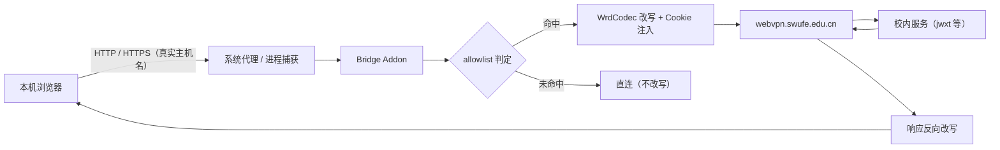

# 数据流

> Status: Draft ｜ Owner: cherrchen ｜ Last Reviewed: 2026-09-20

**用途**：描述数据在系统中的流转路径、变换与落点，用于评估影响面与排障。
**不写**：实体定义（→ [data-model.md](data-model.md)）、接口签名（→ [interfaces.md](interfaces.md)）。

---

## 主流程

说明：来自本机浏览器的请求先经系统代理或进程捕获进入本机桥，由 Bridge Addon 做 allowlist 判定；命中则用 WrdCodec 生成 WebVPN URL、附加 WebVPN Cookie 后发往 `webvpn.swufe.edu.cn`，再由校内服务返回，响应经反向改写（`Location`、`Set-Cookie`、HTML/JS/JSON 内绝对 URL）回到浏览器；未命中则直连且不改写。客户端侧始终使用真实主机名，仅上行改走 WebVPN。

## 流程清单

| ID | 流程 | 触发 | 输入 | 关键变换 | 输出 | 持久化 | 详见 |
| -- | ---- | ---- | ---- | -------- | ---- | ------ | ---- |
| DF-001 | 请求改写 | 命中 allowlist 的请求进入本机桥 | 真实主机名的原始 HTTP/HTTPS 请求 | allowlist 精确判定 → WrdCodec 生成 WebVPN URL → 上游主机改为 `webvpn.swufe.edu.cn` → 附加 WebVPN Cookie → 按需最小调整 `Host`/`Origin`/`Referer` | 改写后的上行请求 | 无 | [components.md](components.md)、[api/wrd-codec-library.md](../api/wrd-codec-library.md) |
| DF-002 | 响应反向改写 | WebVPN 上游返回响应 | WebVPN 形态响应 | 按优先级改写：`Location` → `Set-Cookie` 的 Domain/Path → `text/html` / `application/javascript` / `application/json` 中绝对 URL；其它内容类型默认不改写 | 真实主机名语义的响应 | 无 | [components.md](components.md)、[interfaces.md](interfaces.md) |
| DF-003 | 会话获取与失效检测 | 用户完成 CAS/MFA 登录；或失效信号命中 | 登录 WebView session 的 Cookie；探测 URL 的响应 | 同策略导出或白名单拷贝 Cookie → 注入桥；失效信号（探测返回登录页标记 / `Set-Cookie` 清空会话 / 连续改写后 302 到 CAS）触发停桥流程 | `SessionState` 或过期处理 | `userData/session.bin`（加密）或 Electron Session 持久分区 | [data-model.md](data-model.md)、[api/electron-ipc.md](../api/electron-ipc.md) |
| DF-004 | CA 安装与卸载 | 用户点击安装/卸载 | mitmproxy 专用 confdir 中的 MITM CA | 生成/读取 CA → 调用 OS 信任库安装或卸载 | CA 状态（installed / trusted） | mitmproxy 专用 confdir | [components.md](components.md)、[api/electron-ipc.md](../api/electron-ipc.md)、[security/](../security/README.md) |
| DF-005 | 系统代理设置与清除 | 开桥 / 关桥 / 会话过期 / 退出 | OS 当前代理设置 | 读 OS 代理 → 已启用且非本桥则拒绝启动（`PROXY_CONFLICT`）→ 否则设 `127.0.0.1:<bridge_port>` 并记「由本 App 设置」标记 → 关闭时仅在标记存在时清除 | 系统代理指向本桥或恢复原状 | `AppSettings.systemProxyManagedByApp`（运行时标记） | [components.md](components.md)、[api/electron-ipc.md](../api/electron-ipc.md) |
| DF-006 | allowlist 读写 | UI 增删主机 / 切换通配 / App 启动 | `AllowlistConfig` | 主机小写化 + 精确匹配；可选 swufe 通配（apex 或 `.swufe.edu.cn` 后缀）；硬编码排除 `webvpn.swufe.edu.cn` 与 `authserver.swufe.edu.cn` | 路由判定结果 | `userData/config.json` | [data-model.md](data-model.md)、[api/electron-ipc.md](../api/electron-ipc.md) |

## 数据生命周期

| 阶段 | 说明 | 保留策略 |
| ---- | ---- | -------- |
| 采集 / 接收 | DF-003 从登录 WebView 的 session 采集 WebVPN 会话 Cookie | 仅采集会话所需 Cookie 及最小附属状态；不采集密码 |
| 校验 | DF-003 失效检测：探测登录页标记、`Set-Cookie` 清空、连续改写后 302 到 CAS | 每次桥运行期间持续进行；命中即触发停桥流程 |
| 存储 | `userData/config.json`（settings + allowlist）、`userData/session.bin`（加密）或 Electron Session 持久分区、CA 用 mitmproxy 专用 confdir | Cookie 存用户目录且权限收紧；CA 私钥仅本机 |
| 使用 / 派生 | DF-001/DF-002 使用 Cookie 与 allowlist；DF-005 使用「由本 App 设置」标记 | 会话与标记只在桥运行期间有效，标记随清除动作失效 |
| 归档 / 删除 | 退出登录清 Cookie；卸载 CA 移除信任；关闭/退出清除本 App 设置的系统代理 | 不保留历史会话；无云端账号体系 |

## 一致性要求

| 流程 | 一致性要求 | 失败行为 |
| ---- | ---------- | -------- |
| DF-005 | 强一致：`systemProxyManagedByApp` 标记与代理状态必须一致（标记存在 ⇔ 代理由本 App 设置） | 不一致时不得清除非本 App 设置的代理；宁可保留也不误清用户自有设置 |
| DF-004 / DF-005 | 关闭后必须无残留：不留半开系统代理；CA 可随时一键卸载 | 关闭/过期/退出后若检测到残留，进入错误状态并给出可观测信号（`BRIDGE_CRASH`） |
| DF-006 | 幂等：allowlist 精确匹配为幂等判定，同一主机多次判定结果稳定；`setAllowlist` 重复调用结果一致 | 匹配不确定即视为不命中的保守行为（直连不改写） |
| DF-003 | 会话失效处理的三步（停桥、清系统代理、停进程捕获）必须同时完成，不出现半开状态 | 未完成全部三步即视为错误状态，暴露 `SESSION_EXPIRED` |
| DF-002 | 改写前后 URL 语义稳定：客户端侧始终呈现真实主机名，仅上行改走 WebVPN | 语义不稳定会导致跳转到不可达地址，暴露为改写结果异常（见 R1） |
| DF-001 | 改写只作用于 allowlist 主机；`webvpn.swufe.edu.cn` / `authserver.swufe.edu.cn` 永不二次包装 | 违反即形成环路，登录与桥流量出现自环（`SESSION_EXPIRED` 或登录失败） |

## 异常路径

| 场景 | 期望行为 | 可观测信号 |
| ---- | -------- | ---------- |
| `PROXY_CONFLICT` | 拒绝启动，桥不进入 `running`；提示先关闭 Clash / mihomo / sing-box 等 | `BridgeStatus.error.code = PROXY_CONFLICT` |
| `CA_MISSING` | HTTPS 改写路径不可用；引导用户安装 CA | 错误码 `CA_MISSING`；`getCaStatus().installed = false` |
| `NOT_LOGGED_IN` | 拒绝开桥；引导去登录 | 错误码 `NOT_LOGGED_IN`；`BridgeStatus.loggedIn = false` |
| `SESSION_EXPIRED` | 停桥 → 清系统代理 → 停进程捕获 → 弹窗重登 | 状态机 `running → stopping → idle`；错误码 `SESSION_EXPIRED` |
| `BRIDGE_CRASH` | mitm sidecar 退出，桥进入 `error` 后回到 `idle`；提示查看日志或重启桥 | 错误码 `BRIDGE_CRASH`；sidecar 进程消失 |
| `ALLOWLIST_EMPTY` | 无可改写主机，阻止开桥并提示添加主机 | 错误码 `ALLOWLIST_EMPTY` |
| 会话过期（信号命中） | 与 `SESSION_EXPIRED` 同一路径：自动停桥并弹窗重登 | 探测返回登录页标记 / `Set-Cookie` 清空会话 / 连续改写后 302 到 CAS |
