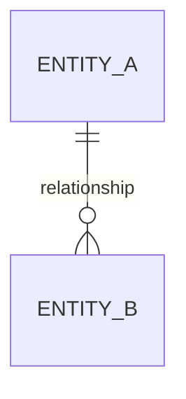

# Data Model

> Status: TBD ｜ Owner: <OWNER> ｜ Last Reviewed: <DATE>
>
> Chinese source of truth: [data-model.md](data-model.md)

**Purpose**: define core entities, relationships and invariants; the source of truth for data-related changes.
**Do not write**: storage technology choices (that is an ADR), migration scripts (that is a spec's `migration.md`, see [specs/README.md](../../specs/README.md)).

---

## Entity list

| Entity | Description | Lifecycle | Detail |
| ------ | ----------- | --------- | ------ |
| TBD | TBD | TBD | TBD |

## Relationship diagram



> Delete this section when there are no entities; do not draw relationships before they are confirmed.

## Entity template

```markdown
### <entity>

- Description: …
- Identity: …
- Key attributes:

  | Attribute | Type | Required | Constraint | Notes |
  | --------- | ---- | -------- | ---------- | ----- |

- Invariants: …
- Lifecycle: created … / updated … / deleted …
- Owner: …
- Related requirements: REQ-xxx
```

## Invariants

| ID | Invariant | Consequence of violation | Validated at |
| -- | --------- | ------------------------ | ------------ |
| INV-001 | TBD | TBD | TBD |

## Storage and migration

| Item | Location |
| ---- | -------- |
| Storage decision | ADR (see [adr/README.md](adr/README.md)) |
| Migration approach | the feature spec's `migration.md` |
| Backup / recovery | [docs/operations/](../operations/README.md) |

## Change process

Before changing the data model:

1. Update this file (entities, invariants);
2. Assess whether an ADR is required (a material data-model change requires one);
3. Define migration and rollback in the spec;
4. Update the verification entries in [verification](../../specs/_template/verification.md).
