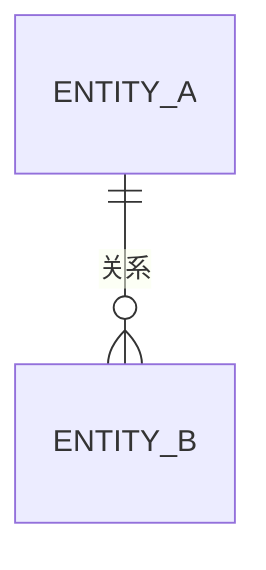

# 数据模型

> Status: TBD ｜ Owner: <OWNER> ｜ Last Reviewed: <DATE>

**用途**：定义核心实体、关系与不变式，是数据相关改动的 Source of Truth。
**不写**：具体存储技术选型（属于 ADR）、表结构迁移脚本（属于对应 Spec 的 `migration.md`，见 [specs/README.md](../../specs/README.md)）。

---

## 实体清单

| 实体 | 说明 | 生命周期 | 详见 |
| ---- | ---- | -------- | ---- |
| TBD | TBD | TBD | TBD |

## 关系图



> 无实体时删除本节；实体未确认前不要画关系图。

## 实体模板

```markdown
### <实体名>

- 说明：……
- 标识：……
- 关键属性：

  | 属性 | 类型 | 必填 | 约束 | 说明 |
  | ---- | ---- | ---- | ---- | ---- |

- 不变式：……
- 生命周期：创建 … / 更新 … / 删除 …
- 所有者：……
- 关联需求：REQ-xxx
```

## 不变式（Invariants）

| ID | 不变式 | 违反后果 | 校验位置 |
| -- | ------ | -------- | -------- |
| INV-001 | TBD | TBD | TBD |

## 存储与迁移

| 内容 | 位置 |
| ---- | ---- |
| 存储选型决策 | ADR（见 [adr/README.md](adr/README.md)） |
| 迁移方案 | 对应 Feature Spec 的 `migration.md` |
| 备份 / 恢复 | [docs/operations/](../operations/README.md) |

## 变更流程

修改数据模型前必须：

1. 更新本文件（实体、不变式）；
2. 评估是否需要 ADR（数据模型重大改变 ⇒ 必须）；
3. 在 Spec 中定义迁移与回滚；
4. 更新 [verification](../../specs/_template/verification.md) 中的验证项。
