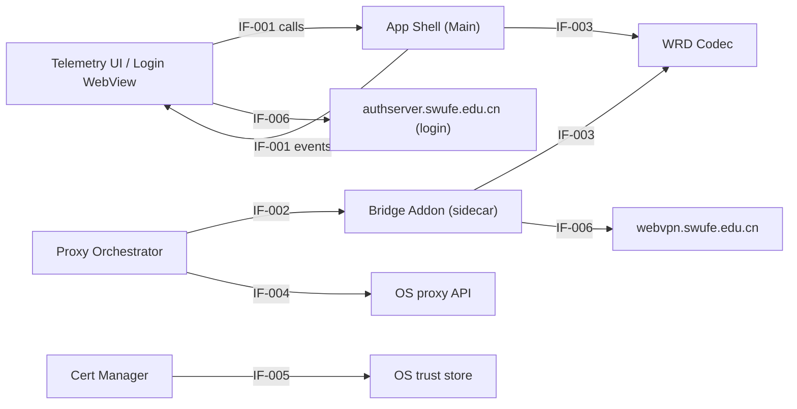

# Interfaces

> Status: Draft ｜ Owner: cherrchen ｜ Last Reviewed: 2026-09-20
>
> Chinese source of truth: [interfaces.md](interfaces.md)

**Purpose**: define the **boundaries** between modules and between the system and the outside: who provides, who consumes, what the contract is, and how compatibility is guaranteed.
**Do not write**: field-level API definitions (→ [docs/api/](../api/README.md)), data entities (→ [data-model.md](data-model.md)).

---

## Interface list

| ID | Interface | Provider | Consumer | Type | Stability | Detail |
| -- | --------- | -------- | -------- | ---- | --------- | ------ |
| IF-001 | Renderer ↔ Main (preload `window.swufeBridge`) | App Shell (Electron Main) | Telemetry UI, Login WebView (Renderer) | in-process | Internal | [api/electron-ipc.md](../api/electron-ipc.md) |
| IF-002 | Main ↔ mitm sidecar control | Bridge Addon (mitmproxy sidecar) | Proxy Orchestrator (Main) | inter-process (local) | Internal / Evolving | [api/bridge-control-protocol.md](../api/bridge-control-protocol.md) |
| IF-003 | Bridge Addon ↔ WRD Codec library | WRD Codec | Bridge Addon, App Shell | in-process | Evolving | [api/wrd-codec-library.md](../api/wrd-codec-library.md) |
| IF-004 | App ↔ OS proxy API | OS (system API) | Proxy Orchestrator | local system API | Evolving | [components.md](components.md) |
| IF-005 | App ↔ OS trust store | OS (system API) | Cert Manager | local system API | Evolving | [components.md](components.md) |
| IF-006 | App ↔ `webvpn.swufe.edu.cn` / `authserver.swufe.edu.cn` | Campus WebVPN / CAS | Bridge Addon, Login WebView | network HTTPS | Evolving | [components.md](components.md) |

## Boundary diagram

Description: the in-process boundary IF-001 is a stable contract (Internal); IF-003 is also in-process but may still change with the implementation (Evolving); the inter-process boundary (IF-002) and the external boundaries (IF-004–IF-006) change with the sidecar implementation and the external systems. The two IF-006 edges correspond to "login (authserver → webvpn)" and "rewritten business requests (Bridge Addon → webvpn)"; login traffic must not enter the rewrite path.

## Interface contracts

### IF-001 Renderer ↔ Main (preload `window.swufeBridge`)

- Provider: App Shell (Electron Main).
- Consumer: Telemetry UI, Login WebView (Renderer).
- Stability: Internal (app-internal only; breaking changes still need assessment).
- Input: method calls `login` / `logout` / `getSession`, `startBridge` / `stopBridge` / `getStatus`, `getAllowlist` / `setAllowlist`, `installCa` / `uninstallCa` / `getCaStatus`, `listCaptureCandidates` / `setCapturePids`, `setDebugLogging`; event subscription `onDebugLog`.
- Output: `BridgeStatus`, `AllowlistConfig`, CA status, session state, `DebugLogEvent`. Field-level definitions in [api/electron-ipc.md](../api/electron-ipc.md).
- Error model: `BridgeStatus.error.code` takes the fixed codes `PROXY_CONFLICT` / `CA_MISSING` / `NOT_LOGGED_IN` / `SESSION_EXPIRED` / `BRIDGE_CRASH` / `ALLOWLIST_EMPTY`; CA operations use `{ok, message}`.
- Idempotency: `getStatus` / `getSession` / `getAllowlist` / `getCaStatus` are idempotent reads; `setAllowlist` is idempotent; `startBridge` / `stopBridge` / `installCa` / `uninstallCa` are not (repeated calls are handled by the state machine).
- Versioning: preload and Main are built and versioned together; no cross-version mixing.
- Compatibility commitment: added methods/fields are backward compatible; removals or signature changes are breaking (allowed exceptions in "Compatibility strategy").
- Related spec / ADR: [specs/001-phase1-local-bridge](../../specs/001-phase1-local-bridge/spec.md), [ADR-0003](adr/ADR-0003-electron-gui-for-phase-1.md).

### IF-002 Main ↔ mitm sidecar control

- Provider: Bridge Addon (mitmproxy sidecar).
- Consumer: Proxy Orchestrator (Main).
- Stability: Internal / Evolving (consumed only inside this app; two options are listed and not finalised, so no stability promise is made until then).
- Input: child-process lifecycle + config hot reload (option A); or the local control port `127.0.0.1:control` with `GET /health`, `POST /config` (body `{allowlist, cookies, debug}`), `POST /shutdown` (option B).
- Output: health status; config application result; graceful shutdown result.
- Error model: TBD (the error body is undefined; option A signals via exit code and logs).
- Idempotency: `GET /health` is idempotent; `POST /shutdown` is idempotent; `POST /config` is idempotent with "last config wins" semantics.
- Versioning: the sidecar ships with the App; switching the control option (A/B) is an implementation change, not a contract change.
- Compatibility commitment: Cookies never enter logs or control-port responses (INV-001); `/health` and `/shutdown` semantics are stable.
- Related spec / ADR: [specs/001-phase1-local-bridge](../../specs/001-phase1-local-bridge/spec.md), [ADR-0002](adr/ADR-0002-reuse-mitmproxy-for-tls.md).

### IF-003 Bridge Addon ↔ WRD Codec library

- Provider: WRD Codec (authoritative Python implementation; TypeScript may follow later).
- Consumer: Bridge Addon, App Shell.
- Stability: Evolving (the algorithm and default parameters are verified against a live address-bar URL, but the interface may still change with the Phase 1 implementation).
- Input: `encryptHost(host, key?, iv?)`, `decryptHost(token, key?, iv?)`, `encodeUrl(ordinaryUrl, webvpnHost?)`, `decodeUrl(webvpnUrl)`. Signatures and semantics in [api/wrd-codec-library.md](../api/wrd-codec-library.md).
- Output: encrypted token, WebVPN URL, ordinary URL.
- Error model: a wrong/custom key yields a non-correct hostname or an explicit failure (see TC-A05).
- Idempotency: all pure functions, same input yields the same output.
- Versioning: bound to the `wrd_codec.py` vectors; defaults `webvpnHost = webvpn.swufe.edu.cn`, `key = iv = wrdvpnisthebest!`.
- Compatibility commitment: vector consistency is the contract (NFR-002); added optional parameters are backward compatible.
- Related spec / ADR: [specs/001-phase1-local-bridge](../../specs/001-phase1-local-bridge/spec.md), [ADR-0001](adr/ADR-0001-wrd-rewrite-in-mitm-layer.md), [ADR-0005](adr/ADR-0005-builtin-wrd-key-with-override.md).

### IF-004 App ↔ OS proxy API

- Provider: OS (system API).
- Consumer: Proxy Orchestrator.
- Stability: Evolving (follows OS versions).
- Input: read the current HTTP/HTTPS system proxy; set the proxy to `127.0.0.1:<bridge_port>`; clear the proxy set by this app.
- Output: proxy state (enabled or not, and where it points).
- Error model: read failure or a proxy already in use → `PROXY_CONFLICT`.
- Idempotency: reads are idempotent; repeated set/clear calls converge to the same target state.
- Versioning: an OS adaptation layer inside Proxy Orchestrator absorbs differences; nothing else is exposed.
- Compatibility commitment: only the proxy set by this app is cleared (INV-002); macOS / Windows behaviour differences stay inside the adaptation layer.
- Related spec / ADR: [specs/001-phase1-local-bridge](../../specs/001-phase1-local-bridge/spec.md), [ADR-0004](adr/ADR-0004-refuse-start-when-system-proxy-in-use.md).

### IF-005 App ↔ OS trust store

- Provider: OS (system API).
- Consumer: Cert Manager.
- Stability: Evolving (follows OS versions; installation often needs admin rights).
- Input: install the local MITM CA into the system trust store; remove it.
- Output: CA status (installed / trusted).
- Error model: a failed install/uninstall returns `{ok: false, message}`; starting the bridge without a trusted CA → `CA_MISSING`.
- Idempotency: repeated install/uninstall converges to the target state.
- Versioning: an OS adaptation layer inside Cert Manager absorbs differences.
- Compatibility commitment: the CA private key stays local and is never uploaded (REQ-010).
- Related spec / ADR: [specs/001-phase1-local-bridge](../../specs/001-phase1-local-bridge/spec.md), [ADR-0002](adr/ADR-0002-reuse-mitmproxy-for-tls.md).

### IF-006 App ↔ `webvpn.swufe.edu.cn` / `authserver.swufe.edu.cn`

- Provider: campus WebVPN (`webvpn.swufe.edu.cn`) and CAS (`authserver.swufe.edu.cn`).
- Consumer: Bridge Addon (business traffic), Login WebView (login traffic).
- Stability: Evolving (fully external).
- Input: rewritten WebVPN-form HTTPS requests (carrying WebVPN Cookies); CAS login interaction.
- Output: campus service responses; session Cookies after login.
- Error model: session-expiry signals (probe returns a login-page marker / `Set-Cookie` clears the session / repeated 302 to CAS after rewriting) → `SESSION_EXPIRED`; unreachable network → `BRIDGE_CRASH` or rewrite failure.
- Idempotency: GET/HEAD are idempotent per HTTP semantics; POST and others are decided by the campus service.
- Versioning: no version negotiation; changes are adapted (see R2 for Cookie field/policy changes).
- Compatibility commitment: `webvpn.swufe.edu.cn` and `authserver.swufe.edu.cn` are never wrapped twice (INV-004); Login WebView traffic bypasses the bridge.
- Related spec / ADR: [specs/001-phase1-local-bridge](../../specs/001-phase1-local-bridge/spec.md), [ADR-0001](adr/ADR-0001-wrd-rewrite-in-mitm-layer.md).

## Compatibility strategy

| Interface | Allowed changes | Changes requiring an ADR | Deprecation process |
| --------- | --------------- | ------------------------ | ------------------- |
| IF-001 | added optional methods/fields, added error codes | removing or changing signatures; changing `BridgeStatus` state-machine values | TBD |
| IF-002 | added endpoints/fields; switching control option A ↔ B | changing the chosen control option; removing `/health` or `/shutdown` | TBD |
| IF-003 | added optional parameters | changing signatures or the default key/iv semantics | TBD |
| IF-004 | adapting to new OS API versions | changing the proxy-clearing policy (INV-002) | TBD |
| IF-005 | adapting to new OS trust-store APIs | changing the CA / trust model (ADR-0002, REQ-010) | TBD |
| IF-006 | adapting to upstream semantics | upstream changes altering the rewrite/anti-loop strategy | TBD |

## Contract tests

| Interface | Test location | Coverage |
| --------- | ------------- | -------- |
| IF-001 | [specs/001-phase1-local-bridge/verification.md](../../specs/001-phase1-local-bridge/verification.md) (TC-D01, TC-D02, TC-C01–C04, TC-E01–E03, TC-B05, TC-H01) | Session / bridge-control / allowlist / CA / process-capture IPC behaviour and error codes |
| IF-002 | [specs/001-phase1-local-bridge/verification.md](../../specs/001-phase1-local-bridge/verification.md) (TC-F01, TC-F02) + [api/bridge-control-protocol.md](../api/bridge-control-protocol.md) | `/health`, `/config`, `/shutdown` and config hot reload |
| IF-003 | [specs/001-phase1-local-bridge/verification.md](../../specs/001-phase1-local-bridge/verification.md) (TC-A01–A05) | codec vectors and URL conversion consistency |
| IF-004 | [specs/001-phase1-local-bridge/verification.md](../../specs/001-phase1-local-bridge/verification.md) (TC-C01–C04) | conflict refusal, proxy set and clear |
| IF-005 | [specs/001-phase1-local-bridge/verification.md](../../specs/001-phase1-local-bridge/verification.md) (TC-E01–E03) | install, uninstall and missing-CA prompt |
| IF-006 | [specs/001-phase1-local-bridge/verification.md](../../specs/001-phase1-local-bridge/verification.md) (TC-F01–F03, TC-G01–G03, TC-D01) | upstream rewrite, response reverse-rewrite and browser acceptance |
