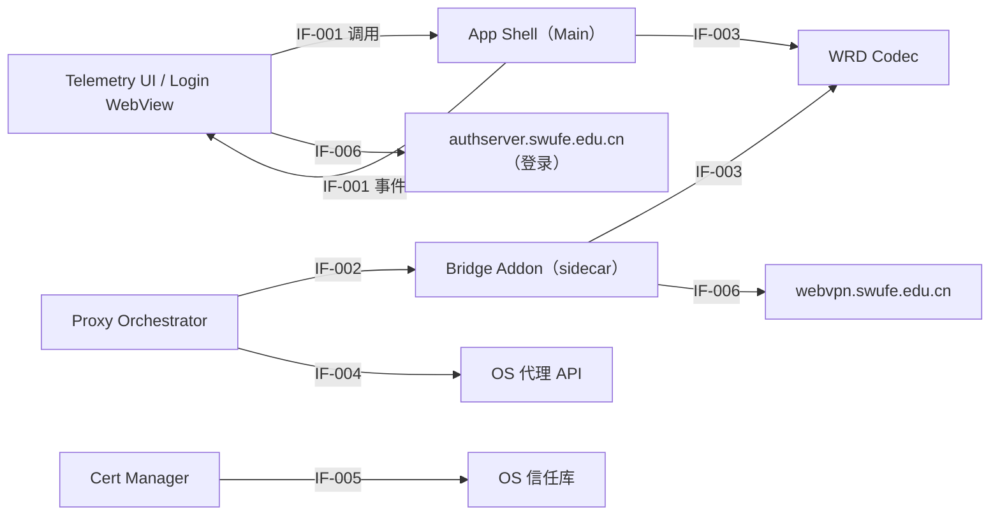

# 接口

> Status: Draft ｜ Owner: cherrchen ｜ Last Reviewed: 2026-09-21

**用途**：定义模块之间、系统与外部之间的**边界**：谁提供、谁消费、契约是什么、兼容性如何保证。
**不写**：具体字段级 API 定义（→ [docs/api/](../api/README.md)）、数据实体（→ [data-model.md](data-model.md)）。

---

## 接口清单

| ID | 接口 | 提供方 | 消费方 | 类型 | 稳定性 | 详见 |
| -- | ---- | ------ | ------ | ---- | ------ | ---- |
| IF-001 | Renderer ↔ Main（preload `window.swufeBridge`） | App Shell（Electron Main） | Telemetry UI、Login WebView（Renderer） | 进程内 | Internal | [api/electron-ipc.md](../api/electron-ipc.md) |
| IF-002 | Main ↔ mitm sidecar 控制 | Bridge Addon（mitmproxy sidecar） | Proxy Orchestrator（Main） | 进程间（本地） | Internal / Evolving | [api/bridge-control-protocol.md](../api/bridge-control-protocol.md) |
| IF-003 | Bridge Addon ↔ WRD Codec 库 | WRD Codec | Bridge Addon、App Shell | 进程内 | Evolving | [api/wrd-codec-library.md](../api/wrd-codec-library.md) |
| IF-004 | App ↔ OS 代理 API | OS（系统 API） | Proxy Orchestrator | 本机系统 API | Evolving | [components.md](components.md) |
| IF-005 | App ↔ OS 信任库 | OS（系统 API） | Cert Manager | 本机系统 API | Evolving | [components.md](components.md) |
| IF-006 | App ↔ `webvpn.swufe.edu.cn` / `authserver.swufe.edu.cn` | 学校 WebVPN / CAS | Bridge Addon、Login WebView | 网络 HTTPS | Evolving | [components.md](components.md) |

## 边界图

说明：进程内边界（IF-001）为稳定契约（Internal）；IF-003 同为进程内但接口仍可随实现调整（Evolving）；进程间边界（IF-002）与外部边界（IF-004～IF-006）随 sidecar 实现方式与外部系统演进而变化。`IF-006` 的两条方向分别对应「登录（authserver → webvpn）」与「改写后的业务请求（Bridge Addon → webvpn）」，登录流量不得进入改写路径。

## 接口契约

### IF-001 Renderer ↔ Main（preload `window.swufeBridge`）

- 提供方：App Shell（Electron Main）。
- 消费方：Telemetry UI、Login WebView（Renderer）。
- 稳定性：Internal（仅 App 内使用；破坏性变更仍需评估）。
- 输入：方法调用 `login` / `logout` / `getSession`、`startBridge` / `stopBridge` / `getStatus`、`getAllowlist` / `setAllowlist` / `getSettings`、`installCa` / `uninstallCa` / `getCaStatus`、`listCaptureCandidates` / `setCaptureMode` / `setCaptureProcesses`、`setDebugLogging`；事件订阅 `onDebugLog` / `onStatus` / `onSessionExpired`（后两者为 M2 新增，`getSettings` 亦为 M2 新增且不返回 WRD key/IV）。M3 以 `setCaptureMode`（`'system-proxy' | 'selected-apps'`）取代 M2 的 `setCapturePids`，并新增 `setCaptureProcesses`（intercept pattern 字符串数组，整体覆盖写入）。
- 输出：`BridgeStatus`（含 `localCaptureEnabled` 与 `captureError`）、`AllowlistConfig`、CA 状态、会话状态、`DebugLogEvent`。字段级定义见 [api/electron-ipc.md](../api/electron-ipc.md)。
- 错误模型：`BridgeStatus.error.code` 取固定错误码 `PROXY_CONFLICT` / `CA_MISSING` / `NOT_LOGGED_IN` / `SESSION_EXPIRED` / `BRIDGE_CRASH` / `ALLOWLIST_EMPTY`（切到「指定应用」捕获方式而系统代理被其它软件占用时同样返回 `PROXY_CONFLICT`）；CA 操作用 `{ok, message}`。进程捕获失败不进入 `error`，只出现在 `BridgeStatus.captureError`。Electron 的 `invoke` rejection 只保留 `message` / `stack`，因此 `setCaptureMode` / `setCaptureProcesses` 的拒绝消息形如 `<CODE>：<message>`（如 `PROXY_CONFLICT：…`），Renderer 解析前缀决定是否弹出代理冲突模态。
- 幂等性：`getStatus` / `getSession` / `getAllowlist` / `getSettings` / `getCaStatus` 为幂等读；`setAllowlist`、`setCaptureMode`、`setCaptureProcesses`（整体覆盖写入）幂等；`startBridge` / `stopBridge` / `installCa` / `uninstallCa` 非幂等（重复调用按状态机处置）。
- 版本策略：preload 与 Main 同构建同版本，不跨版本混用。
- 兼容性承诺：新增方法/字段向后兼容；删除或改签名属破坏性变更（允许的例外见「兼容性策略」）。
- 关联 Spec / ADR：[specs/001-phase1-local-bridge](../../specs/001-phase1-local-bridge/spec.md)、[ADR-0003](adr/ADR-0003-electron-gui-for-phase-1.md)、[ADR-0006](adr/ADR-0006-local-capture-mode-and-mutual-exclusion.md)。

### IF-002 Main ↔ mitm sidecar 控制

- 提供方：Bridge Addon（mitmproxy sidecar）。
- 消费方：Proxy Orchestrator（Main）。
- 稳定性：Internal / Evolving（仅供本 App 内部消费；第一期已采用方案 A「子进程生命周期 + 配置文件热加载」，不再承诺其它控制面形态）。
- 输入：子进程生命周期（spawn / 结束）；启动参数 `--mode regular@<port>`（**不传** `--listen-port`：全局 `listen_port` 会让运行时新增的 `local:<spec>` 与 `regular` 被判为同一监听地址而报错）；配置文件整体覆盖写入（`allowlist` / `cookies` / `debug` / `webvpnBase` / `wrdKey` / `wrdIv` / `capture`，路径与字段见 [api/bridge-control-protocol.md](../api/bridge-control-protocol.md)）。`capture` 为 `{"processes": string[]}`，缺省即空数组；`system-proxy` 捕获方式下恒为 `[]`，非法（非列表 / 空串 / 含逗号 / 非字符串）⇒ `CONFIG_INVALID`。
- 输出：stderr 上的就绪与诊断行（`swufe-ready` / `swufe-error <CODE> <message>` / `swufe-capture {"enabled":bool,"processes":string[],"error":string|null}`）、进程退出码（正常 `0`，启动校验失败 `2`）；配置生效结果（热加载，失败保留上次可用配置）。
- 错误模型：sidecar 级诊断 `swufe-error <CODE> <message>` + 退出码 `2`（`CONFIG_INVALID`、`ALLOWLIST_EMPTY`、`LISTEN_NOT_LOOPBACK`）；运行期配置重载失败不退出，保留上次可用配置并重复上报同一消息前只打印一次；M2 将 sidecar 非预期退出映射为 `BRIDGE_CRASH`。`swufe-capture` 只报告进程捕获状态（键固定 `enabled` / `processes` / `error`），不参与就绪判定，捕获失败不改变桥状态，也不自动重试（直到运行时配置被重写才重新尝试）。
- 幂等性：配置文件为整体覆盖式写入，以「最后一次生效」为幂等语义；结束进程重复调用收敛到已停止状态。
- 版本策略：sidecar 与 App 同发布；控制面能力变更（如启用方案 B）视为实现变更而非契约变更。
- 兼容性承诺：Cookie 禁止进日志与诊断行（INV-001）；`swufe-ready` / `swufe-error` / `swufe-capture` 行格式与退出码语义稳定；`swufe-capture` 的键集合固定为 `enabled` / `processes` / `error`；监听地址恒为 `127.0.0.1`。
- 关联 Spec / ADR：[specs/001-phase1-local-bridge](../../specs/001-phase1-local-bridge/spec.md)、[ADR-0006](adr/ADR-0006-local-capture-mode-and-mutual-exclusion.md)、[ADR-0002](adr/ADR-0002-reuse-mitmproxy-for-tls.md)。

### IF-003 Bridge Addon ↔ WRD Codec 库

- 提供方：WRD Codec（Python 权威实现；TypeScript 可后补）。
- 消费方：Bridge Addon、App Shell。
- 稳定性：Evolving（算法与默认参数已用实机地址栏 URL 验证，接口仍可随第一期实现调整）。
- 输入：`encryptHost(host, key?, iv?)`、`decryptHost(token, key?, iv?)`、`encodeUrl(ordinaryUrl, webvpnHost?)`、`decodeUrl(webvpnUrl)`。签名与语义见 [api/wrd-codec-library.md](../api/wrd-codec-library.md)。
- 输出：加密 token、WebVPN URL、普通 URL。
- 错误模型：自定义/错误 key 时返回非正确主机或显式失败（见 TC-A05）。
- 幂等性：全部为纯函数，同输入同输出。
- 版本策略：与 `wrd_codec.py` 向量绑定；默认 `webvpnHost = webvpn.swufe.edu.cn`、`key = iv = wrdvpnisthebest!`。
- 兼容性承诺：向量一致性是契约（NFR-002）；新增可选参数向后兼容。
- 关联 Spec / ADR：[specs/001-phase1-local-bridge](../../specs/001-phase1-local-bridge/spec.md)、[ADR-0001](adr/ADR-0001-wrd-rewrite-in-mitm-layer.md)、[ADR-0005](adr/ADR-0005-builtin-wrd-key-with-override.md)。

### IF-004 App ↔ OS 代理 API

- 提供方：OS（系统 API）。
- 消费方：Proxy Orchestrator。
- 稳定性：Evolving（跟随 OS 版本）。
- 输入：读取当前系统 HTTP/HTTPS 代理；设置代理为 `127.0.0.1:<bridge_port>`；清除本 App 设置的代理。捕获方式为 `selected-apps` 时不设置系统代理，并撤销此前由本 App 设置过的（ADR-0006）。
- 输出：代理状态（是否启用、指向何处）。
- 错误模型：读取失败或设置被占用 → `PROXY_CONFLICT`（切到「指定应用」捕获方式前检查系统代理被其它软件占用时同样如此）。
- 幂等性：读取幂等；设置/清除重复调用收敛到同一目标状态。
- 版本策略：由 Proxy Orchestrator 内的 OS 适配层吸收差异，不向其它组件暴露。
- 兼容性承诺：仅清除本 App 设置过的代理（INV-002）；`selected-apps` 捕获方式下不设置系统代理（ADR-0006）；macOS / Windows 行为差异在适配层内。
- 关联 Spec / ADR：[specs/001-phase1-local-bridge](../../specs/001-phase1-local-bridge/spec.md)、[ADR-0004](adr/ADR-0004-refuse-start-when-system-proxy-in-use.md)、[ADR-0006](adr/ADR-0006-local-capture-mode-and-mutual-exclusion.md)。

### IF-005 App ↔ OS 信任库

- 提供方：OS（系统 API）。
- 消费方：Cert Manager。
- 稳定性：Evolving（跟随 OS 版本；安装常需管理员权限）。
- 输入：安装本机 MITM CA 到系统信任；从系统信任移除。
- 输出：CA 状态（installed / trusted）。
- 错误模型：安装/卸载失败返回 `{ok: false, message}`；未安装/未信任而开桥 → `CA_MISSING`。
- 幂等性：重复安装/卸载收敛到目标状态。
- 版本策略：由 Cert Manager 内的 OS 适配层吸收差异。
- 兼容性承诺：CA 私钥仅本机、不上传（REQ-010）。
- 关联 Spec / ADR：[specs/001-phase1-local-bridge](../../specs/001-phase1-local-bridge/spec.md)、[ADR-0002](adr/ADR-0002-reuse-mitmproxy-for-tls.md)。

### IF-006 App ↔ `webvpn.swufe.edu.cn` / `authserver.swufe.edu.cn`

- 提供方：学校 WebVPN（`webvpn.swufe.edu.cn`）与 CAS（`authserver.swufe.edu.cn`）。
- 消费方：Bridge Addon（业务流量）、Login WebView（登录流量）。
- 稳定性：Evolving（完全由外部决定）。
- 输入：改写后的 WebVPN 形态 HTTPS 请求（携带 WebVPN Cookie）；CAS 登录交互。
- 输出：校内服务响应；登录后的会话 Cookie。
- 错误模型：会话失效信号（探测返回登录页标记 / `Set-Cookie` 清空会话 / 连续改写后 302 到 CAS）→ `SESSION_EXPIRED`；网络不可达 → `BRIDGE_CRASH` 或改写失败。
- 幂等性：GET/HEAD 幂等按 HTTP 语义；POST 等由校内服务决定。
- 版本策略：无版本协商；变化即适配（Cookie 字段/策略变更见 R2）。
- 兼容性承诺：`webvpn.swufe.edu.cn` 与 `authserver.swufe.edu.cn` 永不二次包装（INV-004）；登录 WebView 流量 bypass 本桥；网关自有根命名空间（`/wengine-vpn/`、`/authserver/`）不经 token 直接取自网关根，命中网关 bootstrap 判据的 HTML 文档由 Bridge Addon 以 `302` 升级到网关原生 URL 空间（[ADR-0007](adr/ADR-0007-gateway-owned-namespaces-and-native-mode-promotion.md)）。
- 关联 Spec / ADR：[specs/001-phase1-local-bridge](../../specs/001-phase1-local-bridge/spec.md)、[ADR-0001](adr/ADR-0001-wrd-rewrite-in-mitm-layer.md)、[ADR-0007](adr/ADR-0007-gateway-owned-namespaces-and-native-mode-promotion.md)。

## 兼容性策略

| 接口 | 允许的变更 | 需要 ADR 的变更 | 弃用流程 |
| ---- | ---------- | --------------- | -------- |
| IF-001 | 新增可选方法/字段、新增错误码 | 删除或改签名；改变 `BridgeStatus` 状态机取值 | TBD |
| IF-002 | 新增配置字段与诊断行 | 改变已选控制方式（方案 A → 方案 B）；改变配置文件字段语义或退出码 | TBD |
| IF-003 | 新增可选参数 | 改签名或改变默认 key/iv 语义 | TBD |
| IF-004 | 适配新的 OS API 版本 | 改变代理清除策略（INV-002） | TBD |
| IF-005 | 适配新的 OS 信任库 API | 改变 CA / 信任模型（ADR-0002、REQ-010） | TBD |
| IF-006 | 跟随上游语义做适配 | 上游变化导致改写/防环策略改变；改变网关自有命名空间的直通范围或 bootstrap 升级判据（ADR-0007） | TBD |

## 契约测试

| 接口 | 测试位置 | 覆盖内容 |
| ---- | -------- | -------- |
| IF-001 | [specs/001-phase1-local-bridge/verification.md](../../specs/001-phase1-local-bridge/verification.md)（TC-D01、TC-D02、TC-C01–C04、TC-E01–E03、TC-B05、TC-H01） | 会话/桥控/allowlist/CA/进程捕获 IPC 的行为与错误码 |
| IF-002 | L1 `bridges/python/tests/l1/test_addon_reload.py`（配置热更新与失败回退）、L1 `bridges/python/tests/l1/test_addon_capture.py`（local 模式叠加与 `swufe-capture` 上报）+ L2 `bridges/python/tests/l2/test_proxy_end_to_end.py`（`swufe-ready` 行含 `listen_port`、退出码 `2`、回环监听） | 配置文件热加载语义、就绪/诊断行格式与启动失败退出码、进程捕获模式叠加与回报 |
| IF-003 | [specs/001-phase1-local-bridge/verification.md](../../specs/001-phase1-local-bridge/verification.md)（TC-A01–A05） | codec 向量与 URL 互转一致 |
| IF-004 | [specs/001-phase1-local-bridge/verification.md](../../specs/001-phase1-local-bridge/verification.md)（TC-C01–C04） | 冲突拒绝、设置与清除代理 |
| IF-005 | [specs/001-phase1-local-bridge/verification.md](../../specs/001-phase1-local-bridge/verification.md)（TC-E01–E03） | 安装、卸载与未安装提示 |
| IF-006 | [specs/001-phase1-local-bridge/verification.md](../../specs/001-phase1-local-bridge/verification.md)（TC-F01–F03、TC-G01–G03、TC-D01）+ L1 `bridges/python/tests/l1/test_addon_request.py` / `test_addon_response.py`（网关自有路径直通、bootstrap 升级与不误升级）+ L2 `bridges/python/tests/l2/test_proxy_end_to_end.py` | 上行改写、响应反向改写、网关自有命名空间直通与升级、浏览器验收 |
