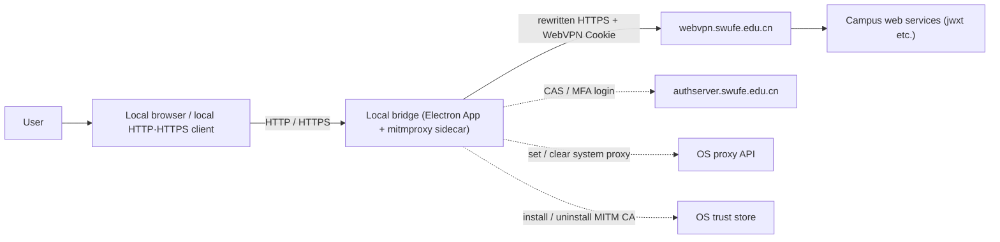

# Architecture Overview

> Status: Draft ｜ Owner: cherrchen ｜ Last Reviewed: 2026-09-25
>
> Chinese source of truth: [overview.md](overview.md)

**Purpose**: convey the overall shape and boundaries of the system in the fewest words, so a reader has a correct mental model within five minutes.
**Do not write**: component detail (→ [components.md](components.md)), data fields (→ [data-model.md](data-model.md)), interface fields (→ [interfaces.md](interfaces.md), [docs/api/](../api/README.md)).

---

## System shape

```text
Style:           Client application + local sidecar (Electron client process + mitmproxy companion process; in-process modules combined across processes)
Deployable unit: Electron App (Main / Renderer) + mitmproxy sidecar (regular proxy + local capture + thin WRD addon)
Primary language: Python 3 (sidecar / addon and the authoritative WrdCodec implementation) + TypeScript (Electron app, incl. IPC type declarations)
Runtime:         Electron / Node (App) + Python (sidecar process)
```

Phase 1 has no TUN-level takeover; the optional future `sing-box TUN → 127.0.0.1:mitm` is not part of this deployable unit (see C-003).

Mobile is a separate deployment shape: Stash (first) / Loon plugins reuse the third-party proxy client's Network Extension, HTTP Engine, MitM, and Script. They are not part of the desktop Electron/mitmproxy deployable unit. Mobile components and traffic boundaries are described in [Spec 003](../../specs/003-ios-proxy-client-plugins/architecture.md). Stash Settings are recorded in [ADR-0014](adr/ADR-0014-stash-local-settings-and-routing-scope.en.md): Interception Scope may be wider than the exact Routing Scope, while unselected targets still PASS unchanged.

Spec 003's Gateway Session belongs to the webvpn-gateway Realm. It is stored locally at the Stash/Loon proxy layer and can be reused on safely classified direct Gateway requests, independently of each Safari/WKWebView Cookie Jar. CAS Cookies from authserver do not enter the Gateway Store. Any future cas-sso research must be separate, off by default and threat-modeled independently; see [ADR-0015](adr/ADR-0015-session-realm-and-proxy-reuse.en.md).

## System context



Description: the user's local browser issues requests to the **real hostname** (e.g. `jwxt.swufe.edu.cn`); the local bridge rewrites the allowlisted ones into WebVPN form and attaches the session, reaching campus web services through the `webvpn.swufe.edu.cn` reverse proxy; responses are reverse-rewritten back to real-hostname semantics so the address bar and page links stay stable. `authserver.swufe.edu.cn` (CAS, may include MFA) is used for login only and never enters the rewrite path (anti-loop). The local bridge sets/clears the system proxy through the OS proxy API and installs/uninstalls the MITM CA through the OS trust store. The local bridge is not a real VPN: non-HTTP/HTTPS traffic and applications that ignore the system proxy are out of its coverage (see C-001).

## Layers / modules at a glance

| Layer / module | Responsibility | Allowed dependencies | Detail |
| -------------- | -------------- | -------------------- | ------ |
| App Shell | Windows/tray (optional), config persistence, Main-side orchestration entry and preload IPC | Main-side modules, WrdCodec | [components.md](components.md) |
| Login WebView | Hosts the official WebVPN / CAS login; anti-loop | App Shell (window host) | [components.md](components.md) |
| Session Broker | Cookie extraction / storage / expiry detection | Login WebView session | [components.md](components.md) |
| Proxy Orchestrator | Start/stop mitm sidecar, system proxy, process capture, proxy-conflict detection | Allowlist Store, OS proxy API, sidecar control port | [components.md](components.md) |
| WRD Codec | Hostname encryption/decryption and URL conversion (pure functions, no IO) | none | [components.md](components.md), [api/wrd-codec-library.md](../api/wrd-codec-library.md) |
| Bridge Addon | Request rewrite + response reverse-rewrite + Cookie injection (inside the mitmproxy sidecar) | WrdCodec, pushed config | [components.md](components.md) |
| Cert Manager | Install/uninstall and query the local MITM CA | OS trust store | [components.md](components.md) |
| Allowlist Store | Read/write host list and wildcard option (single source for routing decisions) | none (local JSON) | [components.md](components.md) |
| Telemetry UI | Status display and debug log panel (Renderer) | App Shell (via preload IPC) | [components.md](components.md) |

## Key constraints

| ID | Constraint | Origin | Impact |
| -- | ---------- | ------ | ------ |
| C-001 | HTTP/HTTPS traffic only | NG-001, REQ-003 | Non-HTTP/HTTPS (SSH/database/SMB/arbitrary TCP·UDP) and applications that ignore the system proxy are out of coverage |
| C-002 | Depends on the official WebVPN session and the MITM CA | ADR-0001, ADR-0002, REQ-010 | Without an installed/trusted CA, HTTPS cannot be rewritten (`CA_MISSING`); session expiry stops the bridge |
| C-003 | No TUN in Phase 1 | NG-002, PR-005 | Must use the two application-layer paths: system proxy and process capture; TUN is left to a later phase |
| C-004 | Traffic outside the allowlist is direct and never rewritten | REQ-005 | Routing uses Allowlist Store as the single source; no rewrite means no session passthrough |

## Decision index

Decisions are not expanded here; this is an index into the ADRs:

| Decision | Status | ADR |
| -------- | ------ | --- |
| WRD rewriting lives in the MITM layer, not in a network kernel | Accepted | [adr/ADR-0001-wrd-rewrite-in-mitm-layer.md](adr/ADR-0001-wrd-rewrite-in-mitm-layer.md) |
| Reuse mitmproxy for TLS/HTTP2/certificates instead of building a MITM stack | Accepted | [adr/ADR-0002-reuse-mitmproxy-for-tls.md](adr/ADR-0002-reuse-mitmproxy-for-tls.md) |
| Phase 1 uses an Electron GUI instead of a pure CLI | Accepted | [adr/ADR-0003-electron-gui-for-phase-1.md](adr/ADR-0003-electron-gui-for-phase-1.md) |
| Refuse to start when the system proxy is already in use | Accepted | [adr/ADR-0004-refuse-start-when-system-proxy-in-use.md](adr/ADR-0004-refuse-start-when-system-proxy-in-use.md) |
| Ship a built-in default WRD key while keeping a config override | Accepted | [adr/ADR-0005-builtin-wrd-key-with-override.md](adr/ADR-0005-builtin-wrd-key-with-override.md) |
| Stash uses a local pseudo WebUI to manage exact WebVPN sites, separating interception from routing scope | Accepted | [adr/ADR-0014-stash-local-settings-and-routing-scope.en.md](adr/ADR-0014-stash-local-settings-and-routing-scope.en.md) |

## Known architectural risks

| Risk | Impact | Mitigation | Status |
| ---- | ------ | ---------- | ------ |
| R1 The academic-affairs frontend uses many dynamic absolute URLs | Insufficient reverse-rewrite coverage makes in-page navigations fall back to direct public-internet access and fail (a hard dependency of browser acceptance) | Reverse rewriting is layered as `Location` → `Set-Cookie` → absolute URLs inside HTML/JS/JSON, keeping the primary navigation paths working first | Open |
| R2 Cookie / session policy changes | Session expiry detection and Cookie injection break; bridge availability drops | Session capture and expiry detection live in the single Session Broker change point, making adaptation fast | Open |
| R3 mitm distribution size and signing | Larger release bundle, more complex signing/notarization | Isolate the embedded-sidecar vs external-mitmproxy difference in the deployment layer; use the external form during development | Open |
| R6 Default key rotation | If the portal changes key/IV, all rewriting fails | Keep the default key/iv overridable through `AppSettings` as a structural interface rather than a hard-coded path | Open |
