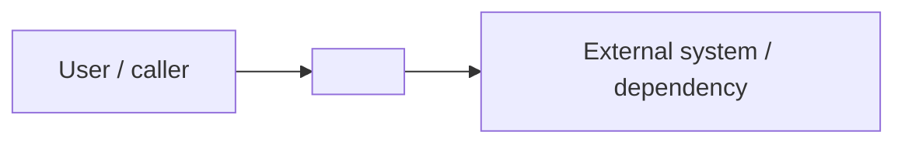

# Architecture Overview

> Status: TBD ｜ Owner: <OWNER> ｜ Last Reviewed: <DATE>
>
> Chinese source of truth: [overview.md](overview.md)

**Purpose**: convey the overall shape and boundaries of the system in the fewest words, so a reader has a correct mental model within five minutes.
**Do not write**: component detail (→ [components.md](components.md)), data fields (→ [data-model.md](data-model.md)), interface fields (→ [interfaces.md](interfaces.md), [docs/api/](../api/README.md)).

---

## System shape

```text
Style:           TBD   (monolith / layered / modular monolith / client-server / event-driven / other)
Deployable unit: TBD
Primary language:TBD
Runtime:         TBD
```

## System context



> Remove the right-hand node when there is no external system; keep it only for real interactions.

## Layers / modules at a glance

| Layer / module | Responsibility | Allowed dependencies | Detail |
| -------------- | -------------- | -------------------- | ------ |
| TBD | TBD | TBD | [components.md](components.md) |

## Key constraints

| ID | Constraint | Origin | Impact |
| -- | ---------- | ------ | ------ |
| C-001 | TBD | NFR-001 / ADR-XXXX | TBD |

## Decision index

Decisions are not expanded here; this is an index into the ADRs:

| Decision | ADR |
| -------- | --- |
| TBD | [adr/template.md](adr/template.md) |

## Known architectural risks

| Risk | Impact | Mitigation | Status |
| ---- | ------ | ---------- | ------ |
| TBD | TBD | TBD | Open |
