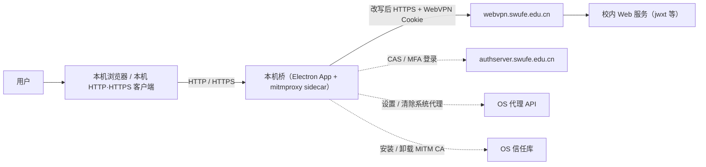

# 架构总览

> Status: Draft ｜ Owner: cherrchen ｜ Last Reviewed: 2026-09-25

**用途**：用最少的篇幅说明系统的整体形态与边界，使读者在 5 分钟内建立正确的系统心智模型。
**不写**：组件细节（→ [components.md](components.md)）、数据字段（→ [data-model.md](data-model.md)）、接口字段（→ [interfaces.md](interfaces.md)、[docs/api/](../api/README.md)）。

---

## 系统形态

```text
风格:      客户端应用 + 本机 sidecar（Electron 客户端进程 + mitmproxy 伴随进程，进程内模块与进程间组合）
部署单元:  Electron App（Main / Renderer）+ mitmproxy sidecar（Regular proxy + local capture + 薄 WRD addon）
主要语言:  Python 3（sidecar / addon 与 WrdCodec 权威实现）+ TypeScript（Electron 应用，含 IPC 类型声明）
运行时:    Electron / Node（App）+ Python（sidecar 进程）
```

第一期不包含 TUN 级接管；后续可选的 `sing-box TUN → 127.0.0.1:mitm` 不在本期部署单元中（见 C-003）。

移动端是独立部署形态：Stash（首发）/Loon 插件复用第三方代理客户端的 Network Extension、HTTP Engine、MitM 与 Script，不属于桌面 Electron/mitmproxy 部署单元。移动端组件与流量边界由 [Spec 003](../../specs/003-ios-proxy-client-plugins/architecture.md) 描述。Stash 的 Settings 设计见 [ADR-0014](adr/ADR-0014-stash-local-settings-and-routing-scope.md)：Interception Scope 可以宽于精确 Routing Scope，未选择目标仍原样 PASS。

Spec 003 的 Gateway Session 属于 webvpn-gateway Realm，在 Stash/Loon 代理层本地保存，并可被安全分类的 direct Gateway request 复用；它与 Safari/WKWebView 各自的 Cookie Jar 解耦。authserver CAS Cookie 当前不进入 Gateway Store。未来 cas-sso 若研究，必须独立、默认关闭并单独威胁建模，见 [ADR-0015](adr/ADR-0015-session-realm-and-proxy-reuse.md)。

## 上下文图（System Context）



说明：用户在本机浏览器中以**真实主机名**（如 `jwxt.swufe.edu.cn`）发起请求，本机桥把命中 allowlist 的请求改写为 WebVPN 形态并携带会话，经 `webvpn.swufe.edu.cn` 反向代理到达校内 Web 服务；响应再由本机桥反向改写回真实主机名语义，使浏览器地址栏与页面链接保持稳定。`authserver.swufe.edu.cn`（CAS，可含 MFA）只用于登录，其流量不进入改写路径（防环）。本机桥通过 OS 代理 API 设置/清除系统代理，并通过 OS 信任库安装/卸载 MITM CA。本机桥不是真 VPN：非 HTTP/HTTPS 流量、不认识系统代理的应用都不在其覆盖范围（见 C-001）。

## 分层 / 模块概览

| 层 / 模块 | 职责 | 允许依赖 | 详见 |
| --------- | ---- | -------- | ---- |
| App Shell | 窗口/托盘（可选）、配置持久化、Main 侧编排入口与 preload IPC | Main 侧各模块、WrdCodec | [components.md](components.md) |
| Login WebView | 承载官方 WebVPN / CAS 登录；防环 | App Shell（窗口宿主） | [components.md](components.md) |
| Session Broker | Cookie 提取/存储/失效检测 | Login WebView 的 session | [components.md](components.md) |
| Proxy Orchestrator | 启停 mitm sidecar、系统代理、进程捕获、代理冲突检测 | Allowlist Store、OS 代理 API、sidecar 控制口 | [components.md](components.md) |
| WRD Codec | hostname 加解密与 URL 互转（纯函数，无 IO） | 无 | [components.md](components.md)、[api/wrd-codec-library.md](../api/wrd-codec-library.md) |
| Bridge Addon | 请求改写 + 响应反向改写 + Cookie 注入（mitmproxy sidecar 内） | WrdCodec、下发的配置 | [components.md](components.md) |
| Cert Manager | 本机 MITM CA 安装/卸载与状态查询 | OS 信任库 | [components.md](components.md) |
| Allowlist Store | 主机列表与通配选项的读写（路由判定唯一数据源） | 无（本地 JSON） | [components.md](components.md) |
| Telemetry UI | 状态展示与调试日志面板（Renderer） | App Shell（经 preload IPC） | [components.md](components.md) |

## 关键约束

| ID | 约束 | 来源 | 影响 |
| -- | ---- | ---- | ---- |
| C-001 | 只能覆盖 HTTP/HTTPS 流量 | NG-001、REQ-003 | 非 HTTP/HTTPS（SSH/数据库/SMB/任意 TCP·UDP）与不认识系统代理的应用不在覆盖范围 |
| C-002 | 依赖官方 WebVPN 会话与 MITM CA | ADR-0001、ADR-0002、REQ-010 | 未安装/未信任 CA 时 HTTPS 无法改写（`CA_MISSING`）；会话失效即停桥 |
| C-003 | 第一期不做 TUN | NG-002、PR-005 | 必须走系统代理与进程捕获两条应用层路径；TUN 留待后续阶段 |
| C-004 | 非 allowlist 流量直连不改写 | REQ-005 | 路由判定以 Allowlist Store 为唯一数据源；不改写即不透传会话 |

## 关键决策索引

技术决策不在此处展开，只列出指向 ADR 的索引：

| 决策 | Status | ADR |
| ---- | ------ | --- |
| WRD 改写放在 MITM 层，而非网络内核 | Accepted | [adr/ADR-0001-wrd-rewrite-in-mitm-layer.md](adr/ADR-0001-wrd-rewrite-in-mitm-layer.md) |
| 复用 mitmproxy 处理 TLS/HTTP2/证书，而非自研 MITM 栈 | Accepted | [adr/ADR-0002-reuse-mitmproxy-for-tls.md](adr/ADR-0002-reuse-mitmproxy-for-tls.md) |
| Phase 1 采用 Electron GUI，而非纯 CLI | Accepted | [adr/ADR-0003-electron-gui-for-phase-1.md](adr/ADR-0003-electron-gui-for-phase-1.md) |
| 系统代理被占用时拒绝启动 | Accepted | [adr/ADR-0004-refuse-start-when-system-proxy-in-use.md](adr/ADR-0004-refuse-start-when-system-proxy-in-use.md) |
| WRD 默认密钥内置并保留配置覆盖 | Accepted | [adr/ADR-0005-builtin-wrd-key-with-override.md](adr/ADR-0005-builtin-wrd-key-with-override.md) |
| Stash 使用本地 pseudo WebUI 管理精确 WebVPN 站点，拦截与路由范围分离 | Accepted | [adr/ADR-0014-stash-local-settings-and-routing-scope.md](adr/ADR-0014-stash-local-settings-and-routing-scope.md) |

## 已知的架构风险

| 风险 | 影响 | 缓解方式 | 状态 |
| ---- | ---- | -------- | ---- |
| R1 教务前端大量动态绝对 URL | 响应反向改写覆盖不足会让页面内跳转落到公网直连而失败（浏览器验收硬依赖） | 响应反向改写按 `Location` → `Set-Cookie` → HTML/JS/JSON 绝对 URL 分层处理，并优先保证主导航路径可用 | Open |
| R2 Cookie / 会话策略变化 | 会话失效判定与 Cookie 注入失效，桥可用性下降 | 会话采集与失效检测集中在 Session Broker 单一变更点，便于快速适配 | Open |
| R3 mitm 分发体积与签名 | 发布包体积增大、签名/公证复杂度上升 | 把嵌入式 sidecar 与外置 mitmproxy 的差异隔离在部署层，开发期先用外置方式 | Open |
| R6 默认密钥轮换 | 若 portal 更换 key/IV，全部改写失败 | 默认 key/iv 通过 `AppSettings` 保留配置覆盖点，作为结构性接口而非写死路径 | Open |
