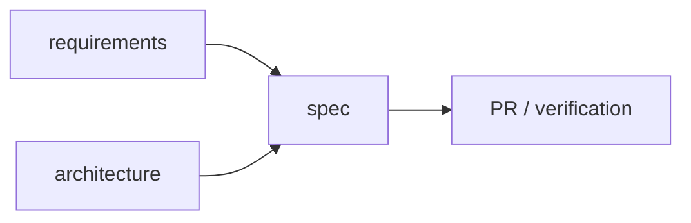

# Documentation Rules

> Status: Draft ｜ Owner: cherrchen ｜ Last Reviewed: 2026-09-20
>
> Chinese source of truth: [documentation-rules.md](documentation-rules.md)

**Purpose**: define document levels, language requirements, sync obligations and anti-pollution rules; the source of truth for any documentation change.
In one sentence: **what information goes where, and what must be synced after a code change.**

---

## 1. Document levels

| Level | Name | Location | Nature | Who may write |
| ----- | ---- | -------- | ------ | ------------- |
| A | Source of truth | [requirements/](../requirements/README.md), [architecture/](../architecture/README.md), [api/](../api/README.md), [adr/](../architecture/adr/README.md), `specs/**` | facts and decisions | reviewed changes |
| B | Guidance | [development/](README.md), [agent/](../agent/README.md), [operations/](../operations/README.md) | practices and process | process adjustments |
| C | Temporary | [.agents/notes/](../../.agents/notes/README.md), research, experiments | temporary context | any agent or human |

Rules:

- Level C content must **never** be cited as the basis for architecture, requirements, API contracts or final decisions;
- Long-lived conclusions formed in Level C must be migrated to Level A/B, and the note must record where;
- Level A documents must not contain unsettled content ("temporary conclusion", "unverified guess") — use `Open Questions`.

## 2. One fact, one source of truth

- A fact is defined once; other documents **reference** it with relative links instead of copying it;
- When the same fact appears twice, keep the more authoritative copy and turn the other into a link (note it in the PR);
- Two documents may never both claim to be the current source of truth; history moves to [archive/](../archive/README.md) or is marked `Superseded`.



## 3. Language rules (bilingual)

- `foo.md` = Chinese primary (source of truth); `foo.en.md` = English counterpart;
- The English version must stay semantically in sync: structure, conclusions, constraints and status values must not conflict; word-for-word translation is not required;
- Single-language exceptions:
  - `**/_template/**` (template skeletons);
  - `**/template.md` (template files);
  - session notes and research under [.agents/notes/](../../.agents/notes/README.md) (except its `README.md`);
  - archived material under [docs/archive/](../archive/README.md);
  - `.github/**` (PR/issue templates follow GitHub conventions);
  - generated reports and temporary debug output.
- The **scope** the `docs:i18n` check enforces: root `README.md` / `AGENTS.md` / `CONTRIBUTING.md`, `docs/**`, `specs/README.md`, `.agents/README.md`, `.agents/notes/README.md`. Everything else (including feature spec instances under `specs/<id>-<name>/`) is not enforced;
- When a document genuinely must stay single-language, add a whole line `<!-- i18n-exempt: <reason> -->` within the first 20 lines of the file; the check then skips it. The reason is mandatory and must not be used to dodge the sync obligation;
- When adding a long-lived document: add **both** `.md` and `.en.md`, and register it in the [docs/README.md](../README.md) index;
- The `docs:i18n` check only verifies that pairs exist; **semantic sync is a review responsibility** and must be stated in the PR's Documentation Impact section.

## 4. Status metadata

Long-lived design documents (Level A) should start with:

```text
> Status: Draft | TBD
> Owner: cherrchen
> Last Reviewed: 2026-09-20
```

Plain READMEs and index documents do **not** need metadata. Status values are defined in [glossary.md](../overview/glossary.md).

## 5. Mermaid usage

Use for: architecture, data flow, state machines, sequences, dependencies, agent workflow.
Do not use for: decoration, single-level lists, comparisons better served by a table, or graphs above roughly 20 nodes (split them).
Every diagram needs prose around it, and the prose alone must carry the conclusion.

## 6. Link rules

- Use relative paths for in-repository links (`../architecture/overview.md`);
- Links must point at files that exist; enforced by `npm run docs:links`;
- Prefer linking to a concrete file rather than a directory (directory links break more often on refactors);
- External material uses a full URL plus a note on the title and why it is useful.

## 7. Documentation update matrix

After a code change, check the table below; uncovered rows are gaps and must be explained in the PR.

| If you changed | Check |
| -------------- | ----- |
| API / interface contract | [docs/api/](../api/README.md), [architecture/interfaces.md](../architecture/interfaces.md), related spec, contract tests |
| Data model | [architecture/data-model.md](../architecture/data-model.md), migration plan (spec `migration.md`), ADR, related spec |
| Architecture / component boundaries | [architecture/overview.md](../architecture/overview.md), [components.md](../architecture/components.md), ADR, related spec |
| User-visible behaviour | [requirements/](../requirements/README.md), related spec, `verification.md` |
| Configuration / environment variables | [operations/](../operations/README.md), [coding-conventions.md](coding-conventions.md) if defaults change |
| Security-relevant logic | [security/](../security/README.md), the spec's Security Considerations, an ADR when needed |
| A new dependency | [dependency-policy.md](dependency-policy.md), an ADR when needed |
| How tests are run | [testing-strategy.md](testing-strategy.md) |
| Workflow / conventions | the matching file in this directory, [CONTRIBUTING.md](../../CONTRIBUTING.md), [AGENTS.md](../../AGENTS.md) |
| Documentation structure (files added/moved/renamed) | the `.en.md` pair, the [docs/README.md](../README.md) index, repository-wide links |

## 8. Anti-pollution rules (for coding agents)

A coding agent must not:

- copy chat or reasoning transcripts into official documents;
- present guesses as project facts (unconfirmed content is `TBD` or an `Open Question`);
- put temporary debug output into Architecture / Requirements;
- change requirements or rewrite a whole document because something "feels better";
- invent designs, components, interfaces or ADRs to make the docs look complete;
- expand scope automatically.

## 9. Archiving

- Never delete important historical design material; move it to [archive/](../archive/README.md) and leave a pointer behind;
- Finished specs get status `Archived` (see [specs/README.md](../../specs/README.md));
- ADRs become `Superseded` with a link to the successor; the body of an `Accepted` ADR is never rewritten.

## 10. Validation

```bash
npm run docs:check   # links + bilingual pairs + spec structure
```

Rules and checks map one-to-one: adding a check requires updating this file.

The checks skip `node_modules` / `.git` / build output / common vendored directories (`.venv`, `vendor`, `target`, …). Adjust `IGNORED_DIRS` in `scripts/lib/util.ts` when the project needs more; do not duplicate that configuration inside individual checks.
