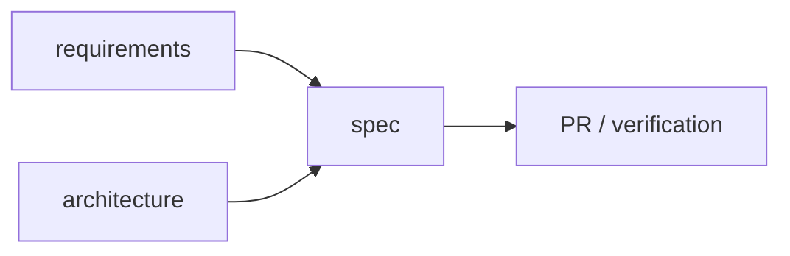

# 文档规则

> Status: Draft ｜ Owner: <OWNER> ｜ Last Reviewed: <DATE>

**用途**：定义文档层级、语言要求、同步义务与防污染规则，是所有文档类变更的 Source of Truth。
本文件回答的是一句话：**什么信息应该写在哪里，以及代码变更后必须同步什么。**

---

## 1. 文档层级

| 层级 | 名称 | 位置 | 性质 | 允许的写入者 |
| ---- | ---- | ---- | ---- | ------------ |
| A | Source of Truth | [requirements/](../requirements/README.md)、[architecture/](../architecture/README.md)、[api/](../api/README.md)、[adr/](../architecture/adr/README.md)、`specs/**` | 事实与决策 | 经过评审的变更 |
| B | Guidance | [development/](README.md)、[agent/](../agent/README.md)、[operations/](../operations/README.md) | 做法与流程 | 流程调整 |
| C | Temporary | [.agents/notes/](../../.agents/notes/README.md)、research、experiments | 临时上下文 | 任何 Agent / 人 |

规则：

- Level C 内容**不得**作为架构、需求、API 契约或最终决策的依据；
- Level C 中形成长期结论时，必须迁移到 Level A/B，并在 note 中标注迁移去向；
- Level A 文档中不得出现「临时结论」「待验证猜测」这类未收敛内容（应放 `Open Questions`）。

## 2. One Fact, One Source of Truth

- 同一事实只能在一处定义；其它文档**引用**（相对链接）而不是复制；
- 发现同一事实出现在两处时，保留更权威的一处，把另一处改为链接（并在 PR 中说明）；
- 不允许两个文档同时声称自己是当前 Source of Truth；历史版本进入 [archive/](../archive/README.md) 或标记 `Superseded`。



## 3. 语言规则（中英双语）

- `foo.md` = 中文主文档（Source of Truth）；`foo.en.md` = 英文副文档；
- 英文版必须语义同步：结构、结论、约束、状态值不得冲突；不要求逐字翻译；
- 只保留单语文档的例外：
  - `**/_template/**`（模板骨架）；
  - `**/template.md`（模板文件）；
  - [.agents/notes/](../../.agents/notes/README.md) 下的 session notes、调研记录（`README.md` 除外）；
  - [docs/archive/](../archive/README.md) 归档内容；
  - `.github/**`（PR / Issue 模板遵循 GitHub 约定）；
  - 自动生成报告、临时调试输出。
- `docs:i18n` 强制配对的**范围**：根目录 `README.md` / `AGENTS.md` / `CONTRIBUTING.md`、`docs/**`、`specs/README.md`、`.agents/README.md`、`.agents/notes/README.md`；其余路径（含 `specs/<id>-<name>/` 的 Feature Spec）不强制；
- 个别文档确需单语时，在文件顶部（前 20 行之内）写一整行 `<!-- i18n-exempt: 理由 -->`，检查会跳过该文件；理由必须写明，且不得用于规避同步义务；
- 新增长期文档时：**同时**添加 `.md` 与 `.en.md`，并在 [docs/README.md](../README.md) 索引中登记；
- 只改了中文版而英文版未同步时，CI 的 `docs:i18n` 只检查配对是否存在；**语义同步由评审负责**，需在 PR 的 Documentation Impact 中说明。

## 4. 状态元数据

长期设计文档（Level A）建议在开头写：

```text
> Status: Draft | TBD
> Owner: <OWNER>
> Last Reviewed: <DATE>
```

普通 README、索引类文档**不需要**元数据。状态取值见 [glossary.md](../overview/glossary.md)。

## 5. Mermaid 使用原则

使用场景：架构、数据流、状态机、时序、依赖关系、Agent 工作流。
不使用场景：装饰、单层列表、可由表格更好表达的对照关系、超过 20 个节点的大图（应拆分为多图）。
每张图必须配有文字说明，且文字本身可以独立表达结论。

## 6. 链接规则

- 使用相对路径链接仓库内文件（`../architecture/overview.md`）；
- 链接必须指向真实存在的文件；由 `npm run docs:links` 检查；
- 尽量链接到具体文件而非目录（目录链接在重构时更易失效）；
- 外部资料使用完整 URL，并在旁边注明资料标题与访问价值。

## 7. Documentation Update Matrix

代码变更后，按下表检查文档影响；未覆盖的行属于缺口，应在 PR 中说明。

| 如果修改了 | 必须检查 |
| ---------- | -------- |
| API / 接口契约 | [docs/api/](../api/README.md)、[architecture/interfaces.md](../architecture/interfaces.md)、相关 Spec、契约测试 |
| 数据模型 | [architecture/data-model.md](../architecture/data-model.md)、迁移方案（Spec 的 `migration.md`）、ADR、相关 Spec |
| 架构 / 组件边界 | [architecture/overview.md](../architecture/overview.md)、[components.md](../architecture/components.md)、ADR、相关 Spec |
| 用户可见行为 | [requirements/](../requirements/README.md)、相关 Spec、`verification.md` |
| 配置 / 环境变量 | [operations/](../operations/README.md)、[coding-conventions.md](coding-conventions.md)（如涉及默认值） |
| 安全相关逻辑 | [security/](../security/README.md)、相关 Spec 的 Security Considerations、必要时 ADR |
| 新增依赖 | [dependency-policy.md](dependency-policy.md)、必要时 ADR |
| 测试方式 | [testing-strategy.md](testing-strategy.md) |
| 开发流程 / 规范 | 本目录对应文件、[CONTRIBUTING.md](../../CONTRIBUTING.md)、[AGENTS.md](../../AGENTS.md) |
| 文档结构（新增/移动/重命名文件） | 对应的 `.en.md` 配对、[docs/README.md](../README.md) 索引、全仓库链接 |

## 8. 防污染规则（针对 Coding Agent）

Coding Agent 不得：

- 把聊天过程、思维过程复制进正式文档；
- 把猜测写成项目事实（未确认内容必须标 `TBD` 或放入 `Open Questions`）；
- 把临时 debug 信息写进 Architecture / Requirements；
- 因为「感觉更好」而修改需求或重写整篇文档；
- 为了文档「完整」而创造不存在的设计、组件、接口或 ADR；
- 自动扩大 Scope。

## 9. 归档策略

- 不直接删除重要的历史设计资料；移动到 [archive/](../archive/README.md) 并在原位置留下指向；
- Spec 完成后状态置为 `Archived`（流程见 [specs/README.md](../../specs/README.md)）；
- ADR 使用 `Superseded` 并指向新 ADR，**不修改**已 Accepted 的 ADR 正文。

## 10. 校验

```bash
npm run docs:check   # 链接 + 双语配对 + spec 结构
```

规则与检查保持一一对应：新增检查项时，必须同步更新本文件。

检查忽略 `node_modules` / `.git` / 构建产物 / 常见 vendored 目录（如 `.venv`、`vendor`、`target`）；需要增删时修改 `scripts/lib/util.ts` 中的 `IGNORED_DIRS`，不要各自在检查脚本里重复配置。
