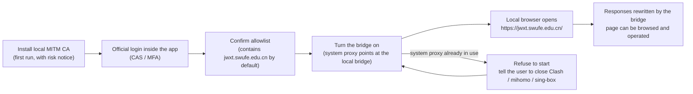

# Product Requirements

> Status: Draft ｜ Owner: cherrchen ｜ Last Reviewed: 2026-09-20
>
> Chinese source of truth: [product-requirements.md](product-requirements.md)

**Purpose**: product-level value proposition, users, scenarios and prioritisation.
**Do not write**: technical approach, component decomposition, data models.

---

## Product goals

| ID | Goal | Related goal | Priority |
| -- | ---- | ------------ | -------- |
| PR-001 | A local browser can open and operate the academic-affairs site `jwxt.swufe.edu.cn` | [G-001](../overview/goals-and-non-goals.md) | Must |
| PR-002 | Connection state and error reasons are visible; dangerous operations (CA install, bridge on) are reversible | [G-003](../overview/goals-and-non-goals.md) | Must |
| PR-003 | The allowlist is user-editable, contains the academic-affairs host by default, and all other traffic goes direct | [G-001](../overview/goals-and-non-goals.md) | Must |
| PR-004 | Ship for private use first, while keeping the architecture and docs open-sourceable later | [G-004](../overview/goals-and-non-goals.md) | Could |
| PR-005 | A later phase takes over proxy-less scenarios via TUN (explicitly not in Phase 1) | [G-001](../overview/goals-and-non-goals.md) | Won't (now) |

Priority values: `Must` / `Should` / `Could` / `Won't (now)`.

## Users and scenarios

| User | Scenario | Expected outcome | Related requirement |
| ---- | -------- | ---------------- | ------------------- |
| SWUFE students and staff (the developer first) | Off campus, use an ordinary local browser to reach the academic-affairs site and other allowlist hosts, after completing the official WebVPN (CAS/MFA) login | Browse and operate the site without having to understand WebVPN URL shapes | REQ-002 / REQ-005 / REQ-006 / REQ-007 |
| Future open-source users | Self-host, audit code and docs, and assess the risk of trusting a local CA | Decide for themselves, and uninstall the CA in one click when no longer needed | REQ-001 / REQ-010 |

## Core user journeys

First-run happy path: the user installs the local MITM CA (the app shows a risk notice; it can be uninstalled at any time) → completes the official WebVPN/CAS login in the embedded window (MFA may be required) → confirms the allowlist (which contains `jwxt.swufe.edu.cn` by default) → turns the bridge switch on → opens `https://jwxt.swufe.edu.cn/` in a local browser → requests matching the allowlist are rewritten by the local bridge into WebVPN form and carry the session, so the page can be browsed and operated normally. If the system proxy is already occupied by other software before the bridge starts, the app refuses to start and tells the user to close Clash / mihomo / sing-box first; once the system proxy is released, turning the bridge on resumes the path above.

## Success measures

| Metric | Definition | Target | Data source |
| ------ | ---------- | ------ | ----------- |
| Acceptance-checklist pass rate | Every item of the Phase 1 acceptance checklist (`99-appendix/requirements-onepager-v1.0.md` §8) | All pass | `docs/archive/2026-09-20-swufe-webvpn-bridge-docs-v1.0/02-testing/01-test-plan.md`, `docs/archive/2026-09-20-swufe-webvpn-bridge-docs-v1.0/99-appendix/requirements-onepager-v1.0.md` |
| Number of steps | Clicks from "already logged in" to "browser shows the academic-affairs site" (excluding CAS itself) | ≤ 3 | `docs/archive/2026-09-20-swufe-webvpn-bridge-docs-v1.0/01-requirements/01-PRD.md` §8 |
| Security baseline | No password on disk; CA uninstallable in one click; no leftover system proxy after shutdown | All three hold | `docs/archive/2026-09-20-swufe-webvpn-bridge-docs-v1.0/01-requirements/01-PRD.md` §8, `docs/archive/2026-09-20-swufe-webvpn-bridge-docs-v1.0/02-testing/02-test-cases.md` TC-C03 / TC-C04 / TC-D01 / TC-E02 |

## Priorities and trade-offs

- **Correctness before feature count**: make the academic-affairs path work end to end (open and operate the page) before widening rewrite coverage.
- **No second equivalent approach**: keep exactly one current technical path per problem to avoid parallel maintenance (e.g. do not build a home-grown proxy core/TLS/PKI; reuse a mature stack).
- **Keep the academic-affairs navigation working first**: response reverse rewriting (`Location`, cookie domains, absolute URLs in pages) starts with the critical academic-affairs redirects, then extends to other allowlist hosts.
- **Reversibility first**: anything that touches local networking or the trust store must be recoverable in one click (uninstall CA, clear the system proxy on bridge shutdown).
- **Private use first**: do not pay distribution, signing or store-listing costs ahead of time for "future open source".

## Product risks

| Risk | Impact | Mitigation |
| ---- | ------ | ---------- |
| The academic-affairs front end uses many absolute URLs / a complex SPA | Navigation jumps away and breaks | Response reverse rewriting is mandatory; test cases cover the critical redirects |
| Session / cookie policy changes | Connection drops | Stop the bridge explicitly on expiry; adaptation points stay in the Session Broker |
| University policy | Compliance dispute | Serve only authorised users; document the official channel and the risks |
| Conflicts with other proxies | Cannot start | Refuse to start with an explanatory prompt (chosen strategy, see [ADR-0004](../architecture/adr/ADR-0004-refuse-start-when-system-proxy-in-use.md)) |

## Open questions

| ID | Question | Impact | Status |
| -- | -------- | ------ | ------ |
| PQ-001 | The exact session cookie names and expiry signals must be confirmed against the real service | REQ-002 / REQ-008 / session-expiry handling | Open |
| PQ-002 | Chained coexistence with Clash / mihomo / sing-box system proxies | REQ-004 / [ADR-0004](../architecture/adr/ADR-0004-refuse-start-when-system-proxy-in-use.md) | Resolved (explicitly out of scope for Phase 1) |
