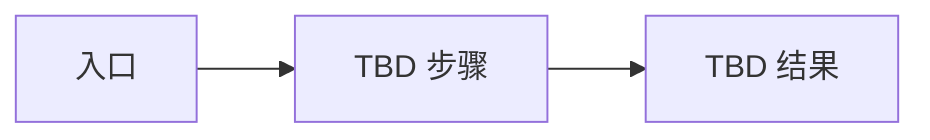

# 产品需求

> Status: TBD ｜ Owner: <OWNER> ｜ Last Reviewed: <DATE>

**用途**：定义产品级的价值主张、用户、使用场景与优先级排序。
**不写**：技术方案、组件划分、数据模型。

---

## 产品目标

| ID | 目标 | 关联 Goal | 优先级 |
| -- | ---- | --------- | ------ |
| PR-001 | TBD | G-001 | TBD |

优先级取值：`Must` / `Should` / `Could` / `Won't (now)`。

## 用户与场景

| 用户 | 场景 | 期望结果 | 关联需求 |
| ---- | ---- | -------- | -------- |
| TBD | TBD | TBD | REQ-001 |

## 核心用户旅程

> 若流程图不比文字更清楚，删除本节。仅在流程确实是项目核心时保留。

## 成功度量

| 指标 | 定义 | 目标值 | 数据来源 |
| ---- | ---- | ------ | -------- |
| TBD | TBD | TBD | TBD |

## 优先级与取舍

TBD —— 冲突时的取舍原则（例如：正确性优先于功能数量；可维护性优先于短期速度）。

## 开放问题

| ID | 问题 | 影响范围 | 状态 |
| -- | ---- | -------- | ---- |
| PQ-001 | TBD | TBD | Open |
