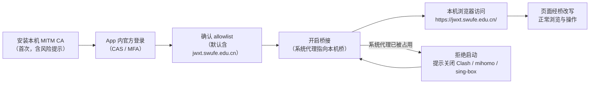

# 产品需求

> Status: Draft ｜ Owner: cherrchen ｜ Last Reviewed: 2026-09-20

**用途**：定义产品级的价值主张、用户、使用场景与优先级排序。
**不写**：技术方案、组件划分、数据模型。

---

## 产品目标

| ID | 目标 | 关联 Goal | 优先级 |
| -- | ---- | --------- | ------ |
| PR-001 | 本机浏览器能打开并操作教务站点 `jwxt.swufe.edu.cn` | [G-001](../overview/goals-and-non-goals.md) | Must |
| PR-002 | 连接状态与错误原因可见；危险操作（安装 CA、开启桥接）均可逆 | [G-003](../overview/goals-and-non-goals.md) | Must |
| PR-003 | allowlist 可由用户增删，默认包含教务主机，其余流量直连 | [G-001](../overview/goals-and-non-goals.md) | Must |
| PR-004 | 私用优先落地，架构与文档保持日后可开源 | [G-004](../overview/goals-and-non-goals.md) | Could |
| PR-005 | 后续阶段以 TUN 接管无系统代理场景（第一期不做） | [G-001](../overview/goals-and-non-goals.md) | Won't (now) |

优先级取值：`Must` / `Should` / `Could` / `Won't (now)`。

## 用户与场景

| 用户 | 场景 | 期望结果 | 关联需求 |
| ---- | ---- | -------- | -------- |
| 西财师生（开发者本人优先） | 在校外用本机普通浏览器访问教务等 allowlist 站点，先完成官方 WebVPN（CAS/MFA）登录 | 无需理解 WebVPN URL 形态即可正常浏览与操作页面 | REQ-002 / REQ-005 / REQ-006 / REQ-007 |
| 未来开源用户 | 自建、审计代码与文档，评估信任本机 CA 的风险 | 可自行判断并在不再需要时一键卸载 CA | REQ-001 / REQ-010 |

## 核心用户旅程

首次使用主路径：用户安装本机 MITM CA（App 展示风险提示，可随时卸载）→ 在 App 内嵌窗口完成官方 WebVPN/CAS 登录（可含 MFA）→ 确认 allowlist（默认含 `jwxt.swufe.edu.cn`）→ 开启桥接开关 → 在本机浏览器访问 `https://jwxt.swufe.edu.cn/` → 命中 allowlist 的请求被本地桥改写为 WebVPN 形态并携带会话，页面可正常浏览与操作。若开启桥接前检测到系统代理已被其它软件占用，App 拒绝启动并提示用户先关闭 Clash / mihomo / sing-box 等占用者；用户释放系统代理后再次开启即可继续主路径。

## 成功度量

| 指标 | 定义 | 目标值 | 数据来源 |
| ---- | ---- | ------ | -------- |
| 验收清单通过率 | 第一期验收清单（`99-appendix/requirements-onepager-v1.0.md` §8）全部条目 | 全部通过 | `docs/archive/2026-09-20-swufe-webvpn-bridge-docs-v1.0/02-testing/01-test-plan.md`、`docs/archive/2026-09-20-swufe-webvpn-bridge-docs-v1.0/99-appendix/requirements-onepager-v1.0.md` |
| 操作步骤数 | 从「已登录」到「浏览器打开教务」所需点击次数（不含 CAS 本身） | ≤ 3 次 | `docs/archive/2026-09-20-swufe-webvpn-bridge-docs-v1.0/01-requirements/01-PRD.md` §8 |
| 安全基线 | 无密码落盘；CA 可一键卸载；关闭后无残留系统代理 | 三项均满足 | `docs/archive/2026-09-20-swufe-webvpn-bridge-docs-v1.0/01-requirements/01-PRD.md` §8、`docs/archive/2026-09-20-swufe-webvpn-bridge-docs-v1.0/02-testing/02-test-cases.md` TC-C03 / TC-C04 / TC-D01 / TC-E02 |

## 优先级与取舍

- **正确性优先于功能数量**：第一期先保证教务主路径端到端可用（能打开并操作页面），再考虑扩大改写覆盖面。
- **不引入第二套等价方案**：同一问题只保留一条现行技术路径，避免并行维护（如不自研代理内核/TLS/PKI，复用成熟栈）。
- **先保教务主路径导航**：`Location`、Cookie 域、页面内绝对 URL 等响应反向改写先覆盖教务关键跳转，再扩展到其它 allowlist 站点。
- **可逆性优先**：任何影响本机网络或信任库的操作都必须可一键恢复（卸载 CA、关闭桥接清除系统代理）。
- **私用优先**：不为「未来开源」提前引入分发、签名、商店上架等成本。

## 产品风险

| 风险 | 影响 | 缓解 |
| ---- | ---- | ---- |
| 教务页大量绝对 URL/复杂前端 | 点击跳飞 | 响应反向改写必做；用例覆盖关键跳转 |
| 会话/Cookie 策略变化 | 断连 | 过期明确停桥；适配点集中在 Session Broker |
| 学校政策 | 合规争议 | 仅服务授权用户；文档声明官方通道与风险 |
| 与其它代理冲突 | 无法启动 | 拒绝启动并提示（已选策略，见 [ADR-0004](../architecture/adr/ADR-0004-refuse-start-when-system-proxy-in-use.md)） |

## 开放问题

| ID | 问题 | 影响范围 | 状态 |
| -- | ---- | -------- | ---- |
| PQ-001 | 会话 Cookie 的具体名称与失效信号需以实机为准 | REQ-002 / REQ-008 / 会话过期处理 | Open |
| PQ-002 | 与 Clash / mihomo / sing-box 等系统代理的链式共存 | REQ-004 / [ADR-0004](../architecture/adr/ADR-0004-refuse-start-when-system-proxy-in-use.md) | Resolved（第一期明确不做） |
