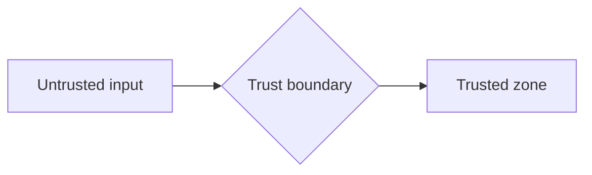

# Security Documentation

> Status: TBD ｜ Owner: <OWNER> ｜ Last Reviewed: <DATE>
>
> Chinese source of truth: [README.md](README.md)

**Purpose**: record long-lived security facts and constraints.
**Current state**: framework only — it contains **no concrete security architecture**. Adopting projects must fill it in; unknown items stay `TBD`.

> Warning: never invent security design to make this section look complete. A wrong security assumption is worse than an empty one.

---

## 1. Trust boundaries

| ID | Boundary | Inside | Outside | Crossing | Validation requirement |
| -- | -------- | ------ | ------- | -------- | ---------------------- |
| TB-001 | TBD | TBD | TBD | TBD | TBD |



> Do not draw this until the system structure is confirmed.

## 2. Authentication

```text
Mechanism:    TBD
Credential:   TBD
Session/token:TBD
Expiry policy:TBD
```

## 3. Authorisation

```text
Model:         TBD   (RBAC / ABAC / ACL / other)
Granularity:   TBD
Default policy:TBD   (deny by default / allow by default)
Check points:  TBD
```

## 4. Secrets and configuration

| Item | Convention |
| ---- | ---------- |
| Storage | TBD (never in the repository) |
| Injection | TBD |
| Rotation | TBD |
| Leak response | TBD |

## 5. Untrusted input

| Input source | Risk | Required handling |
| ------------ | ---- | ----------------- |
| TBD | injection / overflow / deserialisation / XSS / SSRF | TBD |

## 6. Dependency risk

See [dependency-policy.md](../development/dependency-policy.md): vulnerability scanning, licences, supply-chain risk.

## 7. Data privacy

| Data category | Sensitivity | Storage | Retention | Access control |
| ------------- | ----------- | ------- | --------- | -------------- |
| TBD | TBD | TBD | TBD | TBD |

## 8. Security-sensitive operations

| Operation | Risk | Constraints (who may run it, audit required?) |
| --------- | ---- | --------------------------------------------- |
| TBD | TBD | TBD |

## 9. Related

- Security-relevant architecture decisions ⇒ ADR ([adr/README.md](../architecture/adr/README.md))
- Security verification entries ⇒ [verification-strategy.md](../verification/verification-strategy.md)
- Every spec must fill in Security Considerations (see [specs/_template/design.md](../../specs/_template/design.md))
