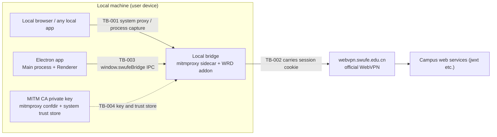

# Security Documentation

> Status: Draft ｜ Owner: cherrchen ｜ Last Reviewed: 2026-09-20
>
> Chinese source of truth: [README.md](README.md)

**Purpose**: record long-lived security facts and constraints for this project: trust boundaries, authentication and authorisation, secrets and untrusted input.
**Scope**: SWUFE WebVPN Bridge Phase 1 (a local Electron app plus a mitmproxy sidecar). Security conclusions in long-lived design docs defer to this file and the related ADRs; per-spec security verification entries live in the spec's Security Considerations and `verification.md`.

---

## 1. Trust boundaries

| ID | Boundary | Inside | Outside | Crossing | Validation requirement |
| -- | -------- | ------ | ------- | -------- | ---------------------- |
| TB-001 | Local browser / any local app → local bridge proxy | Local bridge (mitmproxy sidecar + thin WRD addon) | HTTP/HTTPS traffic from the local browser and any local application | System HTTP/HTTPS proxy pointed at `127.0.0.1:<bridgePort>`; or mitmproxy local process capture | Traffic is decrypted and rewritten with the user's knowledge: only allowlisted hosts get WRD rewriting, everything else is direct and untouched |
| TB-002 | Local bridge → `webvpn.swufe.edu.cn` | Local bridge | The official WebVPN upstream | Upstream HTTPS requests carrying the session cookie | The upstream is still verified over real TLS; session cookies are used only for this upstream; `webvpn.swufe.edu.cn` / `authserver.swufe.edu.cn` are hard-coded exclusions and are never re-wrapped (loop prevention) |
| TB-003 | Electron Renderer ↔ Main IPC | Main process (session, bridge orchestration, CA, system proxy) | Renderer (UI) | `window.swufeBridge` exposed by preload | The IPC surface is limited to the methods defined in the interface docs; sensitive values (session cookies) are returned only on demand and never reach debug logs or the debug panel |
| TB-004 | Local processes → CA private key and system trust store | MITM CA private key and OS trust store state | Other local processes and users | Reading the private key from the mitmproxy-dedicated confdir; installing/removing the CA in the OS trust store | The CA private key stays local, is never uploaded and never committed; install/uninstall must be explicit user actions and installation shows a risk warning |



How to read the diagram: TB-001 is the only entry point for local traffic into the decryption and rewriting chain, and the user must know about it — only allowlisted hosts are rewritten. TB-002 is the only egress from the bridge to the school upstream, and session cookies are sent only there. TB-003 is the only channel between the UI and privileged capabilities. TB-004 governs decryption capability itself (private key plus system trust) and is established or removed only by explicit user action. The login WebView sits on the client side of TB-001 but its traffic is direct and never enters the bridge (REQ-008).

## 2. Authentication

```text
Mechanism:    Official WebVPN / CAS (authserver.swufe.edu.cn, possibly with MFA);
              the app builds no auth of its own and no fake login form -
              login happens in the embedded WebView
Credential:   session cookies only; no student ID or password is stored
Session/token: the WebVPN session cookie set plus minimal ancillary state
              (storage and encryption: see section 4)
Expiry policy: stop the bridge -> clear the system proxy -> stop process capture
              -> show a modal asking the user to log in again
```

Expiry signals (the implementation may combine them, see the technical design): a probe URL returning login-page markers, `Set-Cookie` clearing the session, and a 302 to CAS after consecutive rewrites.

## 3. Authorisation

```text
Model:        allowlist (deny by default)
Granularity:  hostname (exact match; optional *.swufe.edu.cn wildcard including
              the apex swufe.edu.cn)
Default policy: deny - hosts outside the allowlist are direct and never rewritten
Check points:  the mitmproxy addon routing decision (every request is matched by host first);
              webvpn.swufe.edu.cn and authserver.swufe.edu.cn are hard-coded
              exclusions for loop prevention
```

The matching algorithm and the `AllowlistConfig` fields are defined in [architecture/data-model.md](../architecture/data-model.md); the default value always contains `jwxt.swufe.edu.cn`.

## 4. Secrets and configuration

| Item | Convention |
| ---- | ---------- |
| MITM CA private key | **Storage**: mitmproxy-dedicated confdir, local only, never uploaded, never committed; **Injection**: generated/loaded by the mitmproxy CA mechanism, never moved through config or env vars; **Rotation**: rebuild the confdir and reinstall the CA; **Leak response**: `TBD` - no response flow is defined for phase 1; mitigation is that a machine-local CA can simply be uninstalled and regenerated |
| WebVPN session cookies | **Storage**: `userData/session.bin` (optionally encrypted with Electron `safeStorage`) or an Electron persistent session partition; never logged; **Injection**: the Main process pushes them to the sidecar over the bridge control protocol (cookies must not appear in control-port responses); **Rotation**: refreshed on every login; **Leak response**: `TBD` - no server-side revocation path is defined for phase 1; mitigation is to log out, delete `session.bin` and log in again |
| WRD default key / iv | **Storage**: `wrdvpnisthebest!` is built in, overridable via `AppSettings.wrdKey` / `wrdIv` (ADR-0005); **Injection**: delivered to the sidecar with the configuration; **Rotation**: if the portal hands out a different key/iv, override in configuration (source risk R6, low probability / medium impact); **Leak response**: `TBD` - the value is not a user-specific secret; changing the configuration switches it |

## 5. Untrusted input

| Input source | Risk | Required handling |
| ------------ | ---- | ----------------- |
| Campus page HTML / JS (the rewriting target) | Injection / XSS / absolute URLs escaping WebVPN semantics | Perform URL reverse rewriting only, never execute page scripts; rewrite only `text/html`, `application/javascript` and `application/json` absolute URLs, per priority order |
| Upstream `Location` and `Set-Cookie` responses | Redirects escaping to unreachable direct connections; cookie Domain/Path scope polluted by rewriting | Reverse-rewrite in priority order 1) `Location` 2) `Set-Cookie` Domain/Path; the client side always uses real hostname semantics |
| Hostnames typed by the user into the allowlist | Invalid hostnames or out-of-scope hosts pulled into decryption and rewriting | Accept only lowercase valid hostnames, exact match; the only wildcard allowed is `*.swufe.edu.cn` (including the apex) |
| PID list for process capture | Capturing unintended processes, decrypting extra traffic | Capture only PIDs the user explicitly selected; stop capture together with the bridge; macOS permission prompts are guided by the UI |
| Debug log `detail` field | Recording bodies or cookies, causing leakage | `detail` must not contain cookies or bodies; logging is off by default |

## 6. Dependency risk

See [dependency-policy.md](../development/dependency-policy.md): vulnerability scanning, licences, supply-chain risk.
This project adds one hard constraint: **never build a proxy core, TLS stack or PKI in-house** (NFR-001 / ADR-0002). mitmproxy and Electron are infrastructure-level dependencies — expensive to replace — so version upgrades or replacements must go through an ADR and the re-verification requirements of [verification-strategy.md](../verification/verification-strategy.md).

## 7. Data privacy

| Data category | Sensitivity | Storage | Retention | Access control |
| ------------- | ----------- | ------- | --------- | -------------- |
| WebVPN session cookies | High | `userData/session.bin` (optionally `safeStorage`-encrypted) or an Electron persistent session partition | Cleared on logout/session expiry (automatic cleanup interval `TBD` - not defined for phase 1) | Read/written only by the Main process and the sidecar; never in logs or the debug panel |
| Allowlist and AppSettings | Low | `userData/config.json` | Kept for the lifetime of the app | The local user (a file in the user data directory) |
| Debug logs | Low (off by default; bodies and cookies forbidden) | In-memory ring buffer; on-disk location `TBD` (not defined for phase 1) | `TBD` - retention policy not defined for phase 1 | Local viewing only |

## 8. Security-sensitive operations

| Operation | Risk | Constraints (who may run it, audit required?) |
| --------- | ---- | --------------------------------------------- |
| Install the MITM CA | Local HTTPS on that device becomes decryptable | Only the local user may trigger it explicitly; a risk warning must be shown first (personal devices only, removable at any time, NFR-005); the authorization is raised by macOS inside this app's own session — the certificate is elevated into the system keychain first, and the **app process itself** then writes the trust settings ([ADR-0008](../architecture/adr/ADR-0008-ca-trust-authorization-in-app-session.en.md)), never through an osascript-administered child |
| Uninstall the MITM CA | TLS interception fails if the bridge is still running | Explicit local user action; stopping the bridge first is recommended |
| Set the system proxy | Affects all HTTP/HTTPS traffic on the machine | Only when no other system proxy is in use; otherwise refuse to start (ADR-0004 / `PROXY_CONFLICT`). The start path also runs a fake-ip (TUN) preflight that refuses with the same code ([ADR-0011](../architecture/adr/ADR-0011-refuse-start-on-fake-ip-dns.en.md)) |
| Clear the system proxy | Accidentally clearing a proxy the user set themselves | Clear only when the "set by this app" marker exists (NFR-004); stop, expiry and quit all follow this path |
| Start the bridge | Allowlisted traffic is decrypted and rewritten | Requires a login, an installed and trusted CA, and a non-empty allowlist; otherwise `NOT_LOGGED_IN` / `CA_MISSING` / `ALLOWLIST_EMPTY` |
| Enable process capture | All traffic of the captured process is decrypted | Only PIDs the user explicitly selected; stopped together with the bridge; macOS may require accessibility/network-extension authorisation |

These operations are those of a local single-user tool; phase 1 introduces no multi-user, audit-log or central-authorisation mechanisms.

## 9. Compliance and policy risk

- Serve only users **entitled to use the university WebVPN**, for resources they are authorised to reach;
- **No unauthorised tunnelling** (no bypass of access controls beyond the school SSLVPN, no replacement for the school's real VPN);
- HTTPS decryption is limited to **devices where the user consented to install the CA** (this machine), and the CA can be uninstalled in one action;
- Documentation must state the official channel and the risks (the PRD "school policy" risk item);
- The response to a change in school policy (source risk R5: low probability / high impact) is to **stop updating or keep only manual URL conversion** rather than continuing automatic rewriting.

## 10. Related

- Security-relevant architecture decisions ⇒ ADR ([adr/README.md](../architecture/adr/README.md))
- Security verification entries ⇒ [verification-strategy.md](../verification/verification-strategy.md)
- Every spec must fill in Security Considerations (see [specs/_template/design.md](../../specs/_template/design.md)); for phase 1 see the Security Considerations of [specs/001-phase1-local-bridge/design.md](../../specs/001-phase1-local-bridge/design.md)
- Configuration and runtime constraints ⇒ [operations/README.md](../operations/README.md)
- Threat-related test cases (proxy conflict, session expiry, response rewriting) ⇒ [testing-strategy.md](../development/testing-strategy.md)
