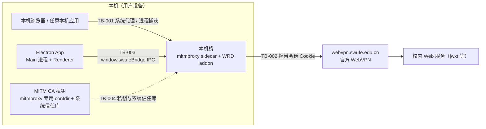

# 安全文档

> Status: Draft ｜ Owner: cherrchen ｜ Last Reviewed: 2026-09-25

**用途**：记录本项目的信任边界、认证授权、密钥与不可信输入等长期安全事实与约束。
**范围**：桌面 Phase 1（本机 Electron 应用 + mitmproxy sidecar）与 [Spec 003 iOS 代理客户端插件](../../specs/003-ios-proxy-client-plugins/)。两种宿主的拦截边界不同；下文旧有 Phase 1 细节按桌面语境理解，移动端新增边界见第 11 节、[ADR-0014](../architecture/adr/ADR-0014-stash-local-settings-and-routing-scope.md) 与 Spec 003。

---

## 1. 信任边界（Trust Boundaries）

| ID | 边界 | 内部 | 外部 | 跨越方式 | 校验要求 |
| -- | ---- | ---- | ---- | -------- | -------- |
| TB-001 | 本机浏览器 / 任意本机应用 → 本机桥代理 | 本机桥（mitmproxy sidecar + 薄 WRD addon） | 本机浏览器与任意本机应用发出的 HTTP/HTTPS 流量 | 系统 HTTP/HTTPS 代理指向 `127.0.0.1:<bridgePort>`；或 mitmproxy local 进程捕获 | 流量在用户知情下被解密并改写：仅 allowlist 命中的主机做 WRD 改写，其余主机直连、不改写 |
| TB-002 | 本机桥 → `webvpn.swufe.edu.cn` | 本机桥 | 官方 WebVPN 上游 | 携带会话 Cookie 的上游 HTTPS 请求 | 上游仍按真实 TLS 校验；会话 Cookie 只用于该上游；对 `webvpn.swufe.edu.cn` / `authserver.swufe.edu.cn` 硬编码排除、不做二次包装（防环） |
| TB-003 | Electron Renderer ↔ Main IPC | Main 进程（会话、桥编排、CA、系统代理） | Renderer（UI） | preload 暴露的 `window.swufeBridge` | IPC 面仅限接口文档定义的方法；敏感值（会话 Cookie）仅在需要时返回，不得进入调试日志或调试面板 |
| TB-004 | 本机进程 → CA 私钥与系统信任库 | MITM CA 私钥与 OS 信任库状态 | 本机其它进程与用户 | 读取 mitmproxy 专用 confdir 中的私钥；向 OS 信任库安装/卸载 CA | CA 私钥仅本机、不上传、不写入仓库；安装/卸载必须是用户显式操作，安装时展示风险提示 |



图说明：TB-001 是本机流量进入解密与改写链路的唯一入口，用户必须知情且只有 allowlist 主机被改写；TB-002 是本桥与学校上游之间唯一的出口，会话 Cookie 只随该出口发送；TB-003 是 UI 与特权能力的唯一通道；TB-004 决定解密能力本身（私钥 + 系统信任），仅在用户显式操作下建立或移除。登录 WebView 位于 TB-001 的客户端一侧，但其流量按 REQ-008 直连、不经本桥。

## 2. 认证（Authentication）

```text
机制:        官方 WebVPN / CAS（authserver.swufe.edu.cn，可含 MFA）；
             App 不自建认证、不伪造登录表单，登录在应用内嵌 WebView 中完成
凭据类型:    仅会话 Cookie；不保存学号/密码
会话/令牌:   WebVPN 会话 Cookie 集合及最小附属状态
             （存储位置与加密见第 4 节）
失效策略:    停桥 → 清除系统代理 → 停止进程捕获 → 弹窗要求重新登录
```

失效信号（实现可组合，见技术设计）：探测 URL 返回登录页标记、`Set-Cookie` 清空会话、连续改写后 302 到 CAS。

## 3. 授权（Authorization）

```text
模型:        Allowlist 白名单（默认拒绝）
权限粒度:    主机名（精确匹配；可选 *.swufe.edu.cn 通配，含 apex swufe.edu.cn）
默认策略:    默认拒绝——不在 allowlist 的主机直连，不做任何改写
越权检查点:  mitmproxy addon 的路由判定（每个请求先判定 host 是否命中）；
             webvpn.swufe.edu.cn 与 authserver.swufe.edu.cn 硬编码排除，防环
```

匹配算法与 `AllowlistConfig` 字段定义见 [architecture/data-model.md](../architecture/data-model.md)；默认值必含 `jwxt.swufe.edu.cn`。

## 4. 密钥与配置（Secrets）

| 项 | 约定 |
| -- | ---- |
| MITM CA 私钥 | **存储**：mitmproxy 专用 confdir，仅本机，不上传、不写入仓库；**注入**：由 mitmproxy CA 机制生成/加载，不经配置或环境变量搬运；**轮换**：重建 confdir 并重新安装 CA；**泄露应急**：`TBD`——第一期未定义响应流程，缓解方式为本机专用 CA 可直接卸载并重建 |
| WebVPN 会话 Cookie | **存储**：`userData/session.bin`（可选 Electron `safeStorage` 加密）或 Electron Session 持久分区，禁止进入日志；**注入**：Main 进程经桥控制协议下发 sidecar（Cookie 禁止出现在控制口响应中）；**轮换**：每次登录刷新；**泄露应急**：`TBD`——第一期未定义服务端吊销路径，缓解方式为登出、删除 `session.bin` 后重新登录 |
| WRD 默认 key / iv | **存储**：默认内置 `wrdvpnisthebest!`，可用 `AppSettings.wrdKey` / `wrdIv` 覆盖（ADR-0005）；**注入**：随配置下发到 sidecar；**轮换**：若 portal 下发不同 key/iv 则改配置覆盖（原包 R6，低概率/中影响）；**泄露应急**：`TBD`——该值非用户专属秘密，改配置即可切换 |

## 5. 不可信输入

| 输入来源 | 风险 | 处理要求 |
| -------- | ---- | -------- |
| 校内页面 HTML / JS（响应改写目标） | 注入 / XSS / 绝对 URL 跳飞出 WebVPN 语义 | 只做 URL 反向改写，不执行页面脚本；仅按优先级处理 `text/html`、`application/javascript`、`application/json` 的绝对 URL |
| 上游响应的 `Location` 与 `Set-Cookie` | 跳飞到不可达的公网直连；Cookie Domain/Path 作用域被改写污染 | 按优先级 1) `Location` 2) `Set-Cookie` Domain/Path 做反向改写；客户端侧始终使用真实主机名语义 |
| 用户输入的 allowlist 主机名 | 非法主机名、超范围主机被纳入解密与改写 | 仅接受小写合法 hostname 并做精确匹配；通配只允许 `*.swufe.edu.cn`（含 apex） |
| 进程捕获的 PID 列表 | 捕获非预期进程，导致额外流量被解密 | 只捕获用户显式选择的 PID；关闭桥时一并停止捕获；macOS 权限授权由 UI 引导 |
| 调试日志 `detail` 字段 | 记录请求/响应正文或 Cookie 造成泄露 | `detail` 禁止包含 Cookie 与正文；日志默认关闭 |

## 6. 依赖风险

见 [dependency-policy.md](../development/dependency-policy.md)：漏洞扫描、许可证、供应链风险。
本项目另有一条硬约束：**不自研代理内核、TLS 与 PKI**（NFR-001 / ADR-0002），mitmproxy 与 Electron 属基础设施级依赖——替换成本高，其版本升级或替换必须走 ADR 与 [verification-strategy.md](../verification/verification-strategy.md) 的复验证要求。

## 7. 数据隐私

| 数据类别 | 敏感性 | 存储 | 保留 | 访问控制 |
| -------- | ------ | ---- | ---- | -------- |
| WebVPN 会话 Cookie | 高 | `userData/session.bin`（可选 `safeStorage` 加密）或 Electron Session 持久分区 | 登出/会话失效时清除（自动清理周期 `TBD`——第一期未定义） | 仅 Main 进程与 sidecar 读写；禁止进入日志与调试面板 |
| allowlist 与 AppSettings | 低 | `userData/config.json` | 随 App 生命周期长期保留 | 本机用户（用户目录文件） |
| 调试日志 | 低（默认关闭，且禁止正文与 Cookie） | 内存环缓；落盘位置 `TBD`（第一期未定义） | `TBD`——第一期未定义保留策略 | 仅本机查看 |

## 8. 安全敏感操作

| 操作 | 风险 | 约束（谁可执行、是否需要审计） |
| ---- | ---- | ------------------------------ |
| 安装 MITM CA | 该设备上的本机 HTTPS 会被解密 | 只能由本机用户显式触发；安装前必须展示风险提示（仅限个人设备、可随时卸载，NFR-005）；授权由 macOS 在本应用会话内的系统弹窗完成——先提权把证书写入系统钥匙串，再由**应用进程自己**写入信任设置（[ADR-0008](../architecture/adr/ADR-0008-ca-trust-authorization-in-app-session.md)），不再经 osascript 提权子进程写信任设置 |
| 卸载 MITM CA | 桥仍在运行时 TLS 解密失败；同名 CA 可能属于其它工具 | 本机用户显式触发；建议先停桥再卸载；只按本应用本地 CA 的 SHA-1 指纹定位并删除证书，不按通用名称删除 |
| 设置系统代理 | 影响本机全部 HTTP/HTTPS 流量 | 仅当系统代理未被占用时设置；已被占用则拒绝启动（ADR-0004 / `PROXY_CONFLICT`）。开桥前另做 fake-ip（TUN）预检，命中同一错误码拒绝启动（[ADR-0011](../architecture/adr/ADR-0011-refuse-start-on-fake-ip-dns.md)） |
| 清除系统代理 | 误清用户自己设置的代理；清理失败后残留半开代理 | 仅清除指向本桥地址和端口的代理（NFR-004）；系统写入前保存归属标记，清理成功后才清标记，失败时下次启动重试 |
| 开启桥 | 命中 allowlist 的流量被解密与改写 | 需已登录、CA 已安装且受信任、allowlist 非空；否则返回 `NOT_LOGGED_IN` / `CA_MISSING` / `ALLOWLIST_EMPTY` |
| 启用进程捕获 | 被捕获进程的全部流量被解密 | 仅限用户显式选择的 PID；关闭桥时一并停止；macOS 可能需辅助功能/网络扩展授权 |

以上操作是本地单用户工具行为，第一期不引入多用户、审计日志或集中授权机制。

## 9. 合规与政策风险

- 仅服务**有权使用学校 WebVPN 的用户**访问其被授权的资源；
- **不提供未授权穿透**（不绕过学校 SSLVPN 之外的访问控制，不替代学校真 VPN）；
- HTTPS 解密**仅限用户同意安装 CA 的设备**（本机），且可一键卸载；
- 文档需声明官方通道与风险（原包 PRD「学校政策」风险项）；
- 学校政策变更（原包风险 R5：低概率 / 高影响）的应对是**停更或只保留手动 URL 转换**，不继续提供自动化改写。

## 10. 相关

- 安全相关架构决策 ⇒ ADR（[adr/README.md](../architecture/adr/README.md)）
- 安全验证项 ⇒ [verification-strategy.md](../verification/verification-strategy.md)
- 每个 Spec 必须填写 Security Considerations（见 [specs/_template/design.md](../../specs/_template/design.md)）；Phase 1 见 [specs/001-phase1-local-bridge/design.md](../../specs/001-phase1-local-bridge/design.md) 的 Security Considerations
- 配置与运行约束 ⇒ [operations/README.md](../operations/README.md)

## 11. 移动代理插件安全边界（Spec 003）

Stash/Loon 插件复用宿主 Network Extension、HTTP Engine、MitM CA 和 Script。M2 只存储 webvpn-gateway Gateway Session；它可经安全分类在代理层供其他 App/WKWebView 的 Gateway request 复用，Session 只发送到 webvpn.swufe.edu.cn。普通源站、raw authserver、Settings Namespace 永不接收；客户端已有 Gateway ticket 时保留并 capture/refresh，不由旧 store 覆盖。Safari/WKWebView Cookie Jar 不共享也不被修改。CAS Cookie 当前不捕获、不存储、不注入。

Safe Auth Trace 只记录本地 allowlist 字段：timestamp、host 和 pathname 分类、route/request kind、ticket/session 状态、injection 与 client precedence、WRD original host、redirect host、必要 Cookie names、CAS service target hostname。禁止 Cookie value、CAS ticket、execution、Authorization、账号/密码/MFA、完整 query/service URL、长 WRD token 与 request/response body。Trace 不进入 Settings、通知、云端或 Session Store；实现契约见 [ADR-0015](../architecture/adr/ADR-0015-session-realm-and-proxy-reuse.md) 与 [Spec 003 interfaces](../../specs/003-ios-proxy-client-plugins/interfaces.md)。

Stash 为支持保存后动态启用新的 SWUFE 子域，Interception Scope 可能宽于 Routing Scope：`*.swufe.edu.cn` 可在设备本地进入 HTTP Engine/MitM；Routing Scope 仍只包含 Settings 中启用的精确 hostname。被拦截不代表会经 WebVPN。未选中 host 必须原样 PASS，不改 URL/header/body、不注入 Cookie、不请求 gateway；用户说明必须明确这一点以及 Stash 本地可解密范围。Wildcard 配置当前仍待项目目标 Stash 版本实机验证。

Settings WebUI 由 Stash bundle 本地提供，Settings namespace 在 Session/Routing/Codec 之前由 Script synthetic response short-circuit，永不发送到 gateway server。`POST /__swufe_bridge__/api/settings` 只写站点配置，需使用设备本地 one-use nonce、来源与 Content-Type 校验、严格 schema 和 16 KiB body limit；未知路径/方法、处理异常及 oversized body 必须本地终止，不能 fall through upstream。API 和日志不得暴露 Cookie、Authorization、MFA、WRD secret 或 raw POST body。具体契约与尚待设备验证项见 [Spec 003 interfaces](../../specs/003-ios-proxy-client-plugins/interfaces.md)、[verification](../../specs/003-ios-proxy-client-plugins/verification.md)。
- 威胁相关测试用例（代理冲突、会话过期、响应改写）⇒ [testing-strategy.md](../development/testing-strategy.md)
