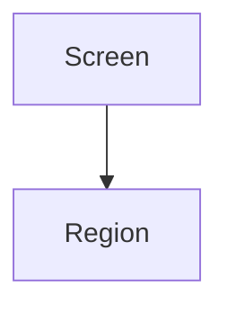

# UI / UX Documentation

> Status: Draft ｜ Owner: <OWNER> ｜ Last Reviewed: <DATE>
>
> Chinese source of truth: [README.md](README.md)

**Purpose**: record interface structure, interaction conventions, states and accessibility requirements.
**Do not write**: implementation detail (framework, component library, styling approach → spec or ADR), interface fields (→ [docs/api/](../api/README.md)).

## When to use this directory

- No user interface ⇒ keep this README and state `No UI (reason: TBD)`; create no other files.
- User interface exists ⇒ split files as below instead of growing one document.

| File | Content |
| ---- | ------- |
| `docs/ui-ux/<surface>.md` | structure, states and interactions of one screen |
| `docs/ui-ux/design-system.md` | shared components and visual conventions |

## Screen document template

```markdown
# <screen name>

> Status: Draft ｜ Owner: <OWNER> ｜ Last Reviewed: <DATE>

## Goal

- User goal: …
- Related requirements: REQ-xxx
- Related spec: `specs/<id>-<name>/`

## Structure and information hierarchy



## States

| State | Presentation | Trigger |
| ----- | ------------ | ------- |
| Empty | … | … |
| Loading | … | … |
| Error | … | … |
| Success | … | … |
| No permission | … | … |

## Interactions

| Action | Result | Edge cases |
| ------ | ------ | ---------- |

## Accessibility

- Keyboard: …
- Contrast: …
- Copy and localisation: …

## Copy

| Location | Copy | Notes |
| -------- | ---- | ----- |

## Open questions

| ID | Question | Status |
| -- | -------- | ------ |
```

## Maintenance rules

1. Changes affecting user-visible behaviour must check [requirements/](../requirements/README.md) and the spec's `ui-ux.md`.
2. Reference design files or prototypes by `<LINK>` rather than copying them into the repository unless there is a stated reason.
3. Undecided visual detail stays `TBD`; never invent a design system.
