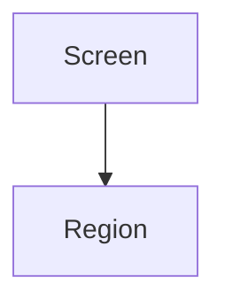

# UI / UX Documentation

> Status: Draft ｜ Owner: cherrchen ｜ Last Reviewed: 2026-09-23
>
> Chinese source of truth: [README.md](README.md)

**Purpose**: record interface structure, interaction conventions, states and accessibility requirements.
**Do not write**: implementation detail (framework, component library, styling approach → spec or ADR), interface fields (→ [docs/api/](../api/README.md)).

## Screen inventory

| File | Content |
| ---- | ------- |
| [main-window.md](main-window.md) | Main window (fixed 720×560, scroll-free): structure, states, interactions, size and content zoom, copy |
| [secondary-windows.md](secondary-windows.md) | Secondary windows (capture / log / allowlist): shared conventions, structure, states, interactions, copy |

The interface is fixed at four windows: the main window carries every high-frequency item and is strictly scroll-free, while the three kinds of long content (capture app picker, debug log, allowlist editing) each move to a non-modal secondary window (one instance per kind); the structural facts come from [Spec 002](../../specs/002-desktop-ui-multiwindow/spec.md) and [ADR-0012](../architecture/adr/ADR-0012-react-antd-multiwindow-renderer.en.md). The tray icon is optional and whether it ships is undecided (see the open questions in [main-window.en.md](main-window.en.md)). The design-system / visual-conventions document is `TBD` (not defined yet).

> When adding a screen, add a row above and create `docs/ui-ux/<surface>.md` from the template below.

## Screen document template

```markdown
# <screen name>

> Status: Draft ｜ Owner: cherrchen ｜ Last Reviewed: 2026-09-23

## Goal

- User goal: …
- Related requirements: REQ-xxx
- Related spec: `specs/<id>-<name>/`

## Structure and information hierarchy



## States

| State | Presentation | Trigger |
| ----- | ------------ | ------- |
| Empty | … | … |
| Loading | … | … |
| Error | … | … |
| Success | … | … |
| No permission | … | … |

## Interactions

| Action | Result | Edge cases |
| ------ | ------ | ---------- |

## Accessibility

- Keyboard: …
- Contrast: …
- Copy and localisation: …

## Copy

| Location | Copy | Notes |
| -------- | ---- | ----- |

## Open questions

| ID | Question | Status |
| -- | -------- | ------ |
```

## Maintenance rules

1. Changes affecting user-visible behaviour must check [requirements/](../requirements/README.md) and the spec's `ui-ux.md`.
2. Reference design files or prototypes by full URL (or a repository-relative path) rather than copying them into the repository, unless there is a stated reason.
3. Undecided visual detail stays `TBD`; never invent a design system.
