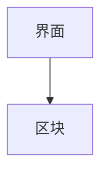

# UI / UX 文档

> Status: Draft ｜ Owner: cherrchen ｜ Last Reviewed: 2026-09-20

**用途**：记录界面结构、交互约定、状态与可访问性要求。
**不写**：实现细节（框架、组件库、样式方案 → 属于 Spec 或 ADR）、接口字段（→ [docs/api/](../api/README.md)）。

## 界面清单

| 文件 | 内容 |
| ---- | ---- |
| [main-window.md](main-window.md) | 主窗口（第一期唯一界面）：结构、状态、交互、文案 |

第一期只有主窗口一个界面；托盘图标非必须，是否实现未定（见 [main-window.md](main-window.md) 的开放问题）。设计系统/视觉规范文档 `TBD`（第一期未定义）。

> 新增界面时在上表补一行，并按下方「界面文档模板」新建 `docs/ui-ux/<surface>.md`。

## 界面文档模板

```markdown
# <界面名称>

> Status: Draft ｜ Owner: cherrchen ｜ Last Reviewed: 2026-09-20

## 目标

- 用户目标：……
- 关联需求：REQ-xxx
- 关联 Spec：`specs/<id>-<name>/`

## 结构与信息层级



## 状态

| 状态 | 表现 | 触发条件 |
| ---- | ---- | -------- |
| 空态 | …… | …… |
| 加载 | …… | …… |
| 错误 | …… | …… |
| 成功 | …… | …… |
| 无权限 | …… | …… |

## 交互

| 操作 | 结果 | 边界条件 |
| ---- | ---- | -------- |

## 可访问性

- 键盘操作：……
- 对比度：……
- 文案与本地化：……

## 文案

| 位置 | 文案 | 备注 |
| ---- | ---- | ---- |

## 开放问题

| ID | 问题 | 状态 |
| -- | ---- | ---- |
```

## 维护规则

1. 影响用户可见行为的改动，必须检查 [requirements/](../requirements/README.md) 与对应 Spec 的 `ui-ux.md`。
2. 设计稿或原型以完整 URL（或仓库内相对路径）引用，不要复制到仓库，除非有明确理由。
3. 未定的视觉细节标 `TBD`；不要编造设计系统。
