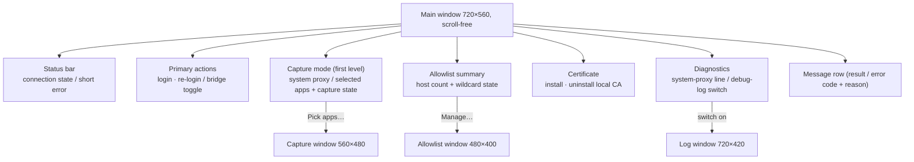

# Main Window

> Status: Draft ｜ Owner: cherrchen ｜ Last Reviewed: 2026-09-23
>
> Chinese source of truth: [main-window.md](main-window.md)

## Goal

- User goal: after logging in to the official WebVPN on this machine, the user turns the bridge on and can open and operate the academic affairs site `jwxt.swufe.edu.cn` in an ordinary browser; connection state and error reasons are always visible, and every step can be rolled back (turn the bridge off, clear the system proxy, uninstall the CA).
- Related requirements: REQ-001 (Electron app shell), REQ-002 (login and session), REQ-003 (traffic takeover), REQ-005 (allowlist routing), REQ-009 (observability), REQ-010 (certificate lifecycle), REQ-012 (multi-window structure), NFR-003, NFR-005, NFR-007; experience goal G-002, security goal G-003.
- Related spec: [specs/002-desktop-ui-multiwindow/](../../specs/002-desktop-ui-multiwindow/spec.md) (the current source of truth for the interface structure); the Phase 1 capability baseline is [specs/001-phase1-local-bridge/](../../specs/001-phase1-local-bridge/spec.md).
- Related decisions: [ADR-0003](../architecture/adr/ADR-0003-electron-gui-for-phase-1.en.md) (Electron shell), [ADR-0006](../architecture/adr/ADR-0006-local-capture-mode-and-mutual-exclusion.en.md) (capture modes exclude each other), [ADR-0012](../architecture/adr/ADR-0012-react-antd-multiwindow-renderer.en.md) (renderer framework and the four-window structure).

## Window inventory and information hierarchy

The interface is fixed at **four windows**: the main window carries every high-frequency item and must not scroll, while the three kinds of **long content** (capture app picker, debug log, allowlist editing) each move to a non-modal secondary window.

| Window | Size (DIP) | Resizable | Instances | Scrolling |
| ------ | ---------- | --------- | --------- | --------- |
| Main window | 720×560 (baseline) | No (`resizable: false`) | 1 | **None (strictly scroll-free)** |
| [Capture window](secondary-windows.en.md#capture-window) | 560×480 | Yes (min = default) | ≤1 | list scrolls internally |
| [Log window](secondary-windows.en.md#log-window) | 720×420 | Yes (min = default) | ≤1 | table scrolls internally |
| [Allowlist window](secondary-windows.en.md#allowlist-window) | 480×400 | Yes (min = default) | ≤1 | list scrolls internally |



The hierarchy is unchanged top-down (state → primary action → configuration → diagnostics), but **long content no longer lives in the main window**:

```text
Main window
├─ Status bar (textual state name + short error reason)
├─ Primary actions
│  ├─ [Log in to WebVPN] / [Re-login]
│  └─ bridge toggle (disabled while logged out, busy, or handling expiry)
├─ Capture mode (first level)
│  ├─ (•) system proxy (all traffic) / ( ) selected apps
│  ├─ process capture: off / enabled (N apps) / enabling… / failed — reason
│  ├─ [Pick apps…] → capture window
│  └─ authorisation guidance + [Retry] (only when process capture failed)
├─ Allowlist
│  ├─ N hosts (incl. *.swufe.edu.cn) / no hosts yet
│  └─ [Manage…] → allowlist window
├─ Certificate
│  ├─ CA state text
│  ├─ [Install local CA] (must show the risk notice first)
│  └─ [Uninstall local CA]
├─ Diagnostics
│  ├─ system proxy: pointing at this bridge 127.0.0.1:<port> / not set by this app
│  └─ debug-log switch → opens the log window; turning it off closes and clears it
└─ Message row (role=status, aria-live=polite)
```

Constraints ([spec.md](../../specs/002-desktop-ui-multiwindow/spec.md) SC2-001 / SC2-002 / SNFR-001):

- Root container `height: 100%; overflow: hidden`, fixed row heights and compact spacing (Ant Design `componentSize="small"` plus token overrides); no region may become a scroll container.
- No collapsible sections: the former "Advanced" collapsible is gone; "Diagnostics" is two permanent lines (system-proxy state + debug-log switch) so expanding never changes the window height.
- The main window contents are fixed to: status bar, [Login/Re-login] plus the bridge toggle, capture-mode radio plus the process-capture state line (with [Pick apps…]), allowlist summary (with [Manage…]), CA state plus [Install/Uninstall local CA], one system-proxy line, the debug-log switch and the message row. It contains **no** app list, no log table and no allowlist editing control.
- Overflow (content zoom or system font size) is handled by ① enlarging the window with the content zoom factor (clamped to the work area), and ② if it still does not fit, moving content out in order (system-proxy line → capture state line → allowlist summary) into secondary windows. Scrolling is **never** the fallback.

## Size and content zoom

| Item | Convention |
| ---- | ---------- |
| Baseline | 720×560 (DIP), `resizable: false`: the user cannot resize the frame by dragging |
| Content zoom | Content zoom factor `zoomFactor` defaults to 1.0; `Cmd` (macOS) / `Ctrl` (Windows) + `=`/`+` zooms in and `-`/`_` zooms out in steps of 0.25, range [0.5, 2.0]; `Cmd`/`Ctrl` + `0` resets to 1.0; trackpad/menu zoom (`zoom-changed`) applies as well |
| Window size | Actual size = baseline × `zoomFactor`, clamped to the current display work area (`width ≤ workArea.width − 80`, `height ≤ workArea.height − 120`, never below the baseline) |
| Zoom memory | After each load the content zoom is reset to 1.0 and the window is re-fitted to the baseline (Chromium remembers zoom per origin and replays a stale factor under `file://`) |
| Platform scaling | Only the **content** zoom factor is used, never the display `scaleFactor` (macOS Retina `scaleFactor = 2` would resize the window to 1440×1120 DIP, beyond a normal laptop's logical work area) |
| Measurement | At `zoomFactor` 1.0 / 1.25 / 1.5 (and 2.0) assert: `document.scrollingElement.scrollHeight ≤ clientHeight`, no scrollable overflowing element in the document, and window frame ≈ baseline × factor (after clamping) |

## States

The status bar follows the bridge state machine (`BridgeStatus` → text plus `Tag` colour; colour is only an aid, the state name is always written out):

| State | Status bar | Bridge toggle | Notes |
| ----- | ---------- | ------------- | ----- |
| Not logged in | grey "Not logged in" | disabled | log in first |
| Logged in, bridge off | green "Logged in" | can start | |
| Bridging | green "Bridging" | can stop | system-proxy mode, or selected apps before capture took effect |
| Bridging (process capture) | green "Bridging (process capture)" | can stop | selected-apps mode and the sidecar reported `enabled: true` |
| Bridging (starting) | blue "Bridging (starting)" | disabled | |
| Stopping | blue "Stopping" | disabled | |
| Error | red "Error" + reason text | as applicable | e.g. "proxy-environment conflict (system proxy in use / TUN mode present)" |
| Handling expiry | orange "Handling expiry" | forced off | modal: [Go to login] |

The four process-capture state lines (decoupled from the bridge state; a failure never changes the bridge state):

| State line | Condition |
| ---------- | --------- |
| `进程捕获：未启用` | capture mode is system proxy (or selected apps not yet enabled) |
| `进程捕获：启用中…` | selected-apps mode, the sidecar has not reported back yet |
| `进程捕获：已启用（N 个应用）` | the sidecar reports `enabled: true`; N = number of saved apps |
| `进程捕获：启用失败 — <原因>` | the sidecar reports a failure; the macOS authorisation guidance and [Retry] appear next to it |

## Interactions

| Action / flow | Result | Edge cases |
| ------------- | ------ | ---------- |
| First use | 1. after start: "not installed" → 2. [Install local CA] → risk modal → after confirming the OS may ask for a password/permission → 3. [Log in to WebVPN] opens the portal/CAS in a WebView → 4. auth completes, state becomes "Logged in" → 5. confirm the allowlist ([Manage…] opens the secondary window) → 6. turn the bridge toggle on → 7. the user opens the academic site in a browser | At step 6, if a system proxy already exists a modal blocks the start and explains that Clash must be closed (REQ-004 / [ADR-0004](../architecture/adr/ADR-0004-refuse-start-when-system-proxy-in-use.en.md)); a gateway host resolving into the fake-ip range (TUN mode) is blocked by the same modal ([ADR-0011](../architecture/adr/ADR-0011-refuse-start-on-fake-ip-dns.en.md)); without the CA the start fails and shows error code `CA_MISSING` with its reason |
| Daily use | 1. start the app; with valid cookies it shows "Logged in" → 2. start the bridge → 3. use the browser → 4. stop the bridge or quit (quitting must clear the proxy) | Stopping the bridge or quitting must never leave a "half-open" system proxy (NFR-004) |
| Switching capture mode | Selected apps: revoke the system proxy this app set and ask the sidecar to enable local mode for the chosen apps; system proxy: remove local mode and set the system proxy again | The two modes exclude each other (REQ-003 / [ADR-0006](../architecture/adr/ADR-0006-local-capture-mode-and-mutual-exclusion.en.md)); when another tool owns the system proxy, switching to selected apps is refused with `PROXY_CONFLICT` and the same modal appears; after a refusal the radio returns to the persisted value |
| Picking captured apps | [Pick apps…] opens the capture window; ticking/unticking happens there, is persisted and pushed immediately, and needs no bridge restart | Opening is allowed while logged out (the selection is saved but takes no effect); when process capture failed the main window shows the guidance and [Retry] (retry re-pushes the current configuration) |
| Session expiry | 1. the bridge detects 401 / a login-page redirect / cookie invalidation → 2. automatically: stop bridge, clear system proxy, stop process capture → 3. modal: "session expired" + [Go to login] | The modal always appears in the main window (even when a secondary window has focus) and focuses it; while handling expiry the toggle is forced off; after a successful re-login the state returns to "Logged in, bridge off" |
| Viewing the debug log | Turning the debug-log switch on makes the log window appear and start receiving records; turning it off closes the window and clears the Main-side buffer | Only domains and rewrite results, never bodies or cookies; at most 200 records; the main window carries only the switch, never the log list (REQ-009) |
| Installing / uninstalling the CA | [Install local CA] first shows the risk notice — cancelling performs no system action; [Uninstall local CA] requires an installed CA | Install is disabled once the CA is installed and trusted; uninstall is disabled while the CA is not installed or the state has not loaded (NFR-005 / REQ-010) |
| Closing the main window | The app quits (all secondary windows go with the process and the exit cleanup still runs) | Closing a secondary window on its own only destroys that window and changes no persisted state |

## Accessibility

- Keyboard: buttons, switches and radios all carry clear labels and can be focused and operated from the keyboard; risky actions (install/uninstall CA) are never hover-only.
- State expression: the status bar states the status in words; errors are "colour + text + error code"; a failed process capture says "failed — <reason>" rather than showing an icon only.
- Contrast: states are never distinguished by colour alone (Ant Design default light theme plus textual explanation).
- Platform conventions: macOS / Windows follow each platform's window and permission-dialog conventions (certificate trust, system proxy settings and process-capture authorisation are each confirmed through the native dialog).
- Copy and localisation: UI and copy are Chinese-first (NFR-007, the `zh_CN` locale of `ConfigProvider` covers built-in component copy); English can follow when the project is open-sourced.
- Theme: light by default (dark mode is an open question).

## Copy

The main-window strings are fixed as follows (the single source of truth for error copy is `ERROR_MESSAGES` in `apps/desktop/src/main/constants.ts`; the renderer only consumes error codes and messages, and keeps its own fixed strings in `apps/desktop/src/renderer/lib/messages.ts`).

| Location | Copy | Notes |
| -------- | ---- | ----- |
| Window title | `SWUFE WebVPN Bridge` | also the HTML `<title>` |
| Login button | `登录 WebVPN` / `重新登录` | follows the login state |
| Bridge label | `桥接` | the switch's `aria-label` is `开启桥接` / `关闭桥接` |
| Capture-mode radios | `系统代理（全部流量）` / `指定应用` | REQ-003 |
| Capture entry | `选择应用…` | opens the capture window |
| Capture state line | `进程捕获：未启用` / `进程捕获：启用中…` / `进程捕获：已启用（N 个应用）` / `进程捕获：启用失败 — <原因>` | see "States" |
| Capture guidance | `首次启用时 macOS 会安装并激活 mitmproxy 的网络扩展：请在系统设置 → 通用 → 登录项与扩展（或弹出的授权提示）中允许。未在 5 秒内确认会导致启用失败，授权后点「重试」。` | shown only on failure, together with [Retry] (NFR-005 / R4) |
| Allowlist summary | `N 个主机` / `N 个主机（含 *.swufe.edu.cn）` / `未添加主机` / `未添加主机（含 *.swufe.edu.cn）` | editing happens in the secondary window |
| Allowlist entry | `管理…` | opens the allowlist window |
| CA state | `读取中…` / `已安装并被系统信任` / `已安装，但系统尚未信任` / `未安装` | |
| CA risk notice | title `安装本机 CA`, body `本证书用于在本机解密并改写 HTTPS，仅限个人设备；可随时卸载。`, buttons `确认安装` / `取消` | NFR-005; must be shown before installing |
| CA operation results | `正在安装本机 CA：请在随后弹出的系统窗口中确认（Windows 需点「是(Y)」；macOS 需输入管理员密码）…` / `本机 CA 已安装并被系统信任。` / `安装失败：<msg>` / `正在卸载本机 CA…` / `本机 CA 已卸载。` / `卸载失败：<msg>` | message row |
| Proxy-conflict modal | title `检测到代理环境冲突`, body = `BridgeStatus.error.message`, button `知道了` | REQ-004 / ADR-0004 / ADR-0011; both the CA path and the selected-apps path use this modal |
| Session-expiry modal | title `会话已过期`, body = `BridgeStatus.error.message` (fallback `WebVPN 会话已失效。桥接已停止并已清除系统代理。`), buttons `去登录` / `取消` | REQ-002 |
| System-proxy line | `系统代理：已指向本桥 127.0.0.1:<port>` / `系统代理：未由本 App 设置（捕获方式：指定应用）` / `系统代理：未由本 App 设置` | read-only |
| Debug-log switch | `调试日志` | turning it on opens the log window |
| Login failure | `打开登录窗口失败：<msg>` | message row |
| Bridge-toggle failure | other error codes: `<CODE>：<message>` | `PROXY_CONFLICT` goes to the modal; the error code always stays in the message row |
| Message row | see above (`role=status`, `aria-live=polite`) | text only, colour is never the explanation |

> The strings above are Chinese UI copy and are kept verbatim from the implementation (the Chinese file is the source of truth).

## Open questions

| ID | Question | Status |
| -- | -------- | ------ |
| Q1 | Will a tray icon (showing connection state) be implemented? | TBD (not required for Phase 1) |
| Q2 | Is dark mode supported? | TBD (only the light default theme is fixed today, see [ADR-0012](../architecture/adr/ADR-0012-react-antd-multiwindow-renderer.en.md)) |
| Q3 | Windows permission-dialog details (certificate trust, system proxy, process-capture authorisation)? | TBD (carries over the `KI-001` deferral from 001) |
