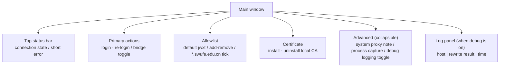

# Main Window

> Status: Draft ｜ Owner: cherrchen ｜ Last Reviewed: 2026-09-20
>
> Chinese source of truth: [main-window.md](main-window.md)

## Goal

- User goal: after logging in to the official WebVPN on this machine, the user turns the bridge on and can open and operate the academic affairs site `jwxt.swufe.edu.cn` in an ordinary browser; connection state and error reasons are always visible, and every step can be rolled back (turn the bridge off, clear the system proxy, uninstall the CA).
- Related requirements: REQ-001 (Electron app shell), REQ-002 (login and session), REQ-003 (traffic takeover), REQ-005 (allowlist routing), REQ-009 (observability), REQ-010 (certificate lifecycle); experience goal G-002, security goal G-003.
- Related spec: [specs/001-phase1-local-bridge/](../../specs/001-phase1-local-bridge/)

## Structure and information hierarchy

The main window is the only Phase 1 screen; the tray icon is optional and undecided (see "Open questions").



How to read the diagram: the window is ordered top-down as "state → primary action → configuration → diagnostics"; the status bar answers "can I use it now", the primary action is the only mandatory click target, the allowlist and certificate decide what the bridge is capable of, and the advanced area plus log panel are used only when troubleshooting.

Information architecture (item by item from package §2):

```text
Main window
├─ Top status bar (connection state / short error)
├─ Primary actions
│  ├─ [Log in to WebVPN] / [Re-login]
│  └─ [Start bridge] toggle
├─ Allowlist
│  ├─ default jwxt.swufe.edu.cn
│  ├─ add / remove
│  └─ [ ] enable *.swufe.edu.cn
├─ Certificate
│  ├─ [Install local CA]
│  └─ [Uninstall local CA]
├─ Advanced (collapsible)
│  ├─ system proxy state note
│  ├─ process capture: pick browser and other processes (selectable list)
│  └─ [ ] debug logging
└─ Log panel (when debug is on): host | rewrite result | time
```

## States

| State | Status bar | Toggle | Notes |
| ----- | ---------- | ------ | ----- |
| Not logged in | grey "Not logged in" | disabled | log in first |
| Logged in, bridge off | blue "Logged in" | can start | |
| Bridging | green "Bridging" | can stop | |
| Error | red + reason | as applicable | e.g. "system proxy in use" |
| Handling expiry | orange | forced off | |

## Interactions

| Action / flow | Result | Edge cases |
| ------------- | ------ | ---------- |
| First use | 1. On start an onboarding bar: "a local certificate is required to handle HTTPS" → 2. user accepts the risk and installs the CA (the OS may ask for a password/permission) → 3. click "Log in to WebVPN"; the WebView opens the portal/CAS → 4. auth completes, the app detects the session and the state becomes "Logged in" → 5. confirm the allowlist → 6. turn on "Start bridge" → 7. prompt the user to open the academic affairs site in a browser | At step 6, if a system proxy already exists, a modal blocks the start and explains that Clash must be closed (REQ-004 / ADR-0004); without the CA, starting returns `CA_MISSING` and points at installing it |
| Daily use | 1. start the app; if cookies are still valid it shows "Logged in" (if silent validation is impossible, re-login is required) → 2. start the bridge → 3. use the browser → 4. stop the bridge or quit when done (quitting must clear the proxy) | Stopping the bridge or quitting must never leave a "half-open" system proxy (NFR-004) |
| Session expiry | 1. the bridge detects 401 / a login-page redirect / cookie invalidation (probe signals are implementation-defined) → 2. automatically: stop bridge, clear system proxy, stop process capture → 3. modal: "The WebVPN session has expired. Please log in again." → [Go to login] | While handling expiry the toggle is forced off; after a successful re-login the state returns to "Logged in, bridge off" |
| Uninstall CA / app | "Uninstall local CA" in settings; quit/uninstall instructions: stop the bridge, then uninstall the certificate | The CA is removable in one click (REQ-010); before uninstalling the app, stop the bridge and uninstall the CA |

## Accessibility

- Keyboard: buttons have clear labels and can be focused and triggered from the keyboard; the bridge toggle and risky actions (install/uninstall CA) are not hidden behind hover-only affordances.
- Contrast: errors are not conveyed by colour alone (red plus a textual reason); the status bar always states the status in words.
- Platform conventions: macOS / Windows follow each platform's window and permission-dialog conventions (certificate trust, system proxy settings and process-capture authorisation are each confirmed through the native dialog).
- Theme: dark mode is not forced (following the system is optional).
- Copy and localisation: UI and copy are Chinese-first (NFR-007); English can follow when the project is open-sourced.

## Copy

| Location | Copy | Notes |
| -------- | ---- | ----- |
| CA install warning | 本证书用于在本机解密并改写 HTTPS，仅限个人设备；可随时卸载。 | NFR-005; must be shown before installing |
| Proxy conflict prompt | 检测到系统代理已启用。请先关闭 Clash / mihomo / 其它 VPN 的系统代理后再试。 | REQ-004; modal blocks starting the bridge |
| Session expiry prompt | WebVPN 会话已失效。桥接已停止并已清除系统代理。 | REQ-002; the modal offers [Go to login] |

> The three strings above are Chinese UI copy and are kept verbatim from the package (the Chinese file is the source of truth).

## Text wireframe

```text
┌─────────────────────────────────────────────┐
│ SWUFE WebVPN Bridge          ● 已登录        │
├─────────────────────────────────────────────┤
│  [ 重新登录 ]           桥接  ( ●──── ) 开  │
├─────────────────────────────────────────────┤
│ Allowlist                                   │
│  ✓ jwxt.swufe.edu.cn                    [删]│
│  [+] 添加主机…                              │
│  ☐ 启用 *.swufe.edu.cn                      │
├─────────────────────────────────────────────┤
│ 证书  [安装本机 CA]  [卸载本机 CA]           │
├─────────────────────────────────────────────┤
│ ▸ 高级 / 调试日志                           │
│  12:01  jwxt.swufe.edu.cn   rewrite=ok      │
└─────────────────────────────────────────────┘
```

## Open questions

| ID | Question | Status |
| -- | -------- | ------ |
| Q1 | Will a tray icon (showing connection state) be implemented? | TBD (the package lists it as optional, not required for Phase 1) |
| Q2 | Is dark mode supported? | TBD (not forced; following the system is possible) |
| Q3 | Windows permission-dialog details (certificate trust, system proxy, process-capture authorisation)? | TBD (decided during implementation) |
