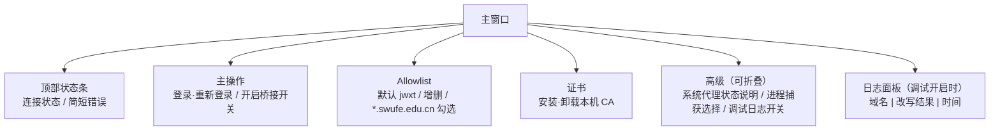

# 主窗口（Main Window）

> Status: Draft ｜ Owner: cherrchen ｜ Last Reviewed: 2026-09-20

## 目标

- 用户目标：用户在本机完成官方 WebVPN 登录后，开启桥接即可用普通浏览器打开并操作教务 `jwxt.swufe.edu.cn`；全程看得见连接状态与错误原因，且随时可以回退（关桥、清系统代理、卸载 CA）。
- 关联需求：REQ-001（Electron 应用外壳）、REQ-002（登录与会话）、REQ-003（流量接管）、REQ-005（Allowlist 路由）、REQ-009（可观测性）、REQ-010（证书生命周期）；体验目标 G-002、安全目标 G-003。
- 关联 Spec：[specs/001-phase1-local-bridge/](../../specs/001-phase1-local-bridge/)

## 结构与信息层级

主窗口是第一期唯一界面；托盘图标非必须，是否实现未定（见「开放问题」）。



上图说明：窗口按「状态 → 主操作 → 配置 → 诊断」自上而下排列；状态条回答「现在能不能用」，主操作是唯一必须点击的入口，Allowlist 与证书决定桥的行为能力，高级区与日志面板只在排查时使用。

信息架构（逐条对应原包 §2）：

```text
主窗口
├─ 顶部状态条（连接状态 / 简短错误）
├─ 主操作
│  ├─ [登录 WebVPN] / [重新登录]
│  └─ [开启桥接] 开关
├─ Allowlist
│  ├─ 默认 jwxt.swufe.edu.cn
│  ├─ 添加 / 删除
│  └─ [ ] 启用 *.swufe.edu.cn
├─ 证书
│  ├─ [安装本机 CA]
│  └─ [卸载本机 CA]
├─ 高级（可折叠）
│  ├─ 系统代理状态说明
│  ├─ 进程捕获：选择浏览器等进程（可选列表）
│  └─ [ ] 调试日志
└─ 日志面板（调试开启时）：域名 | 改写结果 | 时间
```

## 状态

| 状态 | 状态条 | 开关 | 说明 |
| ---- | ------ | ---- | ---- |
| 未登录 | 灰色「未登录」 | 禁用 | 需先登录 |
| 已登录未开桥 | 蓝色「已登录」 | 可开 | |
| 桥接中 | 绿色「桥接中」 | 可关 | |
| 错误 | 红色 + 原因 | 视情况 | 如「系统代理被占用」 |
| 过期处理中 | 橙色 | 强制关 | |

## 交互

| 操作 / 流程 | 结果 | 边界条件 |
| ----------- | ---- | -------- |
| 首次使用 | 1. 启动后引导条：「需要安装本机证书才能处理 HTTPS」→ 2. 用户确认风险并安装 CA（系统可能要求输入密码/允许）→ 3. 点「登录 WebVPN」，WebView 打开门户/CAS → 4. 完成认证，App 检测会话成功，状态变「已登录」→ 5. 确认 allowlist → 6. 打开「开启桥接」→ 7. 提示用浏览器访问教务 | 第 6 步若系统已有代理：模态框阻止并说明关闭 Clash 等（REQ-004 / ADR-0004）；未装 CA 时开桥以 `CA_MISSING` 引导去安装 |
| 日常使用 | 1. 启动，若 Cookie 仍有效显示「已登录」（若无法静默验证则要求重登）→ 2. 开桥 → 3. 用浏览器 → 4. 用完关桥或退出（退出须清代理） | 关桥/退出后不得留下「半开」系统代理（NFR-004） |
| 会话过期 | 1. 桥检测到 401 / 登录页跳转 / Cookie 失效（探测信号由实现定义）→ 2. 自动：停桥、清系统代理、停进程捕获 → 3. 模态：「会话已过期，请重新登录」→ [去登录] | 过期处理中开关强制关；重登成功后回到「已登录未开桥」 |
| 卸载 CA / 卸载 App | 设置内「卸载本机 CA」；退出/卸载说明：关闭桥后卸载证书 | CA 可一键卸载（REQ-010）；卸载 App 前建议先关桥并卸载 CA |

## 可访问性

- 键盘操作：按钮具备清晰标签，可被键盘聚焦并触发；严重依赖交互的开关（开桥）与危险操作（安装/卸载 CA）不依赖悬停才可见。
- 对比度：错误不仅靠颜色表达（红色 + 文字原因）；状态条同时给出文字状态名。
- 平台习惯：macOS / Windows 遵循各平台窗口与权限对话框习惯（系统证书信任、系统代理设置、进程捕获授权各由平台对话框确认）。
- 主题：不强制暗色主题（可跟随系统，非必须）。
- 文案与本地化：界面与文案中文优先（NFR-007）；开源时补英文可后置。

## 文案

| 位置 | 文案 | 备注 |
| ---- | ---- | ---- |
| CA 安装警告 | 本证书用于在本机解密并改写 HTTPS，仅限个人设备；可随时卸载。 | NFR-005；安装前必须展示 |
| 代理冲突提示 | 检测到系统代理已启用。请先关闭 Clash / mihomo / 其它 VPN 的系统代理后再试。 | REQ-004；模态阻止开桥 |
| 会话过期提示 | WebVPN 会话已失效。桥接已停止并已清除系统代理。 | REQ-002；模态提供 [去登录] |

## 文字线框

```text
┌─────────────────────────────────────────────┐
│ SWUFE WebVPN Bridge          ● 已登录        │
├─────────────────────────────────────────────┤
│  [ 重新登录 ]           桥接  ( ●──── ) 开  │
├─────────────────────────────────────────────┤
│ Allowlist                                   │
│  ✓ jwxt.swufe.edu.cn                    [删]│
│  [+] 添加主机…                              │
│  ☐ 启用 *.swufe.edu.cn                      │
├─────────────────────────────────────────────┤
│ 证书  [安装本机 CA]  [卸载本机 CA]           │
├─────────────────────────────────────────────┤
│ ▸ 高级 / 调试日志                           │
│  12:01  jwxt.swufe.edu.cn   rewrite=ok      │
└─────────────────────────────────────────────┘
```

## 开放问题

| ID | 问题 | 状态 |
| -- | ---- | ---- |
| Q1 | 是否实现托盘图标（显示连接状态）？ | TBD（原包列为可选，非第一期必做） |
| Q2 | 是否支持暗色主题？ | TBD（不强制，可跟随系统） |
| Q3 | Windows 侧权限对话框细节（证书信任、系统代理、进程捕获授权）？ | TBD（实现阶段确定） |
