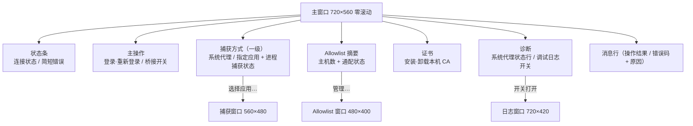

# 主窗口（Main Window）

> Status: Draft ｜ Owner: cherrchen ｜ Last Reviewed: 2026-09-23

## 目标

- 用户目标：用户在本机完成官方 WebVPN 登录后，开启桥接即可用普通浏览器打开并操作教务 `jwxt.swufe.edu.cn`；全程看得见连接状态与错误原因，且随时可以回退（关桥、清系统代理、卸载 CA）。
- 关联需求：REQ-001（Electron 应用外壳）、REQ-002（登录与会话）、REQ-003（流量接管）、REQ-005（Allowlist 路由）、REQ-009（可观测性）、REQ-010（证书生命周期）、REQ-012（多窗口界面结构）、NFR-003、NFR-005、NFR-007；体验目标 G-002、安全目标 G-003。
- 关联 Spec：[specs/002-desktop-ui-multiwindow/](../../specs/002-desktop-ui-multiwindow/spec.md)（当前界面结构的事实来源）；第一期能力基线见 [specs/001-phase1-local-bridge/](../../specs/001-phase1-local-bridge/spec.md)。
- 相关决策：[ADR-0003](../architecture/adr/ADR-0003-electron-gui-for-phase-1.md)（Electron 外壳）、[ADR-0006](../architecture/adr/ADR-0006-local-capture-mode-and-mutual-exclusion.md)（捕获方式互斥）、[ADR-0012](../architecture/adr/ADR-0012-react-antd-multiwindow-renderer.md)（渲染层框架与四窗口结构）。

## 窗口清单与信息层级

界面固定为**四个窗口**：主窗口承载全部高频内容且不允许滚动，三类**长内容**各自进入非模态二级窗口（捕获应用选择、调试日志、Allowlist 编辑）。

| 窗口 | 尺寸（DIP） | 可缩放 | 实例 | 滚动 |
| ---- | ----------- | ------ | ---- | ---- |
| 主窗口 | 720×560（基线） | 否（`resizable: false`） | 1 | **无（严格零滚动）** |
| [捕获窗口](secondary-windows.md#捕获窗口) | 560×480 | 是（min = 默认） | ≤1 | 列表内部滚动 |
| [日志窗口](secondary-windows.md#日志窗口) | 720×420 | 是（min = 默认） | ≤1 | 表格内部滚动 |
| [Allowlist 窗口](secondary-windows.md#allowlist-窗口) | 480×400 | 是（min = 默认） | ≤1 | 列表内部滚动 |



信息层级自上而下不变（状态 → 主操作 → 配置 → 诊断），但**长内容不再出现在主窗口**：

```text
主窗口
├─ 状态条（文字状态名 + 简短错误原因）
├─ 主操作
│  ├─ [登录 WebVPN] / [重新登录]
│  └─ 桥接 开关（未登录、忙碌、过期处理中时禁用）
├─ 捕获方式（一级）
│  ├─ (•) 系统代理（全部流量） / ( ) 指定应用
│  ├─ 进程捕获：未启用 / 已启用（N 个应用）/ 启用中… / 启用失败 — 原因
│  ├─ [选择应用…] → 捕获窗口
│  └─ 授权引导 + [重试]（仅进程捕获失败时显示）
├─ Allowlist
│  ├─ N 个主机（含 *.swufe.edu.cn） / 未添加主机
│  └─ [管理…] → Allowlist 窗口
├─ 证书
│  ├─ CA 状态文字
│  ├─ [安装本机 CA]（安装前必须展示风险提示）
│  └─ [卸载本机 CA]
├─ 诊断
│  ├─ 系统代理：已指向本桥 127.0.0.1:<port> / 未由本 App 设置
│  └─ 调试日志 开关 → 打开日志窗口；关闭即关窗并清空
└─ 消息行（role=status, aria-live=polite）
```

约束（[spec.md](../../specs/002-desktop-ui-multiwindow/spec.md) SC2-001 / SC2-002 / SNFR-001）：

- 根容器 `height: 100%; overflow: hidden`，区块用固定行高与紧凑间距（Ant Design `componentSize="small"` + token 调整）；任何区块都不得成为可滚动容器。
- 不设折叠区：「高级」折叠区已取消，改为常驻的「诊断」两行（系统代理状态 + 调试日志开关），避免展开/收起改变窗口高度。
- 主窗口内容清单固定为：状态条、[登录/重新登录] 与桥接开关、捕获方式单选与进程捕获状态行（含 [选择应用…]）、allowlist 摘要（含 [管理…]）、CA 状态与 [安装/卸载本机 CA]、系统代理状态一行、调试日志开关、消息行。**不含**应用列表、日志表格与 allowlist 编辑控件。
- 溢出（内容缩放或系统字号）的处置顺序是：① 随内容缩放系数放大窗口（clamp 到工作区）；② 仍装不下时把内容依次外移（系统代理状态行 → 捕获方式状态行 → allowlist 摘要行）到二级窗口；**不得**用滚动条兜底。

## 尺寸与内容缩放

| 项 | 约定 |
| --- | ---- |
| 基线 | 720×560（DIP），`resizable: false`：用户不能拖拽改变窗口大小 |
| 内容缩放 | 内容缩放系数 `zoomFactor` 默认 1.0；`Cmd`(macOS)/`Ctrl`(Windows) + `=`/`+` 放大、`-`/`_` 缩小，步长 0.25，范围 [0.5, 2.0]；`Cmd`/`Ctrl` + `0` 复位为 1.0；触控板/菜单缩放（`zoom-changed`）同样生效 |
| 窗口尺寸 | 实际尺寸 = 基线 × `zoomFactor`，并 clamp 到当前显示器工作区（`width ≤ workArea.width − 80`、`height ≤ workArea.height − 120`，且不小于基线） |
| 缩放记忆 | 每次加载完成后把内容缩放复位为 1.0 并按基线重设窗口尺寸（Chromium 会按 origin 记住缩放系数，`file://` 下会残留上一轮的缩放） |
| 平台换算 | 只使用**内容**缩放系数，**不**使用显示器 `scaleFactor`（macOS Retina 的 `scaleFactor = 2` 会把窗口放大到 1440×1120 DIP，超过普通笔记本的逻辑工作区） |
| 实测口径 | 在 `zoomFactor` 1.0 / 1.25 / 1.5（及 2.0）下分别断言：`document.scrollingElement.scrollHeight ≤ clientHeight`、文档内无可滚动溢出元素、窗口外框 ≈ 基线 × 系数（clamp 后） |

## 状态

状态条与桥状态机一致（`BridgeStatus` → 文字 + `Tag` 颜色；颜色只是辅助，文字始终给出状态名）：

| 状态 | 状态条 | 桥接开关 | 说明 |
| ---- | ------ | -------- | ---- |
| 未登录 | 灰「未登录」 | 禁用 | 需先登录 |
| 已登录未开桥 | 绿「已登录」 | 可开 | |
| 桥接中 | 绿「桥接中」 | 可关 | 捕获方式为系统代理，或指定应用但进程捕获未生效 |
| 桥接中（进程捕获） | 绿「桥接中（进程捕获）」 | 可关 | 捕获方式为指定应用且 sidecar 已报告 `enabled: true` |
| 桥接中（正在启动） | 蓝「桥接中（正在启动）」 | 禁用 | |
| 正在停止 | 蓝「正在停止」 | 禁用 | |
| 错误 | 红「错误」+ 原因文字 | 视情况 | 如「代理环境冲突（系统代理被占用 / 存在 TUN 模式）」 |
| 过期处理中 | 橙「过期处理中」 | 强制关 | 模态：[去登录] |

进程捕获的四种状态行（与桥状态解耦，失败不影响桥状态）：

| 状态行 | 条件 |
| ------ | ---- |
| `进程捕获：未启用` | 捕获方式为系统代理（或指定应用但尚未启用） |
| `进程捕获：启用中…` | 捕获方式为指定应用，sidecar 尚未回报结果 |
| `进程捕获：已启用（N 个应用）` | sidecar 报告 `enabled: true`；N = 已保存的应用数 |
| `进程捕获：启用失败 — <原因>` | sidecar 报告失败；同时显示 macOS 授权引导与 [重试] |

## 交互

| 操作 / 流程 | 结果 | 边界条件 |
| ----------- | ---- | -------- |
| 首次使用 | 1. 启动后「未安装」→ 2. [安装本机 CA] → 模态风险提示 → 确认后系统可能要求密码/允许 → 3. [登录 WebVPN]，WebView 打开门户/CAS → 4. 完成认证，状态变「已登录」→ 5. 确认 allowlist（[管理…] 进二级窗口）→ 6. 打开桥接开关 → 7. 提示用浏览器访问教务 | 第 6 步若系统已有代理：模态阻止并说明关闭 Clash 等（REQ-004 / [ADR-0004](../architecture/adr/ADR-0004-refuse-start-when-system-proxy-in-use.md)）；若网关主机解析到 fake-ip 段（TUN 模式）以同一模态阻止（[ADR-0011](../architecture/adr/ADR-0011-refuse-start-on-fake-ip-dns.md)）；未装 CA 时开桥失败并显示错误码 `CA_MISSING` 与原因 |
| 日常使用 | 1. 启动，若 Cookie 仍有效显示「已登录」→ 2. 开桥 → 3. 用浏览器 → 4. 用完关桥或退出（退出须清代理） | 关桥/退出后不得留下「半开」系统代理（NFR-004） |
| 切换捕获方式 | 选「指定应用」：撤销本 App 设置过的系统代理，请求 sidecar 启用 local 模式接管所选应用；选「系统代理」：移除 local 模式并重新设置系统代理 | 两种方式互斥（REQ-003 / [ADR-0006](../architecture/adr/ADR-0006-local-capture-mode-and-mutual-exclusion.md)）；系统代理被其它软件占用时切到「指定应用」以 `PROXY_CONFLICT` 拒绝并弹同一模态；被拒绝后单选回到落盘值 |
| 选择捕获应用 | [选择应用…] 打开捕获窗口；勾选/取消在捕获窗口内完成并立即落盘下发，无需重启桥 | 未登录时也允许打开（勾选可保存但不生效）；进程捕获失败时主窗口显示引导与 [重试]（重试即重新下发当前配置） |
| 会话过期 | 1. 桥检测到 401 / 登录页跳转 / Cookie 失效 → 2. 自动：停桥、清系统代理、停进程捕获 → 3. 模态：「会话已过期」+ [去登录] | 模态始终在主窗口呈现（二级窗口在前台时也如此），并聚焦主窗口；过期处理中开关强制关；重登成功后回到「已登录未开桥」 |
| 查看调试日志 | 打开「调试日志」开关 ⇒ 日志窗口出现并开始接收记录；关闭开关 ⇒ 日志窗口自动关闭、Main 侧缓冲清空 | 仅域名与改写结果，不含正文与 Cookie；最多 200 条；主窗口只承载开关，不承载日志列表（REQ-009） |
| 安装/卸载 CA | [安装本机 CA] 先弹风险提示，取消则不执行任何系统动作；[卸载本机 CA] 需已安装 | CA 已安装且被信任时禁用安装；未安装或状态未读到时禁用卸载（NFR-005 / REQ-010） |
| 关闭主窗口 | 应用退出（所有二级窗口随进程退出，退出清理照常执行） | 二级窗口被单独关闭只销毁自身，不改变任何持久化状态 |

## 可访问性

- 键盘操作：按钮、开关、单选均有清晰标签并可 Tab 聚焦后操作；危险操作（安装/卸载 CA）不依赖悬停才可见。
- 状态表达：状态条给出文字状态名；错误为「颜色 + 文字 + 错误码」；进程捕获失败给出「启用失败 — <原因>」文字而非仅图标。
- 对比度：不依赖颜色区分状态（Ant Design 默认亮色主题 + 文字说明）。
- 平台习惯：macOS / Windows 遵循各平台窗口与权限对话框习惯（系统证书信任、系统代理设置、进程捕获授权各由平台对话框确认）。
- 文案与本地化：界面与文案中文优先（NFR-007，`ConfigProvider` 的 `zh_CN` locale 覆盖组件内置文案）；开源时补英文可后置。
- 主题：亮色默认（暗色主题见「开放问题」）。

## 文案

主窗口固定文案如下（错误文案常量的唯一来源是 `apps/desktop/src/main/constants.ts` 的 `ERROR_MESSAGES`，渲染层只消费错误码与消息；渲染层自身的固定文案集中在 `apps/desktop/src/renderer/lib/messages.ts`）。

| 位置 | 文案 | 备注 |
| ---- | ---- | ---- |
| 窗口标题 | `SWUFE WebVPN Bridge` | 与 HTML `<title>` 一致 |
| 登录按钮 | `登录 WebVPN` / `重新登录` | 随登录态切换 |
| 桥接标签 | `桥接` | 开关的 `aria-label` 为 `开启桥接` / `关闭桥接` |
| 捕获方式单选 | `系统代理（全部流量）` / `指定应用` | REQ-003 |
| 捕获入口 | `选择应用…` | 打开捕获窗口 |
| 捕获状态行 | `进程捕获：未启用` / `进程捕获：启用中…` / `进程捕获：已启用（N 个应用）` / `进程捕获：启用失败 — <原因>` | 见「状态」 |
| 捕获引导 | `首次启用时 macOS 会安装并激活 mitmproxy 的网络扩展：请在系统设置 → 通用 → 登录项与扩展（或弹出的授权提示）中允许。未在 5 秒内确认会导致启用失败，授权后点「重试」。` | 仅失败时显示，与 [重试] 同现（NFR-005 / R4） |
| allowlist 摘要 | `N 个主机` / `N 个主机（含 *.swufe.edu.cn）` / `未添加主机` / `未添加主机（含 *.swufe.edu.cn）` | 编辑在二级窗口 |
| allowlist 入口 | `管理…` | 打开 Allowlist 窗口 |
| CA 状态 | `读取中…` / `已安装并被系统信任` / `已安装，但系统尚未信任` / `未安装` | |
| CA 风险提示 | 标题 `安装本机 CA`，正文 `本证书用于在本机解密并改写 HTTPS，仅限个人设备；可随时卸载。`，按钮 `确认安装` / `取消` | NFR-005；安装前必须展示 |
| CA 操作结果 | `正在安装本机 CA：请在随后弹出的系统授权窗口输入管理员密码…` / `本机 CA 已安装并被系统信任。` / `安装失败：<msg>` / `正在卸载本机 CA…` / `本机 CA 已卸载。` / `卸载失败：<msg>` | 消息行 |
| 代理冲突模态 | 标题 `检测到代理环境冲突`，正文 = `BridgeStatus.error.message`，按钮 `知道了` | REQ-004 / ADR-0004 / ADR-0011；本机 CA 与「指定应用」两种路径都进同一模态 |
| 会话过期模态 | 标题 `会话已过期`，正文 = `BridgeStatus.error.message`（缺省 `WebVPN 会话已失效。桥接已停止并已清除系统代理。`），按钮 `去登录` / `取消` | REQ-002 |
| 系统代理行 | `系统代理：已指向本桥 127.0.0.1:<port>` / `系统代理：未由本 App 设置（捕获方式：指定应用）` / `系统代理：未由本 App 设置` | 只读 |
| 调试日志开关 | `调试日志` | 打开即开日志窗口 |
| 登录失败 | `打开登录窗口失败：<msg>` | 消息行 |
| 桥接开关失败 | 其它错误码：`<CODE>：<message>` | `PROXY_CONFLICT` 走模态；错误码始终保留在消息行 |
| 消息行 | 见上（`role=status`、`aria-live=polite`） | 不解释颜色，只有文字 |

## 开放问题

| ID | 问题 | 状态 |
| -- | ---- | ---- |
| Q1 | 是否实现托盘图标（显示连接状态）？ | TBD（非第一期必做） |
| Q2 | 是否支持暗色主题？ | TBD（当前只固定亮色默认主题，见 [ADR-0012](../architecture/adr/ADR-0012-react-antd-multiwindow-renderer.md)） |
| Q3 | Windows 侧权限对话框细节（证书信任、系统代理、进程捕获授权）？ | TBD（沿 001 的 `KI-001` 延期结论） |
