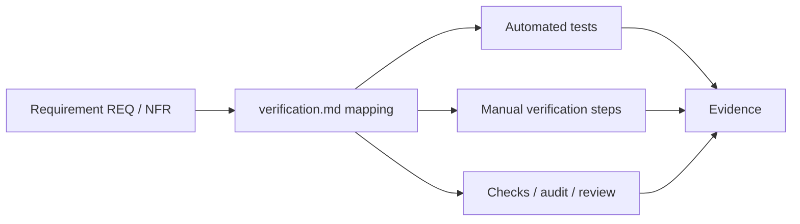

# Verification

> Status: Draft ｜ Owner: <OWNER> ｜ Last Reviewed: <DATE>
>
> Chinese source of truth: [README.md](README.md)

**Purpose**: this directory defines what counts as verified and how requirements map to verification.
It is one of the sources of truth for the definition of done; test implementation detail lives in [testing-strategy.md](../development/testing-strategy.md).

## Files

| File | Content |
| ---- | ------- |
| [verification-strategy.md](verification-strategy.md) | Verification levels, evidence requirements, definition of done, feature lifecycle statuses |

## Relationship to specs

- Per-feature verification is registered in `specs/<id>-<name>/verification.md` as a **requirement → verification** mapping table;
- Mapping status may only be `Pending / Passed / Failed / N/A`;
- A feature is not complete just because "the code is written" (status flow in [specs/README.md](../../specs/README.md)).

## Relationship to testing

Tests are one means of verification, not all of it; scenarios that cannot be automated still need reviewable steps and evidence.
