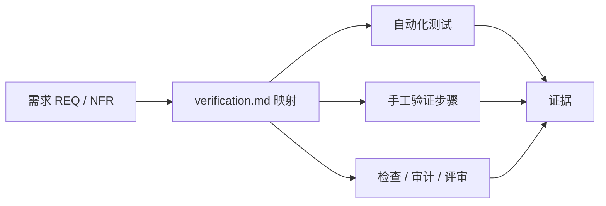

# 验证（Verification）

> Status: Draft ｜ Owner: cherrchen ｜ Last Reviewed: 2026-09-20

**用途**：本目录定义「什么算已验证」，以及需求与验证的映射要求。
它是完成标准（Definition of Done）的 Source of Truth 之一；测试实现细节见 [testing-strategy.md](../development/testing-strategy.md)。

## 文件

| 文件 | 内容 |
| ---- | ---- |
| [verification-strategy.md](verification-strategy.md) | 验证层次、证据要求、完成标准、Feature 生命周期状态 |

## 与 Spec 的关系

- 每个 Feature 的验证登记在 `specs/<id>-<name>/verification.md`，采用**需求 → 验证**映射表；
- 映射状态只能是 `Pending / Passed / Failed / N/A`；
- Feature 不应因为「代码写完了」被视为完成（状态流转见 [specs/README.md](../../specs/README.md)）。

## 与测试的关系

测试是验证的手段之一，不是全部；无法自动化的场景同样必须给出可复核的验证步骤与证据。
