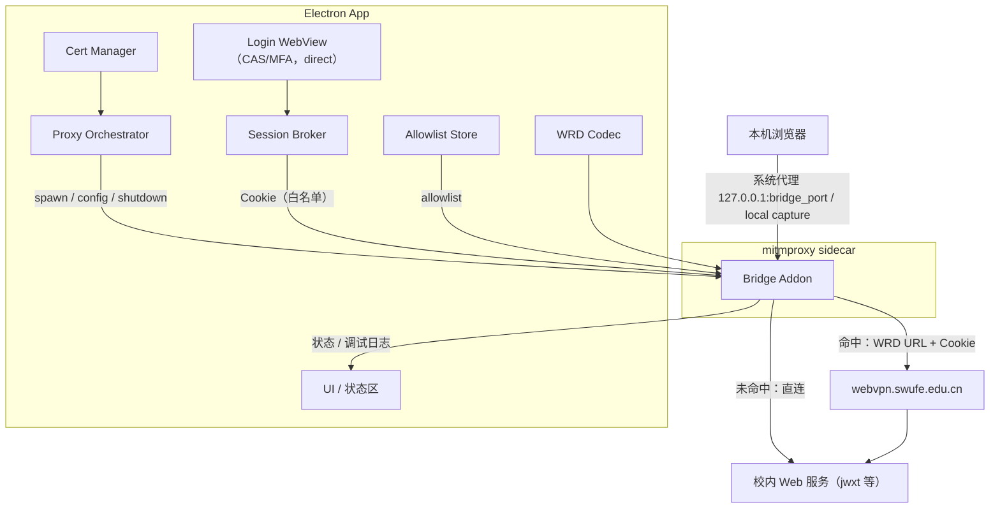

# Technical Design: Phase 1 本机桥（001-phase1-local-bridge）

> Spec ID: 001
> Status: Draft
> Owner: cherrchen
> Last Updated: 2026-09-20

## Context

需求与验收标准见 [spec.md](spec.md)；本文件只说明 How。

相关现状（长期事实，不在本文件重新定义）：

- 形态与边界：[docs/architecture/overview.md](../../docs/architecture/overview.md)、[docs/overview/project-overview.md](../../docs/overview/project-overview.md)
- 组件与职责：[docs/architecture/components.md](../../docs/architecture/components.md)
- 数据流：[docs/architecture/data-flow.md](../../docs/architecture/data-flow.md)
- 接口清单：[docs/architecture/interfaces.md](../../docs/architecture/interfaces.md)
- 数据实体：[docs/architecture/data-model.md](../../docs/architecture/data-model.md)
- 安全模型：[docs/security/README.md](../../docs/security/README.md)

既有已采纳决策（Status: Accepted，2026-09-20）：[ADR-0001](../../docs/architecture/adr/ADR-0001-wrd-rewrite-in-mitm-layer.md)（改写放 mitm 层）、[ADR-0002](../../docs/architecture/adr/ADR-0002-reuse-mitmproxy-for-tls.md)（复用 mitmproxy）、[ADR-0003](../../docs/architecture/adr/ADR-0003-electron-gui-for-phase-1.md)（Electron 外壳）、[ADR-0004](../../docs/architecture/adr/ADR-0004-refuse-start-when-system-proxy-in-use.md)（代理冲突拒绝启动）、[ADR-0005](../../docs/architecture/adr/ADR-0005-builtin-wrd-key-with-override.md)（默认密钥可覆盖）。

M0 预研已完成：WRD URL 编解码由原型 `wrd_codec.py` 在实机 URL 验证（AES-128-CFB，`segment_size=128`，默认 `key = iv = wrdvpnisthebest!`，仅加密 hostname）。本 Spec 是该原型到可用桌面应用的第一次完整实现。

## Proposed Solution

整体思路：**Electron 应用负责会话、编排与信任**，**mitmproxy sidecar 负责 TLS 与 HTTP 语义改写**（[ADR-0001](../../docs/architecture/adr/ADR-0001-wrd-rewrite-in-mitm-layer.md)、[ADR-0002](../../docs/architecture/adr/ADR-0002-reuse-mitmproxy-for-tls.md)）。

模块划分（与归档技术设计的模块划分一致，代码落点见「Components」）：

| 模块 | 职责 |
| ---- | ---- |
| App Shell | 窗口、配置持久化（托盘非必须） |
| Login WebView | 打开官方 WebVPN/CAS 登录；防环 |
| Session Broker | Cookie 提取/存储/失效检测 |
| Proxy Orchestrator | 启停 mitm sidecar、系统代理、进程捕获 |
| WRD Codec | 主机加解密与 URL 互转（Python 权威实现） |
| Bridge Addon | 请求改写与响应反向改写（mitmproxy addon，保持「薄」） |
| Cert Manager | CA 生成/安装/卸载（复用 mitmproxy CA 机制） |
| Allowlist Store | 主机列表与通配选项（`userData/config.json`） |
| Telemetry UI | 状态与调试日志（Render） |

关键步骤：

1. **会话**：登录 WebView 走 direct（或 bypass `webvpn.swufe.edu.cn` / `authserver.swufe.edu.cn`）完成 CAS/MFA；Session Broker 从同一 session partition 导出或按白名单拷贝 Cookie，存 `userData/session.bin`（加密）或 Electron 持久分区，不保存学号/密码。
2. **开桥**：Proxy Orchestrator 先读 OS 代理——已启用且非本桥 ⇒ `PROXY_CONFLICT` 拒绝启动（[ADR-0004](../../docs/architecture/adr/ADR-0004-refuse-start-when-system-proxy-in-use.md)）；否则启动 mitmdump sidecar（regular proxy + 可选 local capture），把系统 HTTP/HTTPS 代理指向 `127.0.0.1:<bridge_port>` 并记录「由本 App 设置」标记；无会话 ⇒ `NOT_LOGGED_IN`；未装/未信任 CA ⇒ `CA_MISSING`；allowlist 为空 ⇒ `ALLOWLIST_EMPTY`。
3. **请求改写**：addon 识别 `scheme/host/port/path/query`；命中 allowlist ⇒ WrdCodec 生成 WebVPN URL、上游改为 `webvpn.swufe.edu.cn`、附加 WebVPN Cookie、按需最小必要调整 `Host`/`Origin`/`Referer`；未命中 ⇒ 直连。
4. **响应反向改写**（按优先级）：`Location` → `Set-Cookie` 的 Domain/Path → `text/html`/`application/javascript`/`application/json` 中的绝对 URL → 其它内容类型不改写。策略固定为「客户端侧始终使用真实主机名，仅上行改走 WebVPN」。
5. **过期与关闭**：失效信号（探测 URL 返回登录页标记 / Set-Cookie 清空会话 / 连续改写后 302 到 CAS）触发 ⇒ 停桥 → 清系统代理（仅在「由本 App 设置」标记存在时）→ 停进程捕获 → 弹窗重登。

说明：命中 allowlist 的请求只在上行改为 WebVPN 形态；响应反向改写后浏览器地址栏与页面链接仍是普通主机名，从而再次命中本桥。未命中主机不经过 WRD 改写，保持直连语义。

## Architecture Impact

| 影响对象 | 是否变化 | 说明 | 需同步的文档 |
| -------- | -------- | ---- | ------------ |
| 组件/分层 | 变化（新增） | 首次实现：Electron 组件（App Shell、Login WebView、Session Broker、Proxy Orchestrator、Cert Manager、Allowlist Store、Telemetry UI）+ WRD Codec + Bridge Addon 从零建立 | [components.md](../../docs/architecture/components.md) |
| 数据流 | 变化（新增） | 新增 DF：登录会话流、请求改写流、响应反向改写流、代理启停/回滚流、调试日志流；定义见 [data-flow.md](../../docs/architecture/data-flow.md) | [data-flow.md](../../docs/architecture/data-flow.md) |
| 接口 | 变化（新增） | 新增 IF：Electron IPC、Bridge 控制协议、WRD Codec 库 API；定义见 [interfaces.md](../../docs/architecture/interfaces.md) | [interfaces.md](../../docs/architecture/interfaces.md) |
| 数据模型 | 变化（新增） | 首次引入 `AllowlistConfig` / `SessionState` / `AppSettings`（`BridgeRuntimeStatus` 不持久化）；`DebugLogRecord` 仅内存/日志，不落库 | [data-model.md](../../docs/architecture/data-model.md) |
| 是否需要 ADR | 需要（已完成） | 五个难以逆转的决策已在架构层决定并 Accepted：[ADR-0001](../../docs/architecture/adr/ADR-0001-wrd-rewrite-in-mitm-layer.md)、[ADR-0002](../../docs/architecture/adr/ADR-0002-reuse-mitmproxy-for-tls.md)、[ADR-0003](../../docs/architecture/adr/ADR-0003-electron-gui-for-phase-1.md)、[ADR-0004](../../docs/architecture/adr/ADR-0004-refuse-start-when-system-proxy-in-use.md)、[ADR-0005](../../docs/architecture/adr/ADR-0005-builtin-wrd-key-with-override.md)；本 Spec 不新增 ADR | ADR-0001..ADR-0005 |

## Components

| 组件 | 变更类型（新增/修改/删除） | 职责变化 |
| ---- | -------------------------- | -------- |
| App Shell | 新增 | 窗口、配置持久化、进程编排入口（托盘非必须） |
| Login WebView | 新增 | 打开官方 WebVPN/CAS 登录（含 MFA）；防环 |
| Session Broker | 新增 | 会话 Cookie 提取、保存（权限收紧）、失效检测 |
| Proxy Orchestrator | 新增 | 启停 sidecar、系统代理读写与冲突检测、进程捕获控制 |
| WRD Codec | 新增 | `encryptHost` / `decryptHost` / `encodeUrl` / `decodeUrl`（Python 权威实现） |
| Bridge Addon | 新增 | 请求改写、响应反向改写、Cookie 注入、直连判定 |
| Cert Manager | 新增 | MITM CA 生成（mitmproxy 专用 confdir）、安装/卸载到系统信任库 |
| Allowlist Store | 新增 | `hosts` + `includeSwufeWildcard` 的读写与默认值 |
| Telemetry UI | 新增 | 状态条与调试日志面板（域名 + 改写结果，无正文） |

## Data Flow

- **会话流**：Login WebView（direct）→ CAS 完成 → Session Broker 从同一 session partition 导出/白名单拷贝 Cookie → `userData/session.bin`（加密）→ 注入 Bridge Addon（禁止进日志与控制口响应）。失败路径：登录未完成 ⇒ 保持 `NOT_LOGGED_IN`，不允许开桥。
- **请求流**：本机浏览器 → 系统代理或 local capture → Bridge Addon → allowlist 匹配 → 命中：WrdCodec 编码 + Cookie → `webvpn.swufe.edu.cn`；未命中：直连。失败路径：sidcar 退出 ⇒ `BRIDGE_CRASH`（UI 提示重启桥/查看日志）。
- **响应流**：上游响应 → Addon 反向改写（Location → Set-Cookie Domain/Path → HTML/JS/JSON 绝对 URL）→ 浏览器。失败路径：内容类型不在改写列表 ⇒ 原样透传（记为未改写）。
- **编排流**：UI 开关 → Proxy Orchestrator 读 OS 代理 → 冲突则拒绝（不改系统设置）→ 否则 spawn sidecar → 设置系统代理并记录标记 → 状态回传 UI；关闭/过期/退出走「清标记 → 清代理 → 停代理服务 → 停捕获」。
- **可观测流**：Addon 产生 `{ts, host, rewritten, direction, detail}` → Main → `onDebugLog` → Renderer 日志面板；默认关闭。

失败与重试：代理设置失败不保留半开状态（见 [plan.md](plan.md) 的 Rollback）；sidecar 异常退出后不自动重启（避免静默反复失败），由用户重新开桥。

## API Changes

| 接口 | 变更 | 兼容性 | 文档位置 |
| ---- | ---- | ------ | -------- |
| Electron IPC（`window.swufeBridge`） | 新增（首次实现） | 兼容（无既有消费方） | [docs/api/electron-ipc.md](../../docs/api/electron-ipc.md) |
| Bridge 控制协议（Main → mitm sidecar） | 新增（首次实现） | 兼容（本机内部协议） | [docs/api/bridge-control-protocol.md](../../docs/api/bridge-control-protocol.md) |
| WRD Codec 库 API | 新增（首次实现） | 兼容（无既有消费方） | [docs/api/wrd-codec-library.md](../../docs/api/wrd-codec-library.md) |

## Data Model Changes

| 实体 | 变更 | 迁移需求 | 回滚方式 |
| ---- | ---- | -------- | -------- |
| `AllowlistConfig` | 新增（`hosts`、`includeSwufeWildcard`、`updatedAt`；默认 `{"hosts":["jwxt.swufe.edu.cn"],"includeSwufeWildcard":false}`） | 无（首次实现） | 删除 `userData/config.json` 即回到默认值 |
| `SessionState` | 新增（`cookies`、`capturedAt`、`lastValidatedAt`；敏感） | 无（首次实现） | 删除 `userData/session.bin`；重登重建 |
| `AppSettings` | 新增（`bridgePort`、`debugLogging`、`capturePids`、`webvpnBase`、`wrdKey`/`wrdIv`、运行时 `systemProxyManagedByApp`） | 无（首次实现） | 删除 `userData/config.json` 恢复默认 |
| `DebugLogRecord` | 新增（`ts/host/rewritten/direction/detail`；禁止含 Cookie 与正文） | 无（首次实现，仅内存/日志，不持久化） | 关闭调试日志即停止产生 |

## UI/UX Changes

新增首次实现的界面与交互：顶部状态条（未登录/已登录未开桥/桥接中/错误/过期处理中）、主操作（登录/重新登录、桥开关）、Allowlist 区（默认 `jwxt.swufe.edu.cn`、增删、`*.swufe.edu.cn` 勾选）、证书区（安装/卸载 + 风险提示）、高级区（系统代理状态说明、进程捕获选择、调试日志开关）、日志面板（域名 | 改写结果 | 时间），以及首次使用引导、代理冲突模态、会话过期模态。

详见 [docs/ui-ux/main-window.md](../../docs/ui-ux/main-window.md)。

## Security Considerations

| 维度 | 影响 | 处理 |
| ---- | ---- | ---- |
| 信任边界 | 本机桥终止 TLS，HTTPS 明文在本机进程内可见；`webvpn.swufe.edu.cn` 为校方系统，非本项目资产 | 仅处理 allowlist 命中流量；未命中直连不做解密改写；威胁模型（本机恶意软件可获明文）写入文档，见 [docs/security/README.md](../../docs/security/README.md) |
| 认证 / 授权 | 必须由用户本人完成 CAS/MFA；桥只转发会话，不代替认证 | 不存学号/密码；不自动填密码；无会话时拒绝开桥（`NOT_LOGGED_IN`） |
| 输入校验 | allowlist 主机名与端口、配置热更新内容来自本机用户输入 | 主机名小写化并校验为合法 hostname；`webvpn.swufe.edu.cn`、`authserver.swufe.edu.cn` 硬编码排除，不可加入改写目标 |
| 密钥 / 敏感数据 | Cookie 与 CA 私钥敏感；调试日志可能泄漏 | Cookie 存用户目录且权限收紧、禁止进日志与控制口响应；CA 私钥仅本机、不上传；调试日志默认关且不含正文/Cookie |
| 依赖风险 | 依赖 mitmproxy（TLS/HTTP2/证书）与 Python 运行时（[ADR-0002](../../docs/architecture/adr/ADR-0002-reuse-mitmproxy-for-tls.md)）；WRD 默认密钥可能轮换（[ADR-0005](../../docs/architecture/adr/ADR-0005-builtin-wrd-key-with-override.md)） | 不自研 PKI（NFR-001）；依赖版本与许可由 [docs/development/dependency-policy.md](../../docs/development/dependency-policy.md) 约束；密钥可配置覆盖 |

## Performance Considerations

Phase 1 无性能指标要求（测试计划明确不做性能压测）。

- 预期负载：单用户本机浏览器流量，仅 allowlist 命中主机进入改写路径。
- 瓶颈点：MITM 加解密与响应反向改写（尤其 `text/html` 的绝对 URL 扫描/替换）。
- 测量方式：`TBD`（本期不设阈值；若后续需要，以教务页面首屏加载耗时与改写耗时对比为基线）。

## Compatibility

| 维度 | 影响 | 处理 |
| ---- | ---- | ---- |
| 向后兼容 | 首次实现，无既有消费方/调用方 | 不适用（无历史版本需要兼容） |
| 数据兼容 | 首次引入 `userData/config.json` 与 `userData/session.bin` | 不适用；文件缺失时按默认值重建 |
| 配置兼容 | 配置键首次定义（`bridgePort`/`debugLogging`/`capturePids`/`webvpnBase`/`wrdKey`/`wrdIv`） | 不适用；未知键忽略，缺省键用默认值 |
| 运行环境 | macOS 与 Windows（第一阶段目标）；Node 22+ 与 Python 3 运行时（mitmproxy） | Linux 不在范围（NG-007）；Python 分发形态见 Q-002 |

## Migration

不适用：首次实现，无既有数据、配置或接口需要迁移；`userData/` 下文件不存在时按默认值初始化。

## Alternatives Considered

| 备选方案 | 优点 | 缺点 | 未采纳原因 |
| -------- | ---- | ---- | ---------- |
| 自研 MITM/TLS 栈 | 省去 Python 运行时随 App 分发的负担 | 自研 MITM PKI/安全成本高，需自行处理 TLS/HTTP2/证书签发 | [ADR-0002](../../docs/architecture/adr/ADR-0002-reuse-mitmproxy-for-tls.md)：复用 mitmproxy 处理 TLS/HTTP2/证书 |
| 在 sing-box/mihomo 内核内实现 WRD 改写 | 复用现有内核与 TUN 能力 | 内核只能看到 CONNECT 目标主机，无法把 HTTP 语义改成 WebVPN 路径，也改不了响应 | [ADR-0001](../../docs/architecture/adr/ADR-0001-wrd-rewrite-in-mitm-layer.md)：改写放 mitm 层，sing-box 仅作未来 TUN/分流壳 |
| 纯 CLI 工具（无 GUI） | 体积小、无需 WebView 与渲染层（与 ADR-0003 的后果对照） | 无法承载 CAS/MFA 登录 WebView 与证书信任引导 | [ADR-0003](../../docs/architecture/adr/ADR-0003-electron-gui-for-phase-1.md)：Phase 1 采用 Electron |

## Risks

| ID | 风险 | 可能性 | 影响 | 缓解 | 对应任务 |
| -- | ---- | ------ | ---- | ---- | -------- |
| R-001 | 教务前端大量动态绝对 URL，导致点击跳飞 | 中 | 高 | 分层响应改写（Location → Set-Cookie → HTML/JS/JSON），先保导航；应急：降级为「书签式 WebVPN URL」辅助 | T009、T010、T011、T037 |
| R-002 | WebVPN Cookie 字段/策略变更 | 中 | 高 | 会话探测集中在 Session Broker；应急：快速补丁 + 重登流程 | T017、T019 |
| R-003 | mitm 嵌入体积/签名问题 | 中 | 中 | 先开发者模式外置 mitm；应急：改用独立安装的 mitmproxy | T007、T042 |
| R-004 | macOS 权限弹窗劝退用户 | 中 | 中 | UX 引导文案；应急：仅走系统代理路径 | T025、T031 |
| R-005 | 学校政策限制自动化 | 低 | 高 | 私用、文档声明（仅服务有权使用 WebVPN 的用户）；应急：停更/只保留手动转换 | T001、T002 |
| R-006 | 默认 WRD 密钥轮换 | 低 | 中 | `wrdKey`/`wrdIv` 配置可覆盖，预留读取 portal；应急：热更新 key | T003、T012 |

## Open Questions

| ID | 问题 | 影响 | 状态 |
| -- | ---- | ---- | ---- |
| DQ-001 | 会话 Cookie 名称与失效信号以实机为准（对应 [spec.md](spec.md) Q-001） | Session Broker 提取与过期检测实现（T017、T019） | Open |
| DQ-002 | mitm sidecar 分发形态未定（对应 [spec.md](spec.md) Q-002） | 打包体积与跨平台分发（T007、T042） | Open |
