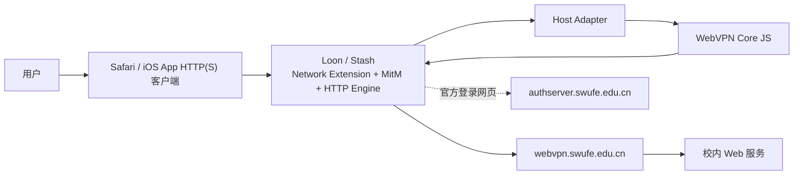
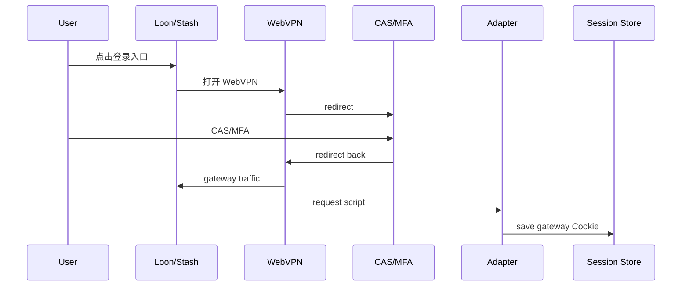

# 技术方案选型与架构设计：iOS Proxy Client Plugins

> Status: Draft  
> Spec ID: 003  
> Owner: cherrchen  
> Last Reviewed: 2026-09-24

## 1. 选型结论

采用“共享 JS Core + Loon Adapter + Stash Adapter”的方案。不采用独立 iOS App，不复刻 Network Extension/TUN/MitM/证书管理。Loon/Stash 已提供 HTTP(S) 拦截、MitM 与脚本运行能力，插件只实现 SWUFE WebVPN 特有协议与状态逻辑。

客户端顺序：Loon 第一实现；Stash 第二实现；两者只在配置语法、Host API、Tile/通知层有差异。

## 2. 系统上下文



第三方代理客户端负责网络接管；Core 不拥有 socket/TLS/CA。

## 3. 目标目录

```text
packages/webvpn-core-js/
  package.json
  src/
    codec/wrd-codec.ts
    codec/aes-cfb128.ts
    routing/allowlist.ts
    rewrite/request.ts
    rewrite/response.ts
    rewrite/body.ts
    session/session.ts
    runtime/contracts.ts
    errors.ts
  tests/
    vectors/

plugins/loon/
  src/adapter.ts
  src/request-entry.ts
  src/response-entry.ts
  swufe-webvpn.plugin
  dist/

plugins/stash/
  src/adapter.ts
  src/request-entry.ts
  src/response-entry.ts
  src/tile-entry.ts
  swufe-webvpn.stoverride
  dist/
```

## 4. Core 分层

### Codec

AES-CFB128 host token、`encodeUrl`/`decodeUrl`、scheme/port token、URL parser/serializer。纯函数，无 Host API。

### Routing

host normalize、exact allowlist、可选 SWUFE wildcard、excluded hosts。

### Session

从 gateway request headers 提取 Session、schema/version、expiry state、serialization、敏感值保护。

### Request Rewrite

输入 ordinary request + settings + session，输出 `pass` / `rewrite` / `login_required` / `error`。

### Response Rewrite

输入 Request Rewrite Context + response，依次处理 Location、Set-Cookie、body WRD URL、gateway bootstrap/promotion。

### Runtime Contracts

Core 只依赖抽象 KV/clock/diagnostic，不依赖 `$request` 等宿主全局。

## 5. Host Adapter

### Loon Adapter

负责 `$request/$response`、`$persistentStore`、`$notification.post`、`$argument`、`$done`、版本检查、plugin `[Mitm]`/Rule/Script 配置。

Loon 官方 Script API 已公开 request/response、persistent store、notification 和 AES 能力；业务 Core 不应直接绑定 Loon AES，以免 Stash 产生第二套 codec。

### Stash Adapter

负责 `$request/$response`、`$persistentStore`、`$notification`、`$environment`、Tile `$done({title,content,url,...})`、`.stoverride` 的 `http.mitm/http.script/script-providers`、版本检查。

## 6. AES-CFB128 方案

现有 Python 实现确定协议为 AES-128-CFB128，key/iv 各 16 bytes，host token 为 `iv_hex + ciphertext_hex`。

Web Crypto 不提供 CFB；Loon 当前公开 AES API也只公开 ECB/CBC/CTR/GCM。因此不能把 CFB 当作两端共有运行时能力。

设计：

- Core 提供统一 `AesCfb128`；
- 构建期 bundle 轻量、无 Node 依赖的纯 JS AES backend；
- 依赖固定版本、许可兼容、进入 lockfile，并通过 Python 共享向量；
- 不采用官方已声明停止维护的 CryptoJS；
- `aes-js`/维护分支可作为候选，但最终包在实现阶段经过 dependency review 后冻结；
- CFB 只是厂商 URL 协议兼容，不承担用户数据机密性边界。

若希望完全避免单一纯 JS backend，可采用“AES block encryptor adapter + Core CFB128 反馈逻辑”，但会增加平台分歧，第一版不优先。

## 7. 构建

使用现有 Node/pnpm 工具链；bundle 工具必须产出：

- 单文件脚本；
- 无 runtime import；
- 无 `node:crypto`/`fs`/`Buffer` 硬依赖；
- target 对齐宿主 JavaScriptCore/WebKit；
- release 带版本 banner/source commit；
- sourcemap 只在开发构建使用。

```text
TypeScript Core + Adapter → bundle → Loon request/response.js
                                └→ Stash request/response/tile.js
```

## 8. 登录与 Session 数据流



插件不需要知道 CAS 内部账号/MFA 数据；只关心认证完成后的 gateway Session。

**P0 风险**：公开脚本 API没有 JS `presentWebView()`。Stash Tile/Override 与 Loon notification 支持 URL 入口，但“是否 App 内呈现”和“该容器是否走同一脚本管线”必须真机确认。

## 9. Ordinary Request 数据流


未命中 allowlist 直接 pass-through。

## 10. Response 数据流

Request/Response script 不保证共享 JS 调用栈，因此不依赖内存对象跨脚本存活。优先从 `$request.url`/响应上下文重新推导；只有证据表明不足时才增加短生命周期 transient context，且不得保存 Cookie/body。

## 11. Gateway-owned Namespace 与 Promotion

desktop 当前将 `/wengine-vpn/`、`/authserver/` 视为 gateway root namespace，并有 bootstrap HTML promotion。移动端默认保持语义一致；必须由真机教务验证确认，不因脚本实现困难直接删除。

## 12. MitM Scope

最小范围建议：gateway、默认 allowlist host、用户显式加入的其它目标 host。

`authserver.swufe.edu.cn` 原则上不为了 Session Capture 做内容脚本处理；若宿主必须列入 MitM 才能保证登录导航，则需独立安全评审，且脚本不得读取认证 body。

## 13. HTTP/3 / QUIC

Stash 官方文档明确 HTTP/3 当前不会进入 HTTP Engine，而作为 UDP 转发；Stash 版必须保证目标域名回落到 TCP HTTP/1.1/2。

Loon 有 UDP 端口/规则能力，但全局 `disable-udp-ports = 443` 不应成为默认插件配置。优先验证按目标域名限制 QUIC 的方式；若做不到，必须披露权衡。

## 14. 安全架构

```text
Browser/App
   ↓ user-enabled host MitM
Loon/Stash runtime
   ↓
Plugin JS
   ↓ HTTPS
Official WebVPN
```

约束：Session 只存在本机宿主持久化；无项目云后端；无账号密码；日志 redact URL token/Cookie/body；只有 allowlist 进入 WRD rewrite；远程更新来自固定 HTTPS 地址。

## 15. 兼容性

| 维度 | 策略 |
| --- | --- |
| desktop | 不改 Python bridge 行为；JS 对齐其向量 |
| Loon | 声明最低版本，使用官方 Plugin/Script API |
| Stash | 声明最低版本，使用 Override/HTTP Engine/Tile |
| iPadOS | 同 iOS 路线，至少做冒烟 |
| tvOS/macOS host | 不属于首期产品验收 |

## 16. 备选方案

| 方案 | 优点 | 缺点 | 结论 |
| --- | --- | --- | --- |
| 独立 iOS App + Network Extension | 控制最大 | entitlement/签名/维护成本高 | 不采用 |
| 仅生成 WebVPN URL | 简单 | 失去真实域名语义 | 仅降级 |
| 两宿主各写一套 JS | 起步快 | 漂移、测试翻倍 | 不采用 |
| 远端代理服务器 | 统一 | 流量/Session 上云 | 不采用 |
| 共享 JS Core + Adapter | 复用与测试性最好 | 需 adapter contract | **采用** |

## 17. 建议 ADR

- ADR-0013：iOS 使用第三方代理客户端插件而非独立 App；
- ADR-0014：移动端共享 JS Core + Host Adapter；
- ADR-0015：移动端 WRD AES-CFB128 backend 与依赖策略；
- 若 P0 登录容器行为改变方案，再建立专门 ADR。
