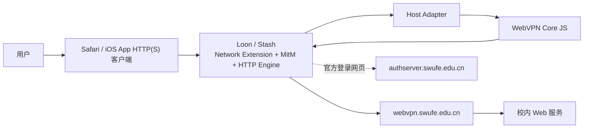
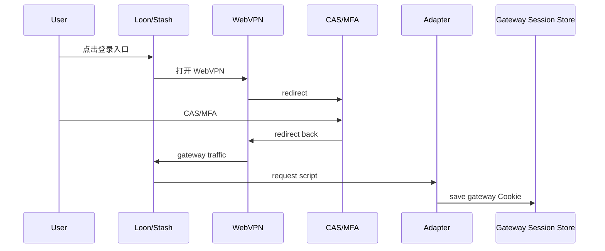
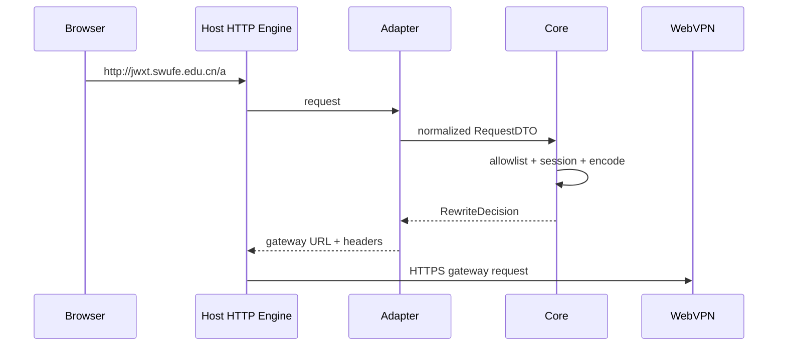
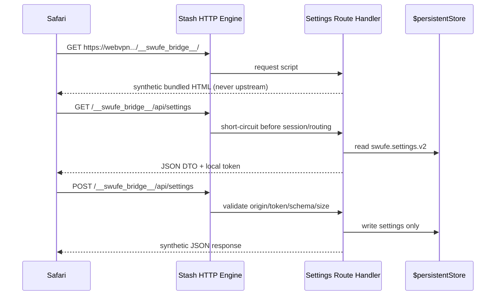

# 技术方案选型与架构设计：iOS Proxy Client Plugins

> Status: Approved  
> Spec ID: 003  
> Owner: cherrchen  
> Last Reviewed: 2026-09-25

## 1. 选型结论

采用“共享 JS Core + Loon Adapter + Stash Adapter”的方案。不采用独立 iOS App，不复刻 Network Extension/TUN/MitM/证书管理。Loon/Stash 已提供 HTTP(S) 拦截、MitM 与脚本运行能力，插件只实现 SWUFE WebVPN 特有协议与状态逻辑。

客户端顺序：**Stash 首发宿主**；Loon 第二实现；两者只在配置语法、Host API、Tile/通知层有差异。

## 2. 系统上下文



第三方代理客户端负责网络接管；Core 不拥有 socket/TLS/CA。

## 3. 目标目录

```text
packages/webvpn-core-js/
  package.json
  src/
    codec/wrd-codec.ts
    codec/aes-cfb128.ts
    routing/allowlist.ts
    rewrite/request.ts
    rewrite/response.ts
    rewrite/body.ts
    session/session.ts
    runtime/contracts.ts
    errors.ts
  tests/
    vectors/

plugins/loon/
  src/adapter.ts
  src/request-entry.ts
  src/response-entry.ts
  swufe-webvpn.plugin
  dist/

plugins/stash/
  src/adapter.ts
  src/request-entry.ts
  src/response-entry.ts
    src/tile-entry.ts
    src/settings/                 # 小型 bundled HTML/CSS/JS（实现可按仓库风格合并）
    swufe-webvpn.stoverride
  dist/
```

## 4. Core 分层

### Codec

AES-CFB128 host token、`encodeUrl`/`decodeUrl`、scheme/port token、URL parser/serializer。纯函数，无 Host API。

### Routing

host normalize、exact allowlist、可选 SWUFE wildcard、excluded hosts。

### Session

从 gateway request headers 提取 Gateway Session、schema/version、expiry state、serialization、敏感值保护；按 Gateway Request Kind 决定安全复用。该 Store 与客户端 Cookie Jar 解耦，且不接收 CAS/SSO Cookie。

### Request Rewrite

输入 ordinary request + settings + session，输出 `pass` / `rewrite` / `login_required` / `error`。

### Response Rewrite

输入 Request Rewrite Context + response，依次处理 Location、Set-Cookie、body WRD URL、gateway bootstrap/promotion。

### Runtime Contracts

Core 只依赖抽象 KV/clock/diagnostic，不依赖 `$request` 等宿主全局。

## 5. Host Adapter

### Loon Adapter

负责 `$request/$response`、`$persistentStore`、`$notification.post`、`$argument`、`$done`、版本检查、plugin `[Mitm]`/Rule/Script 配置。

Loon 官方 Script API 已公开 request/response、persistent store、notification 和 AES 能力；业务 Core 不应直接绑定 Loon AES，以免 Stash 产生第二套 codec。

### Stash Adapter

负责 `$request/$response`、`$persistentStore`、`$notification`、`$environment`、Tile `$done({title,content,url,...})`、`.stoverride` 的 `http.mitm/http.script/script-providers`、版本检查。

Settings namespace dispatcher、synthetic response、token/store IO 属于 Stash Adapter。Settings UI bundle 可独立源码维护，但 build 阶段必须内联进请求脚本，不从运行时 CDN 拉取。Core 不调用 `$request`、`$done` 或 `$persistentStore`。

## 6. AES-CFB128 方案

现有 Python 实现确定协议为 AES-128-CFB128，key/iv 各 16 bytes，host token 为 `iv_hex + ciphertext_hex`。

Web Crypto 不提供 CFB；Loon 当前公开 AES API也只公开 ECB/CBC/CTR/GCM。因此不能把 CFB 当作两端共有运行时能力。

设计：

- Core 提供统一 `AesCfb128`；
- 构建期 bundle 轻量、无 Node 依赖的纯 JS AES backend；
- 依赖固定版本、许可兼容、进入 lockfile，并通过 Python 共享向量；
- 不采用官方已声明停止维护的 CryptoJS；
- `aes-js`/维护分支可作为候选，但最终包在实现阶段经过 dependency review 后冻结；
- CFB 只是厂商 URL 协议兼容，不承担用户数据机密性边界。

若希望完全避免单一纯 JS backend，可采用“AES block encryptor adapter + Core CFB128 反馈逻辑”，但会增加平台分歧，第一版不优先。

## 7. 构建

使用现有 Node/pnpm 工具链；bundle 工具必须产出：

- 单文件脚本；
- 无 runtime import；
- 无 `node:crypto`/`fs`/`Buffer` 硬依赖；
- target 对齐宿主 JavaScriptCore/WebKit；
- release 带版本 banner/source commit；
- sourcemap 只在开发构建使用。

```text
TypeScript Core + Adapter → bundle → Loon request/response.js
                                └→ Stash request/response/tile.js
```

## 8. 登录与 Session 数据流



插件不需要知道 CAS 内部账号/MFA 数据；只捕获认证后 webvpn.swufe.edu.cn 的 Gateway Session，不捕获 authserver Cookie。两个 Realm 的 boundary、direct Gateway injection 与 CAS redirect 关系见下节和 [ADR-0015](../../docs/architecture/adr/ADR-0015-session-realm-and-proxy-reuse.md)。

### 8.1 Session Realm 与 Inter-App Gateway Session Reuse

`Browser Cookie Jar != Plugin Gateway Session Store`。Safari、每个 WKWebView 和 App 可拥有各自的 Cookie Jar；Safari 的 CAS Cookie 不会因此出现在另一个 App 内。Stash/Loon 的 Gateway Session Store 是本地代理状态，Safari 登录流量中捕获的 Gateway Session 可由代理层用于另一个经 HTTP Engine 处理的 App/WKWebView Gateway 请求，不修改客户端 Cookie Jar。

领域概念：

```ts
type SessionRealm = "webvpn-gateway" | "cas-sso";
```

M2 只实现 webvpn-gateway。现有 SessionRecordV1 隐含此 Realm，schema 不迁移。cas-sso 只作为未来独立、高风险、可选能力：默认关闭，单独威胁建模、存储 key、生命周期；只允许发往 authserver.swufe.edu.cn，绝不与 Gateway Cookie 拼接。本轮不实现 CAS Session Bridge。

```mermaid
sequenceDiagram
    participant S as Safari Cookie Jar
    participant P as Stash/Loon Proxy
    participant GS as Gateway Session Store
    participant A as Third-party App WKWebView Cookie Jar
    participant W as WebVPN Gateway
    participant C as CAS authserver
    S->>P: Official login traffic passes proxy
    P->>GS: Capture Gateway ticket and Cookie set
    A->>P: Direct Gateway request without ticket
    P->>GS: Check kind and ready state
    GS-->>P: Stored Gateway Session
    P->>W: Inject only into classified Gateway request
    W->>C: May redirect business flow to CAS
    Note over A,C: WKWebView has its own CAS Cookie Jar; no Safari Cookie sharing
```

图示区分两个认证层：Gateway Session 复用成功后，业务系统仍可能主动跳转到 CAS；再次显示 CAS 页面并不单独证明 Gateway Session 失败。

**P0 结论（2026-09-24）**：两个宿主都没有把登录 URL 留在应用内，通知和 Tile 打开的是系统 Safari。MitM 开启后，Safari 里的 webvpn.swufe.edu.cn 与 authserver.swufe.edu.cn 仍进入各自 HTTP Script，登录完成后的 Gateway 请求能看到 Cookie 名。因此保持插件方案，不改为 Companion App。跨 Realm 与代理层 Gateway Session 复用决策另见 [ADR-0015](../../docs/architecture/adr/ADR-0015-session-realm-and-proxy-reuse.md)。

## 9. Ordinary Request 数据流



未命中 allowlist 直接 pass-through。

## 10. Response 数据流

Request/Response script 不保证共享 JS 调用栈，因此不依赖内存对象跨脚本存活。优先从 `$request.url`/响应上下文重新推导；只有证据表明不足时才增加短生命周期 transient context，且不得保存 Cookie/body。

Gateway RequestKind classification for direct Gateway requests:

| Kind | Stored Gateway Session injection | Default behavior |
| --- | --- | --- |
| SETTINGS_NAMESPACE | Never | Local synthetic response; no upstream or capture |
| WRAPPED_RESOURCE | Eligible when session ready and request has no ticket | Recognizable /http/<token>/... or /https/<token>/... on Gateway |
| GATEWAY_ROOT | Eligible only when login intent is confirmed absent | Explicit or unknown intent passes without injection |
| GATEWAY_STATIC / GATEWAY_OWNED | Only after protocol evidence | Conservative no-injection until confirmed |
| LOGIN | Never | Preserve official login flow |
| LOGOUT | Never | Clear local Gateway Session and pass |
| AUTH_CALLBACK / OTHER | Never by default | Conservative pass until verified |

Concrete login/logout/callback pathnames remain unconfirmed and must not be guessed; see [domain.md](domain.md) and [verification.md](verification.md).

## 11. Gateway-owned Namespace 与 Promotion

desktop 当前将 `/wengine-vpn/`、`/authserver/` 视为 gateway root namespace，并有 bootstrap HTML promotion；这是桌面 ADR-0007 的行为事实。iOS/Loon/Stash 不直接继承这些路径的注入或改写规则：移动端的 GATEWAY_STATIC / GATEWAY_OWNED 必须按当前真机观察逐类启用，未确认的 endpoint 默认不注入。移动端是否需要 bootstrap promotion 也以宿主真机证据为准。

Stash 真机日志显示，响应脚本把透明改写后的请求和浏览器直接访问的 WebVPN 原生 `/http/<token>/` 请求都呈现为同一 gateway URL。对原生 bootstrap 再执行 `302` promotion 会跳回自身，形成无限重定向。Stash Adapter 因此在教务文档导航的 request 阶段直接向浏览器返回指向 WebVPN URL 的 `302`；浏览器对该原生 URL 的响应不再反向改写。其它宿主的 Core promotion 语义不变。

## 12. Interception Scope / Routing Scope

两个范围必须分别配置和授权：

| Scope | Stash 首发设计 | 行为 |
| --- | --- | --- |
| Interception Scope | `webvpn.swufe.edu.cn`、`authserver.swufe.edu.cn`、`*.swufe.edu.cn` HTTPS；`*.swufe.edu.cn:80` 的 force-http-engine 范围待按 Stash 语法/实机评估 | 进入 HTTP Engine；TLS 在设备本地由 Stash MitM 解密 |
| Routing Scope | Settings V2 中 enabled builtin + 合法 customHosts 编译出的精确 host 集 | 唯一可进行普通目标 WRD rewrite；其 Cookie 仅注入改写后的 Gateway upstream。直接 Gateway 请求另走 Gateway Request Kind 分类策略 |

`Intercepted != Routed through WebVPN`。旧表述“MitM 只含当前明确 allowlist”对动态 Domain 功能不成立，是有意改变的安全语义：用户允许 Stash 对 SWUFE 子域范围解密，便于无需重装即启用新域；插件仍只对选中 hostname 代理。未选域需完整 PASS，不读 Cookie、不改 header/body、不请求 gateway。

MitM `*.swufe.edu.cn:443` 是 Stash 官方配置支持的 wildcard 格式，但该仓库现有 Override 和设备 Demo 尚未验证这个通配值与 request script regex 的组合。动态 HTTP 子域是否需要/允许 `force-http-engine` 同样待实机确认。若任一关键范围无法可靠命中，产品退化为静态 Interception Scope，新增域名需更新 Override；不得谎称脚本可运行时扩展 MitM。

为登录入口正常使用，`webvpn` 与 `authserver` 保持在 HTTP Engine 处理范围；认证 body 永不被保存。Gateway Cookie capture 只在 webvpn.swufe.edu.cn context；原始 authserver.swufe.edu.cn 请求始终 PASS、不注入 Gateway Session，也不捕获 CAS Cookie。WRD 解码后 originalHost=authserver.swufe.edu.cn 的网络请求仍发往 Gateway；Trace 需同时记录请求 host 与 decoded original host。

## 13. Settings Virtual WebUI 与 pseudo HTTP API



WebUI source、执行、传输、存储的固定决策：

| 项目 | 决策 |
| --- | --- |
| WebUI source | HTML/CSS/JS 在 Stash 插件/script bundle 内 |
| WebUI execution | Safari |
| WebUI transport | Stash HTTP Script synthetic response |
| Settings persistence | Stash `$persistentStore` |
| Remote application server | none |
| GitHub | 仅发布 `.stoverride` 与 `dist/request.js`、`dist/response.js`、`dist/tile.js` 等制品，不托管运行时页面/API |

保留 URL 前缀为 `https://webvpn.swufe.edu.cn/__swufe_bridge__/`。任何以该前缀开头的 path 在 Core 业务分支之前优先 short-circuit；未知 path/method 也由本地返回 404/405，不向 upstream fall through。Settings 请求不得触发 Session Capture、Routing、WRD、业务 Header/body rewrite。`file://` 无法访问 Stash persistent store；`127.0.0.1` 会要求真实 socket server，均不采用。

Settings route 一经识别，即使 JSON parse/storage/render 出错，也必须由本地生成 4xx/5xx synthetic response；不得复用普通业务 request entry 中的 catch-and-pass 行为。未知路径、方法、nonce 错误及 body 超限均不可 fall through。

第一版 endpoint 仅为 `GET /`、`GET /api/settings`、`POST /api/settings`。响应使用 `Cache-Control: no-store`。错误 JSON 只给机器码。API 代码在 Adapter 层，但 hostname validation/migration/compiler 使用平台无关 DTO 函数。

安全检查至少包含 Host、精确 path、method、Origin/Referer（宿主请求能提供时）、`application/json` Content-Type、自定义 Settings token、UTF-8 body byte cap、schema/version、host allow rule。当前 Stash 随机 token API 可用性尚未验证：实现前确认安全随机能力；无安全随机时 fail closed，不能回退为固定 token 或 `Math.random()`。POST body、Cookie/Authorization 等敏感 header 不进入日志或 API 响应。

## 14. Stash Settings Flow 与业务 Flow 的优先级

```text
request-entry
  1. parse URL safely; host + path in Settings namespace?
       yes → settings handler → synthetic response → stop
  2. apply Gateway RequestKind policy: authserver → PASS; logout → clear stored Gateway Session and PASS without injection;
     request already has Gateway ticket → preserve Cookie, capture/refresh, PASS;
     otherwise inject only for an eligible kind with a ready stored Gateway Session and classifier-confirmed `loginIntent=none`
  3. compile latest Settings DTO → exact RoutingPolicy
  4. selected target? no → PASS unchanged
  5. selected target → Session / codec / rewrite to Gateway
```

Settings route 确认必须发生在 `captureSession()` 与 Core `rewriteRequest()` 之前。HTTP script request/response 两阶段都须识别 namespace；禁止 Settings HTML/JSON 被业务 response rewrite 处理。写入 v2 settings 后，下一次业务请求直接 parse 新 key；不缓存旧路由策略跨请求。

Gateway RequestKind 至少区分 SETTINGS_NAMESPACE、WRAPPED_RESOURCE、GATEWAY_ROOT、GATEWAY_STATIC/GATEWAY_OWNED、LOGIN、LOGOUT、AUTH_CALLBACK、OTHER。Settings 永不注入；WRAPPED_RESOURCE 可根据 Session 状态复用；GATEWAY_ROOT 仅在 classifier 确认 loginIntent=none 时原则上允许；explicit/unknown intent 必须绕过；其它 gateway-owned/login/logout/callback 路径按实机确认后逐类启用，未确认路径默认不注入。具体规则见 [domain.md](domain.md) 与 [interfaces.md](interfaces.md)。

已选 WRD 资源请求中，stored Session ready 时只替换与之不同的客户端核心 Gateway ticket，保留其它 Cookie，并防止单次冲突请求覆盖共享 store；请求无 ticket 时照常注入。Gateway root、login、logout、Settings、gateway-owned、unknown 路径不覆盖请求 ticket；root 上的新 ticket 在 200 响应且无未绑定的新 ticket 下发时才确认进 store；已绑定的服务端轮换不回滚到旧请求值。注入目标始终是 webvpn.swufe.edu.cn。

## 15. HTTP/3 / QUIC

Stash 官方文档明确 HTTP/3 当前不会进入 HTTP Engine，而作为 UDP 转发；Stash 版必须保证目标域名回落到 TCP HTTP/1.1/2。教务实际入口为 HTTP 端口 80；来自 Tunnel 的该连接必须以 `jwxt.swufe.edu.cn:80` 进入 `force-http-engine` 才能触发脚本。不要把这些主机的 443 放进 `force-http-engine`：2026-09-24 真机里，该项让 HTTPS 进不了 HTTP 脚本，Safari 显示无法建立安全连接。HTTPS 只走 MitM。

Loon 有 UDP 端口/规则能力，但全局 `disable-udp-ports = 443` 不应成为默认插件配置。优先验证按目标域名限制 QUIC 的方式；若做不到，必须披露权衡。

### Loon 实现时需逐项确认的宿主边界

以下是 Stash M2 真机问题提炼出的检查项，证据见 [verification.md 的 Stash 真机记录](verification.md)。Loon 是否呈现相同行为仍待 M3 真机验证，不能直接复制 Stash 的配置或绕行实现。

1. **入口协议与脚本命中**：教务验收入口是 `http://jwxt.swufe.edu.cn/`，WebVPN 对应 `/http/`。在 Loon 中分别确认 HTTP/80 请求进入 request 与 response 脚本、HTTPS gateway/CAS 进入所需脚本，并核对浏览器所见 URL 与 WRD 上游 URL。Stash 的 `force-http-engine` 是其宿主配置，不能推定 Loon 有同名或同语义选项。
2. **会话状态与 CAS 往返**：捕获 gateway Cookie 只表示 `captured`，不是教务访问已验证。首次或后续出现 CAS 页面/redirect 均不能单独证明 Gateway Session 失效，也不能单独触发清理；教务成功响应后才能升级为 `valid`。时钟到期、显式 `/logout`，或请求 ticket 与 stored ticket 一致时服务端明确删除该 ticket，才可清理共享 Session；其它 App 无 ticket/不同 ticket 的 Gateway `/login` 响应删除 ticket，不能据此清理 Safari 捕获的 stored Session。已有 stored ticket 时，响应中的新 ticket 也仅在请求携带相同 stored ticket 时作为轮换写入；无 ticket/不同 ticket 请求的新 ticket 不能覆盖另一客户端的共享 Session。其它失效信号仍需真机证据。
3. **原生 WebVPN 命名空间**：分别观察 Loon request/response 脚本中的 `$request.url`，不能从 URL 外观推定请求是透明改写还是浏览器直接发出的 `/http/<token>/`。对浏览器已处于原生 WebVPN URL 的响应应保持网关原有语义；任何 promotion 302 的目标都不能与当前浏览器 URL 相同。Stash 在 request 阶段返回 302 的适配方案仍待其真机复验，Loon 须按自身脚本能力确定实现。
4. **响应体与诊断**：仅改写响应 Header 时，若宿主未提供 body，不得写出空 body；同时验证 Location、Set-Cookie 与业务 HTML 不被截断。分别确认插件加载、脚本执行、脚本日志位置和远程 bundle 更新，避免用“没有普通日志”推断脚本未运行。诊断只记录脱敏主机、状态、动作和错误码，不记录 Cookie、WRD token 或页面内容。

对于动态子域，Stash 官方 rule grammar 包含 `DOMAIN-SUFFIX`、`PROTOCOL,QUIC` 和 `AND` 逻辑规则，因此候选规则为 `AND,((DOMAIN-SUFFIX,swufe.edu.cn),(PROTOCOL,QUIC)),REJECT`。它比旧的 3 条精确域规则覆盖更多 SWUFE 子域，只阻止该后缀 QUIC；现有 Demo 没有该规则，需导入并在真机验证匹配、回落与未选 host PASS。绝不全局拒绝 UDP/443。

## 16. 安全架构

```text
Browser/App
   ↓ Stash-declared Interception Scope (gateway + SWUFE wildcard, pending device proof)
Loon/Stash runtime
   ↓
Plugin JS
   ├─ unselected intercepted SWUFE host → unchanged PASS
   ├─ selected exact host → WRD + Session only to gateway
   ├─ classified direct Gateway request → stored Gateway Session only to Gateway
   └─ Settings namespace → synthetic local response, no upstream
Selected WebVPN request → HTTPS → Official WebVPN
CAS Session remains in the client App's own Cookie Jar; no Safari sharing or Gateway Store capture
```

约束：Session 只存在本机宿主持久化；无项目云后端；无账号密码；日志 redact URL token/Cookie/body；只有 Routing Scope allowlist 进入 WRD rewrite；远程安装与脚本更新仅来自本仓库 **GitHub** HTTPS（Release 与/或 `raw.githubusercontent.com`，见 [prd.md §7 IOS-REQ-001/012](prd.md)）。用户须知 Stash Interception Scope 内的 HTTPS 都可能在设备本地解密，即使该 host 未选 WebVPN。

## 17. 兼容性

| 维度 | 策略 |
| --- | --- |
| desktop | 不改 Python bridge 行为；JS 对齐其向量 |
| Loon | 声明最低版本，使用官方 Plugin/Script API |
| Stash | 声明最低版本，使用 Override/HTTP Engine/Tile |
| iPadOS | 同 iOS 路线，至少做冒烟 |
| tvOS/macOS host | 不属于首期产品验收 |

## 18. 备选方案

| 方案 | 优点 | 缺点 | 结论 |
| --- | --- | --- | --- |
| 独立 iOS App + Network Extension | 控制最大 | entitlement/签名/维护成本高 | 不采用 |
| 仅生成 WebVPN URL | 简单 | 失去真实域名语义 | 仅降级 |
| 两宿主各写一套 JS | 起步快 | 漂移、测试翻倍 | 不采用 |
| 远端代理服务器 | 统一 | 流量/Session 上云 | 不采用 |
| 共享 JS Core + Adapter | 复用与测试性最好 | 需 adapter contract | **采用** |
| Stash bundled virtual WebUI + pseudo API | 自包含、Settings 本地存储、即时生效 | Host script short-circuit/token/wildcard 需验证 | **采用，Stash 首发** |
| BoxJS | 有现成管理页模式 | 外加 runtime/config dependency、范围远超需求 | 不采用 |
| GitHub Pages / remote UI / local socket server | 可独立部署页面 | 增加外部服务或真实 server；不满足自包含目标 | 不采用 |

## 19. ADR 记录

- [ADR-0013](../../docs/architecture/adr/ADR-0013-js-core-aes-cfb128.md)：移动端共享 JS Core 与 AES-CFB128 backend；
- [ADR-0014](../../docs/architecture/adr/ADR-0014-stash-local-settings-and-routing-scope.md)：Stash 本地 pseudo WebUI、精确 Routing Scope 与宽 Interception Scope。
- P0 Safari 呈现方式已在本 Spec 与 [verification.md](verification.md) 记录，不改变 Host Runtime 架构，无需新增 ADR。
