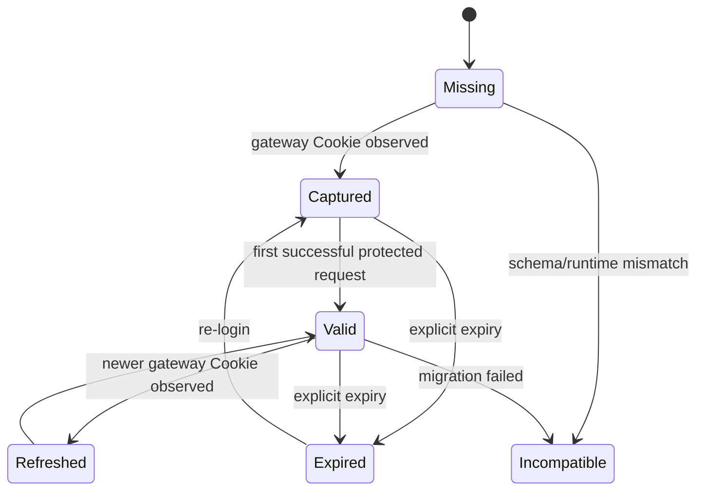

# Domain 文档：iOS Proxy Client Plugins

> Status: Approved  
> Spec ID: 003  
> Owner: cherrchen  
> Last Reviewed: 2026-09-25

## 1. 领域目标

本 Feature 的领域不是“VPN”，而是：在受支持的第三方 HTTP(S) 代理客户端运行时中，把真实校内 Web URL 映射为网瑞达 WebVPN URL，并在不接触用户密码的前提下复用官方 WebVPN 会话，使客户端继续保持真实主机名语义。

## 2. Bounded Context

### WebVPN Protocol Context

负责 WRD hostname 编解码、ordinary URL ↔ WebVPN URL、gateway-owned namespace、响应中的 WRD URL 反向转换；不负责 CAS 密码验证、iOS VPN、TLS CA、DNS 代理。

### Session Context

负责 `webvpn-gateway` Realm 的 Cookie 观察、插件本地安全持久化、过期判断，以及在代理层向符合分类策略的 Gateway 请求复用。此能力与 Safari、WKWebView 等客户端各自的 Cookie Jar 解耦。当前不捕获、不存储、不注入 `authserver.swufe.edu.cn` 的 CAS/SSO Cookie，也不保存账号密码/MFA。

CAS/SSO 属于另一个 `cas-sso` Realm。它当前只作为领域边界，不是 Spec 003 M2 的实现范围；任何未来桥接都必须默认关闭、独立威胁建模、独立存储与生命周期。

### Routing Context

负责 allowlist、gateway/authserver 排除、决定 request 是否进入 WRD 改写。

### Host Runtime Context

负责 Loon/Stash `$request/$response` 适配、persistent store、notification/tile、宿主配置与 MitM 声明。宿主 API 不得泄漏进 WebVPN Core。

### CAS / SSO Context

负责官方 `authserver.swufe.edu.cn` 登录与跳转。用户在官方页面完成 CAS/SSO/MFA；插件观察到的请求只用于脱敏分类诊断，当前始终不捕获或保存 CAS Session。该 Context 不与 Gateway Session 合并。

## 3. Ubiquitous Language

| 术语 | 定义 |
| --- | --- |
| Ordinary URL | 用户看到的真实 URL，如 `http://jwxt.swufe.edu.cn/x` |
| WRD URL | 网瑞达 WebVPN URL，如 `https://webvpn.../https/<token>/x` |
| Gateway | `webvpn.swufe.edu.cn` |
| Auth Server | `authserver.swufe.edu.cn`，CAS/SSO/MFA 所在服务 |
| Allowlist Host | 允许被转为 WRD URL 的真实目标主机 |
| Excluded Host | 永不按普通目标再次 WRD 包装的主机 |
| Session Realm | 有独立主机边界、存储与生命周期的认证会话上下文；本领域定义 `webvpn-gateway` 与未来可选的 `cas-sso` |
| Gateway Session | `webvpn-gateway` Realm 中属于 `webvpn.swufe.edu.cn` 的票据 Cookie 与最小元数据 |
| CAS Session | `cas-sso` Realm 中属于 `authserver.swufe.edu.cn` 的会话；当前不捕获、不存储、不注入 |
| Browser Cookie Jar | 某个 Safari、WKWebView 或 App 自己管理的 Cookie 存储；不等同于插件的 Gateway Session Store |
| Session Capture | 从 gateway 请求 Header 观察并保存 WebVPN Cookie |
| Inter-App Gateway Session Reuse | Stash/Loon 代理层把插件保存的 Gateway Session 用于另一个经该代理处理的客户端 Gateway 请求；不共享或改写客户端 Cookie Jar |
| Reverse Rewrite | 把响应中的 WRD 语义恢复为 Ordinary URL 语义 |
| Gateway-owned Namespace | 属于 WebVPN 网关本身、不能套目标 host token 的路径 |
| Promotion | desktop 已有的 bootstrap HTML → gateway native URL 空间升级行为 |
| Host Adapter | Loon/Stash 平台 API 与 Core 的边界层 |
| MitM Scope | 允许宿主解密 HTTPS 的域名范围 |
| Interception Scope | Stash HTTP Engine 会接管并可解密/执行脚本的域名与协议范围；可以宽于实际 WebVPN 目标 |
| Routing Scope | 用户在 Settings 中启用的精确目标 hostname 集合；只有此集合可做 WebVPN rewrite |
| SiteDefinition | UI 展示站点目录项，含稳定 id、显示名、hostname、builtin 标记和 enabled 状态；配置存储不把目录文案耦合进 Core |
| BuiltinSite | 插件源码内置、由可靠依据登记、用户可开关但不可删除的站点 |
| CustomSite | 用户新增的合法精确 `.swufe.edu.cn` 子域，可删除 |
| SettingsNamespace | `https://webvpn.swufe.edu.cn/__swufe_bridge__/` 内部合成资源/API 路由前缀，永不上游 |
| SettingsRequest | 命中 SettingsNamespace 的 HTTP 请求；优先于所有 Session/业务逻辑处理 |

## 4. 聚合与实体

### PluginRuntime Aggregate

根实体 `PluginRuntimeState`，包含 `settings`、`session`、`runtimeCompatibility`、`lastError`、`notificationThrottle`。它不描述 Loon/Stash 自己的 VPN 开关或节点。

### Session Aggregate

根实体 `SessionRecord`。当前 M2 的 `SessionRecordV1` 隐含属于 `webvpn-gateway` Realm，不要求增加 `realm` schema 字段。Gateway 必须匹配当前配置；记录必须包含确认过的 Gateway ticket；Cookie 非空；Cookie value 永不输出日志；Session 不含 username/password/MFA；schema version 可识别；清除 Session 幂等。

`Browser Cookie Jar != Plugin Gateway Session Store`。Safari 捕获的 Gateway Session 可由代理层复用于已分类的 Gateway 请求，即使发起请求的 App/WKWebView 自身没有 Gateway ticket；这不表示 Safari Cookie Jar 与 WKWebView Cookie Jar 原生共享。Session 只能随目标为 Gateway 的请求发送，不能发送到普通源站或 authserver。

Session 可注入条件：记录 schema 可读、`gatewayHost` 精确匹配 `webvpn.swufe.edu.cn`、Cookie 集包含核心 ticket 且未按本地 `expiresAt` 过期。`captured` 可用于 Gateway 注入，但仅表示已捕获票据；`valid` 表示后续受保护请求成功确认。请求自己的 Cookie name/value 优先；若已有核心 ticket，就保留并 capture/refresh 当前请求 Cookie，不合并旧 stored Cookie。

### RoutingPolicy Value Object

字段 `exactHosts`、`includeSwufeWildcard`、`excludedHosts`。host 标准化为小写；不允许 scheme/port/path；gateway/authserver 始终 excluded；excluded 优先于 exact/wildcard。

Spec 003 Settings V2 不允许 wildcard route 开关；`includeSwufeWildcard` 是 V1 兼容字段，只在安全迁移时降为关闭。Core 的通用 RoutingPolicy 可以保留既有字段，但 Stash Settings Service 只传入启用站点的精确 host 列表。

### SiteDefinition / PluginSettings

Builtin catalog 是插件源码内的静态目录（首版仅 `jwxt.swufe.edu.cn`）；用户配置存 builtin state map 与 custom host strings。显示名和 builtin 标记是 UI/catalog concern，不作为 Core routing contract。Compiler 将 enabled 内置 host 与合法 customHosts 编译为 `RoutingPolicy.exactHosts`。

### InterceptionScope / RoutingScope

Stash 的目标设计允许 `*.swufe.edu.cn` 进入 HTTP Engine，以便用户无需重装插件就能启用任意合法子域。它扩大本机 MitM 能解密的子域，不扩大 WebVPN 转发授权。`Intercepted != Routed through WebVPN`：未启用域必须由 Core 得到 `pass`，且 Adapter 不更改 URL、headers、body 或 Session。

### WrdCodec Value Object

纯函数、无 IO。key/iv 各 16 bytes；host token 为 `iv_hex + ciphertext_hex`；path/query 不参与 hostname AES；encode→decode 可逆；与 Python 权威向量一致。

### RewriteContext

单次被改写请求的临时上下文：`originalUrl`、`originalHost`、`wrdUrl`、`wrdPrefix`、`gatewayOwned`、可选诊断 requestId；默认不得持久化。

## 5. 领域事件

| 事件 | 产生条件 | 消费者 |
| --- | --- | --- |
| `SessionCaptured` | gateway 请求出现有效 Cookie | Session Store、状态 UI |
| `SessionExpired` | 明确过期信号 | Session Store、通知/Tile |
| `RequestRewritten` | allowlist 请求成功变为 WRD | debug sink |
| `ResponseRewritten` | Location/Cookie/body 有反向改写 | debug sink |
| `CodecFailed` | WRD 编码失败 | error state、通知节流 |
| `RuntimeIncompatible` | Host API/version 不满足 | UI |
| `LoginRequested` | 用户点击登录入口 | Host Adapter |
| `BodyRewriteSkipped` | body 过大/类型不支持 | debug sink |

第一版均为进程内概念，不引入消息队列或云端事件总线。

## 6. 关键不变式

- **INV-IOS-001 Gateway Session Scope**：Gateway Session 只能注入目标 host 为 `webvpn.swufe.edu.cn` 的请求，且必须通过 `GatewayRequestKind` 的安全注入策略；不得发送到普通源站或 `authserver.swufe.edu.cn`。
- **INV-IOS-002 No Credential Capture**：authserver 表单字段、用户名、密码、MFA code 不得进入 persistent store。
- **INV-IOS-003 No Double Wrapping**：Gateway/Auth Server 不按 ordinary target 二次包装。
- **INV-IOS-004 Allowlist First**：ordinary 请求必须先 routing，再 codec/Session。
- **INV-IOS-005 Codec Parity**：JS codec 必须由 Python/JS 共享向量证明一致。
- **INV-IOS-006 Reverse Rewrite Order**：`Location` → `Set-Cookie` → Body。
- **INV-IOS-007 Host API Isolation**：Core 不直接访问宿主 `$*` 全局变量。
- **INV-IOS-008 No Silent Login Claim**：只有捕获到可用 gateway Session 后才能进入 `READY`。
- **INV-IOS-009 Settings Short-circuit**：SettingsNamespace 在 Session Capture、Routing、Codec、request/response rewrite 之前本地终结，不访问真实 gateway。
- **INV-IOS-010 Interception Is Not Routing**：被 Stash HTTP Engine 捕获不表示授权 WebVPN rewrite；只有 Routing Scope exact match 可以改写。
- **INV-IOS-011 Reserved Target Deny**：gateway 与 authserver 不能成为 BuiltinSite/CustomSite；ignored/excluded 配置不能解除保留。
- **INV-IOS-012 Custom Host Boundary**：自定义 host 只能是合法精确 `.swufe.edu.cn` 子域；不能是外部域、IP、localhost、wildcard 或带 URL 组件的输入。
- **INV-IOS-013 Cookie Non-leakage**：Session Cookie 只在已选目标改写后的 Gateway upstream 或安全分类允许的直接 Gateway 请求注入；普通源站、未选目标、authserver 与 Settings Namespace 不得接收。
- **INV-IOS-014 Settings API Locality**：pseudo API 仅写 Settings 与短期 nonce keys；GET 可由 SessionStatusProvider 读取非敏感状态摘要，但不回传/记录 Session/CAS Cookie/Auth/MFA/key；日志不包含 POST body。
- **INV-IOS-015 Session Migration Isolation**：Settings V1→V2 迁移不得读写/清理 `swufe.session.v1`。
- **INV-IOS-016 Realm Isolation**：M2 只实现 `webvpn-gateway`；未来 `cas-sso` 必须默认关闭、单独威胁建模、单独存储、单独生命周期，并只允许发送到 `authserver.swufe.edu.cn`；两 Realm 的 Cookie 不得合并。
- **INV-IOS-017 Client Ticket Precedence**：Gateway 请求已携带 WebVPN ticket 时，原请求 Cookie 不得被存储 Session 覆盖；捕获/刷新请求自己的 ticket 后原样 PASS。
- **INV-IOS-018 Auth Flow Safety**：Settings 永不带 Session；已确认的 logout 不注入旧 Session 并清理本地 Gateway Session；LOGIN 与 login intent 为 explicit/unknown 的请求不被旧 Session 注入破坏；未知 endpoint 默认不注入。
- **INV-IOS-019 Cookie Jar Separation**：插件在代理层复用 Gateway Session，不声称或依赖 Safari 与其他 App/WKWebView 原生共享 Cookie Jar。
- **INV-IOS-020 Safe Auth Trace**：诊断只允许安全 trace 字段；不得记录 Cookie value、CAS ticket、`execution`、Authorization、凭据、完整 query/service URL、长 WRD token 或请求/响应 body。
- **INV-IOS-021 CAS Is Not Gateway Expiry Proof**：仅因显示或重定向到 CAS 页面不得清除 Gateway Session；必须有明确的 Gateway ticket 过期/清除信号或其它经真机确认的 Gateway 失效证据。

## 7. Session 状态机



UI 可以把 `Captured`/`Valid` 都显示为“已登录”；内部保留差异便于测试。

## 8. Gateway Request Classification

所有发往 `webvpn.swufe.edu.cn` 的请求先分为 `SETTINGS_NAMESPACE`、`WRAPPED_RESOURCE`、`GATEWAY_ROOT`、`GATEWAY_STATIC` / `GATEWAY_OWNED`、`LOGIN`、`LOGOUT`、`AUTH_CALLBACK` 或 `OTHER`。这些是分类接口，不代表尚未由真机确认的 endpoint 已经确定。Settings namespace 的路径已固定；WRD 形态和 `/` 可按 URL 结构识别；登录、登出与 callback 的具体 pathname 需真机确认。`OTHER` 和任何未确认 path 默认不注入。

| Kind | 注入策略 | 其它行为 |
| --- | --- | --- |
| `SETTINGS_NAMESPACE` | 永不注入 | 本地合成响应并终止，不访问 upstream，不捕获 Session |
| `WRAPPED_RESOURCE` | 若 Session 可用且请求不含 Gateway ticket，则允许注入 | 只在目标仍为 Gateway 时适用；WRD 解码后的 original host 仅用于分类/trace，不扩大 routing scope |
| `GATEWAY_ROOT` | 仅 `loginIntent=none` 时原则上可复用现有 Gateway Session | `explicit` 或 `unknown` 时不注入；具体入口意图与 path 待真机确认 |
| `GATEWAY_STATIC` / `GATEWAY_OWNED` | 按协议证据逐类启用；确认前默认不注入 | `/wengine-vpn/...` 可作为分类候选；不得从路径名称推断所有资源都需 ticket。desktop 已有 namespace 证据不自动成为 iOS 注入规则 |
| `LOGIN` | 不注入 stored Session | 请求自带 ticket 时不覆盖；登录响应中的新 Gateway ticket 可按 capture/rotation 规则更新 |
| `LOGOUT` | 不注入 | 识别到经确认的 logout 请求时清理本地 Gateway Session；具体 endpoint 待真机确认 |
| `AUTH_CALLBACK` / `OTHER` | 默认不注入 | 保守 PASS；新增规则必须有真机证据及测试 |

对所有允许注入的 Gateway Request Kind，只有 classifier 能确认无显式 login intent（`loginIntent=none`）时才可注入；意图为 `explicit` 或 `unknown` 时一律 PASS、不注入。请求 Cookie 中确认出现 `wengine_vpn_ticketwebvpn_swufe_edu_cn` 时，客户端 Cookie 优先：不改写请求 Cookie、不注入旧 Session，capture/refresh 当前 Cookie 后 PASS。若无 ticket，则只有安全分类允许且 stored Gateway Session 可用时才可注入；否则 PASS，让官方登录流程继续。注入时不得覆盖请求已有的任何同名 Cookie。对 raw `authserver.swufe.edu.cn` 请求始终 PASS 且不捕获 Cookie；WRD URL 即使解码出 `originalHost=authserver.swufe.edu.cn`，本次网络请求的 Gateway host 仍是 `webvpn.swufe.edu.cn`，Trace 应分别记录这两个事实。

## 9. Request 决策模型

```text
request
  ├─ host == gateway and path starts SettingsNamespace → local settings handler; synthetic response; stop
  ├─ host == gateway and kind == LOGOUT → clear local Gateway Session; do not inject; pass
  ├─ host == gateway and request has WebVPN ticket → capture/refresh request Cookie; do not override; pass
  ├─ host == gateway and kind permits injection and stored Gateway Session is ready → inject without replacing request ticket; pass
  ├─ host == gateway and LOGIN / AUTH_CALLBACK / OTHER or no ready Session → pass without injection
  ├─ host == authserver → pass through; never persist auth credentials
  ├─ not in Routing Scope (including intercepted wildcard subdomain) → pass through unchanged
  └─ selected exact host
       ├─ no valid session → login_required
       └─ session exists → encode URL + rewrite minimal headers + gateway Cookie
```

## 9. Response 决策模型

只有“由插件从 ordinary URL 改写出去”的请求才进入 reverse rewrite。直接访问 gateway 的登录流量不应被当作 ordinary 响应恢复。

SettingsNamespace response 由 Settings Handler 直接返回，不进入此业务 Response 决策。

顺序：gateway-owned/promotion → Location → Set-Cookie → body → Gateway Session/expiry 状态 → Safe Auth Trace → 返回宿主。Gateway Session 状态与 CAS/SSO Cookie Jar 状态不可互相推断；仅出现 CAS 页面或 CAS redirect 不足以清除 Gateway Session。

## 11. Session Realm 与 Trace

领域类型：

```ts
type SessionRealm = "webvpn-gateway" | "cas-sso";
```

当前 `SessionRecordV1` 属于 `webvpn-gateway` Realm，schema 保持不变。`cas-sso` 是未来独立、高风险、可选能力：默认关闭、独立威胁建模、独立存储 key、独立生命周期，只能发送到 `authserver.swufe.edu.cn`。它不得成为 M2 隐含工作，也不得把 authserver Cookie 改写为 Gateway Cookie 或合并到 `swufe.session.v1`。

Safe Auth Trace 必须能区分真实 host 为 authserver 的 raw 请求与 Gateway 中 WRD 解码出 `originalHost=authserver.swufe.edu.cn` 的请求；并能记录 ticket 是否存在、stored Gateway Session 状态、是否注入、请求 Cookie 是否优先、login intent 分类、重定向目标 host。CAS `service` 参数仅允许提取 target hostname。trace 结构、可记录字段与禁止字段见 [interfaces.md §10](interfaces.md)；trace 不保存或输出敏感值。

## 12. 与 desktop Domain 的关系

Python `WrdCodec`、desktop allowlist/excluded host、response rewrite 顺序都是兼容基线。移动端特有部分只有 Host Runtime、安装、登录入口与宿主能力限制。若移动端必须改变协议语义，应先产生真机证据，再建立 ADR/兼容说明。
