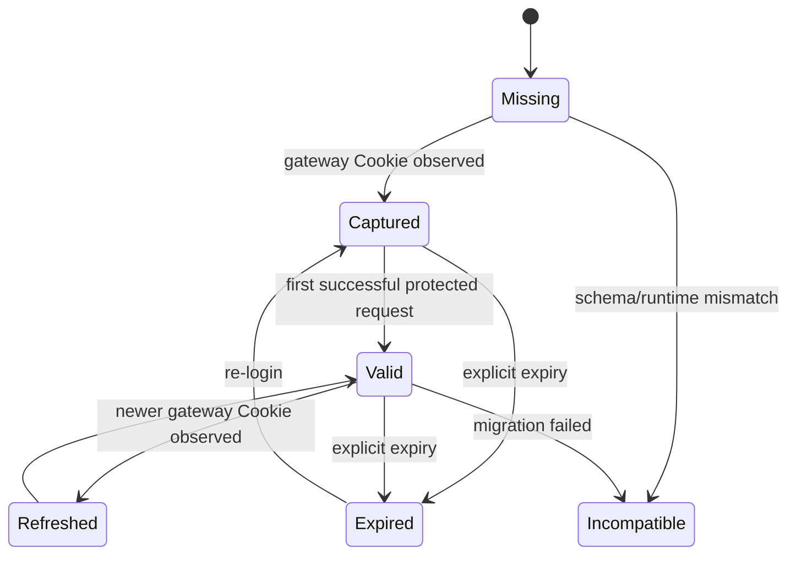

# Domain 文档：iOS Proxy Client Plugins

> Status: Approved  
> Spec ID: 003  
> Owner: cherrchen  
> Last Reviewed: 2026-09-24

## 1. 领域目标

本 Feature 的领域不是“VPN”，而是：在受支持的第三方 HTTP(S) 代理客户端运行时中，把真实校内 Web URL 映射为网瑞达 WebVPN URL，并在不接触用户密码的前提下复用官方 WebVPN 会话，使客户端继续保持真实主机名语义。

## 2. Bounded Context

### WebVPN Protocol Context

负责 WRD hostname 编解码、ordinary URL ↔ WebVPN URL、gateway-owned namespace、响应中的 WRD URL 反向转换；不负责 CAS 密码验证、iOS VPN、TLS CA、DNS 代理。

### Session Context

负责从 gateway 请求观察 WebVPN Cookie、Session 本地保存/读取/清理、会话状态、过期信号；不保存账号密码/CAS 认证 Cookie，不自动完成 MFA。

### Routing Context

负责 allowlist、gateway/authserver 排除、决定 request 是否进入 WRD 改写。

### Host Runtime Context

负责 Loon/Stash `$request/$response` 适配、persistent store、notification/tile、宿主配置与 MitM 声明。宿主 API 不得泄漏进 WebVPN Core。

## 3. Ubiquitous Language

| 术语 | 定义 |
| --- | --- |
| Ordinary URL | 用户看到的真实 URL，如 `https://jwxt.swufe.edu.cn/x` |
| WRD URL | 网瑞达 WebVPN URL，如 `https://webvpn.../https/<token>/x` |
| Gateway | `webvpn.swufe.edu.cn` |
| Auth Server | `authserver.swufe.edu.cn`，CAS/SSO/MFA 所在服务 |
| Allowlist Host | 允许被转为 WRD URL 的真实目标主机 |
| Excluded Host | 永不按普通目标再次 WRD 包装的主机 |
| Session | WebVPN gateway 所需 Cookie 集合及最小元数据 |
| Session Capture | 从 gateway 请求 Header 观察并保存 WebVPN Cookie |
| Reverse Rewrite | 把响应中的 WRD 语义恢复为 Ordinary URL 语义 |
| Gateway-owned Namespace | 属于 WebVPN 网关本身、不能套目标 host token 的路径 |
| Promotion | desktop 已有的 bootstrap HTML → gateway native URL 空间升级行为 |
| Host Adapter | Loon/Stash 平台 API 与 Core 的边界层 |
| MitM Scope | 允许宿主解密 HTTPS 的域名范围 |

## 4. 聚合与实体

### PluginRuntime Aggregate

根实体 `PluginRuntimeState`，包含 `settings`、`session`、`runtimeCompatibility`、`lastError`、`notificationThrottle`。它不描述 Loon/Stash 自己的 VPN 开关或节点。

### Session Aggregate

根实体 `SessionRecord`。不变式：gateway 必须匹配当前配置；Cookie 非空；Cookie 永不输出日志；Session 不含 username/password/MFA；schema version 可识别；清除 Session 幂等。

### RoutingPolicy Value Object

字段 `exactHosts`、`includeSwufeWildcard`、`excludedHosts`。host 标准化为小写；不允许 scheme/port/path；gateway/authserver 始终 excluded；excluded 优先于 exact/wildcard。

### WrdCodec Value Object

纯函数、无 IO。key/iv 各 16 bytes；host token 为 `iv_hex + ciphertext_hex`；path/query 不参与 hostname AES；encode→decode 可逆；与 Python 权威向量一致。

### RewriteContext

单次被改写请求的临时上下文：`originalUrl`、`originalHost`、`wrdUrl`、`wrdPrefix`、`gatewayOwned`、可选诊断 requestId；默认不得持久化。

## 5. 领域事件

| 事件 | 产生条件 | 消费者 |
| --- | --- | --- |
| `SessionCaptured` | gateway 请求出现有效 Cookie | Session Store、状态 UI |
| `SessionExpired` | 明确过期信号 | Session Store、通知/Tile |
| `RequestRewritten` | allowlist 请求成功变为 WRD | debug sink |
| `ResponseRewritten` | Location/Cookie/body 有反向改写 | debug sink |
| `CodecFailed` | WRD 编码失败 | error state、通知节流 |
| `RuntimeIncompatible` | Host API/version 不满足 | UI |
| `LoginRequested` | 用户点击登录入口 | Host Adapter |
| `BodyRewriteSkipped` | body 过大/类型不支持 | debug sink |

第一版均为进程内概念，不引入消息队列或云端事件总线。

## 6. 关键不变式

- **INV-IOS-001 Session Scope**：WebVPN Session 只能注入目标为 Gateway 的上游请求。
- **INV-IOS-002 No Credential Capture**：authserver 表单字段、用户名、密码、MFA code 不得进入 persistent store。
- **INV-IOS-003 No Double Wrapping**：Gateway/Auth Server 不按 ordinary target 二次包装。
- **INV-IOS-004 Allowlist First**：ordinary 请求必须先 routing，再 codec/Session。
- **INV-IOS-005 Codec Parity**：JS codec 必须由 Python/JS 共享向量证明一致。
- **INV-IOS-006 Reverse Rewrite Order**：`Location` → `Set-Cookie` → Body。
- **INV-IOS-007 Host API Isolation**：Core 不直接访问宿主 `$*` 全局变量。
- **INV-IOS-008 No Silent Login Claim**：只有捕获到可用 gateway Session 后才能进入 `READY`。

## 7. Session 状态机



UI 可以把 `Captured`/`Valid` 都显示为“已登录”；内部保留差异便于测试。

## 8. Request 决策模型

```text
request
  ├─ host == gateway → capture session if Cookie exists; pass through
  ├─ host == authserver → pass through; never persist auth credentials
  ├─ not allowlisted → pass through unchanged
  └─ allowlisted
       ├─ no valid session → login_required
       └─ session exists → encode URL + rewrite minimal headers + gateway Cookie
```

## 9. Response 决策模型

只有“由插件从 ordinary URL 改写出去”的请求才进入 reverse rewrite。直接访问 gateway 的登录流量不应被当作 ordinary 响应恢复。

顺序：gateway-owned/promotion → Location → Set-Cookie → body → session/expiry 状态 → 返回宿主。

## 10. 与 desktop Domain 的关系

Python `WrdCodec`、desktop allowlist/excluded host、response rewrite 顺序都是兼容基线。移动端特有部分只有 Host Runtime、安装、登录入口与宿主能力限制。若移动端必须改变协议语义，应先产生真机证据，再建立 ADR/兼容说明。
