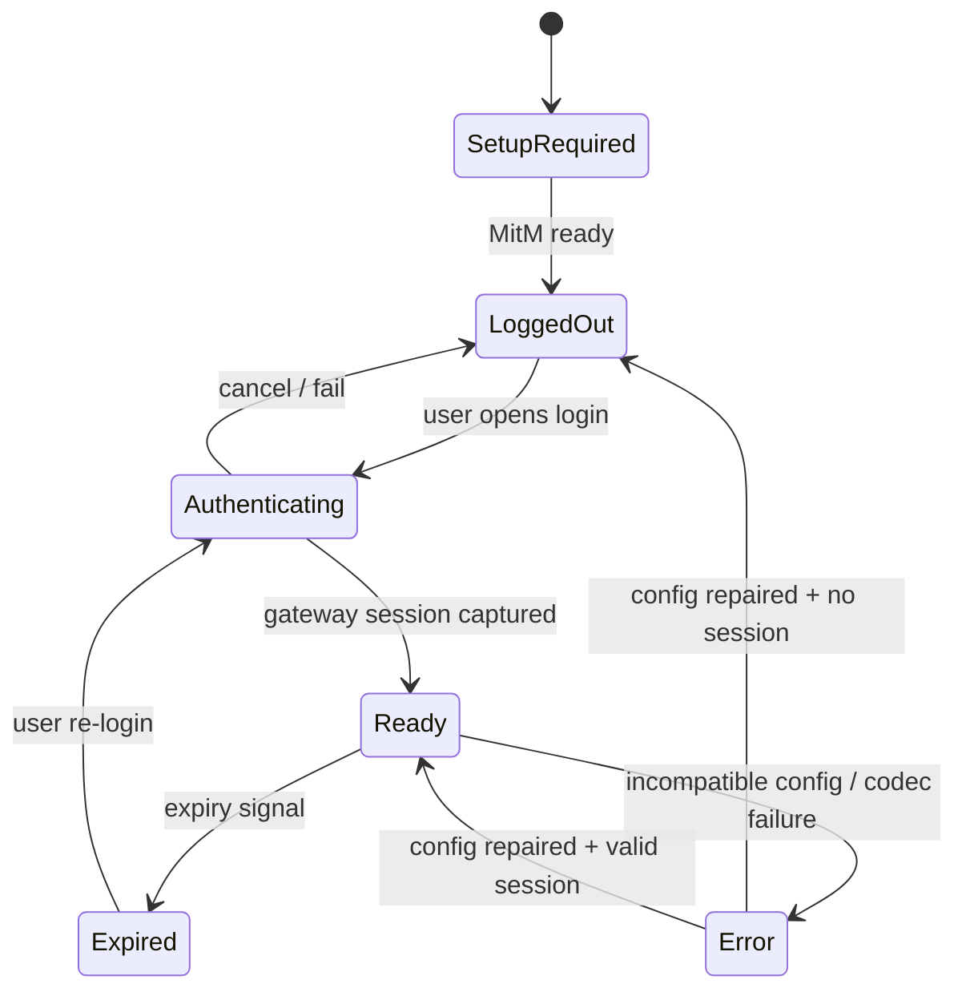

# 交互与 UI/UX 设计：Loon / Stash 插件

> Status: Approved  
> Spec ID: 003  
> Owner: cherrchen  
> Last Reviewed: 2026-09-25

## 1. 设计原则

移动端插件不是一个独立 App，因此 UI 必须遵循宿主客户端已有的交互能力，不伪造一个不存在的“SWUFE App”。

- **官方登录页面原样呈现**：WebVPN/CAS/MFA 页面不重做。
- **最少步骤**：安装 → 信任 MitM → 登录 → 访问。
- **状态比设置更重要**：用户首先需要知道“能不能用、为什么不能用”。
- **危险能力明确**：MitM 的含义必须在首次配置说明中出现。
- **宿主原生优先**：Stash 用 Tile；Loon 用 Plugin Argument/通知/插件信息。
- **降级透明**：若 URL 实际由外部 Safari 打开，不得仍称“应用内登录”。

## 2. 信息架构

用户需要理解的对象只有四个：插件是否启用、MitM 是否就绪、WebVPN 是否登录、哪些网站已启用。Settings V2 不提供通配 routing 开关；高级信息（WRD key/iv、debug）仍隐藏在高级配置中。

## 3. Stash 体验

### 3.1 首页 Tile

```text
┌──────────────────────────────┐
│ SWUFE WebVPN                 │
│ ● 已登录                     │
│ 教务：可用                   │
│ 点击：打开 WebVPN / 重新登录 │
└──────────────────────────────┘
```

| 状态 | Title | Content | 点击行为 |
| --- | --- | --- | --- |
| `SETUP_REQUIRED` | SWUFE WebVPN | 需要配置 MitM | 打开说明页或 Override homepage |
| `LOGGED_OUT` | SWUFE WebVPN | 未登录 · 点击登录 | `https://webvpn.swufe.edu.cn` |
| `READY` | SWUFE WebVPN | 已登录 · N 个网站 | `https://webvpn.swufe.edu.cn/__swufe_bridge__/` |
| `EXPIRED` | SWUFE WebVPN | 登录已失效 · 点击重新登录 | `https://webvpn.swufe.edu.cn` |
| `ERROR` | SWUFE WebVPN | 配置错误 · 查看日志 | 项目故障排查页 |

Tile 不展示 Cookie 名、Cookie 值、WRD token、账户信息。`READY` 只表示 Gateway Session 可供 Gateway 请求使用，不代表某个业务 App 的 CAS/SSO Session 已存在；在第三方 App 内再次出现 CAS 页面不单独证明 Gateway Session 失效。

Tile Script 官方接口允许 `$done({url: ...})` 更新 Tile URL，因此设计为根据登录状态切换 URL；此动态行为仍需目标 Stash 版本实机确认。若真机不稳定，退化为 Tile 固定进入 Settings，Settings 页面分别提供「登录 / 重新登录」按钮与站点管理入口。

### 3.2 首次安装

1. 用户点击 Stash 一键安装 Override。
2. Stash 展示 Override 的名称、描述、作者与 homepage。
3. 用户启用 Override。
4. README/描述提示用户配置并信任 Stash MitM CA。
5. 首页出现 Tile。
6. Tile 初始显示“未登录”。

### 3.3 登录

目标体验：

```text
Stash Tile
    ↓ tap
系统 Safari 中的 WebVPN 官方页面
    ↓
CAS / SSO
    ↓
MFA
    ↓
WebVPN
    ↓
Session Capture
    ↓
回到 Stash
    ↓
Tile = 已登录
```

2026-09-24 真机：Tile `url` 打开系统 Safari。Tile 与说明文案使用「打开网页登录」，不称应用内登录。Safari 里的 gateway 请求仍能进入 Stash 脚本。

### 3.4 Tile 刷新

Tile Script 读取 `SessionRecord`：无 Session → `LOGGED_OUT`；有 Session且未明确过期 → `READY`；被判定失效 → `EXPIRED`；schema/version 不兼容 → `ERROR`。

Tile 不主动以高频网络请求探测 Session，避免耗电。脚本每 30 秒只读本机会话：登录写入后回到首页即可显示「已登录」，不把 10 分钟间隔当作登录完成的刷新。

## 4. Loon 体验

### 4.1 Plugin 参数

本参数草图记录既有 Loon adapter 的独立配置面；Stash Settings V2 不暴露 wildcard routing，且首期 dynamic website management 由 §5 定义。Loon 未来若实现站点 UI，需单独应用 Routing Scope 的 exact-host 安全边界。

建议 `[Argument]`：

```text
启用插件               [ on ]
SWUFE 通配             [ off ]
调试日志               [ off ]
Gateway                 webvpn.swufe.edu.cn
```

普通用户无需修改 Gateway/key/iv；这些字段如果保留覆盖能力，应归入 Advanced。

### 4.2 登录入口

Loon 当前公开 Script API 提供通知 `openUrl`，但没有公开“脚本主动 present WebView”的 API。因此第一版 UX：

- 安装后/会话失效时发送一次低频通知；
- 通知内容：「SWUFE WebVPN 未登录，点击打开网页登录」；
- `openUrl = https://webvpn.swufe.edu.cn`；
- 插件 homepage 指向项目说明页，而不是伪登录页。

2026-09-24、Loon 3.5.1(998)：该通知打开系统 Safari。不把这条入口写成应用内网页。

### 4.3 通知节流

- `login-required` 事件默认 30 分钟内最多一次；
- 用户明确触发“重试登录”可绕过节流；
- Codec/配置错误同一错误码 10 分钟内最多一次；
- debug 开启时只写日志，不提升通知频率。

## 5. 本地 Settings WebUI（Stash）

Tile / Override 的入口指向 `https://webvpn.swufe.edu.cn/__swufe_bridge__/`。Safari 请求经 Stash HTTP Engine，Settings request handler 在 Session Capture、业务 Routing、Codec 和 rewrite 之前 short-circuit，并直接返回随插件 bundle 发布的 HTML。页面的 CSS/JS 内联或随 HTML 本地 bundle 返回；运行时不拉 CDN。

Settings 页采用原生 HTML/CSS/JS，iOS Settings 风格，无第三方 UI 框架，支持 Dark Mode 与 safe-area。最低交互：

```text
SWUFE WebVPN
状态：已登录 / 未登录
代理网站
  教务系统 · jwxt.swufe.edu.cn        [ON]
自定义网站
  foo.swufe.edu.cn                    [ON] 删除
+ 添加网站
保存
```

Journey：打开 Tile → 查看状态与站点 → toggle 或添加 hostname → Core 校验/规范化 → 保存 → 成功提示 → 下一个匹配请求即时采用新设置。

- 内置站点可启用/禁用，不可删除；第一版只预置可靠的 `jwxt.swufe.edu.cn`。
- 自定义站点可删除；输入框只接受 hostname，拒绝 URL、path、port、userinfo、wildcard、IP、localhost 和非 SWUFE host。文案示例：「请输入 `name.swufe.edu.cn` 格式的主机名」。大写与末尾点可规范化，小写输出。
- 未登录时允许管理站点；登录/重登录是独立按钮，打开官方 `https://webvpn.swufe.edu.cn`，不复用 Settings endpoint。
- 页面 GET 当前设置，POST 保存时显示 Saving / Saved / Save failed；非法域名 inline error，存储失败保留用户当前编辑值并提示重试。
- Page status 与站点数量只显示非敏感信息，不回显 Session 或认证数据。
- V1 migration 丢弃越界或非法 hostname 时显示摘要提醒「部分旧网站设置不再受支持，请检查当前列表」；不回显被丢弃的 hostname。
- API token 只存在本机页面内存和 Stash 本地临时存储；页面重载后重新获取。origin/token/schema 任一校验失败都显示通用保存错误。

### 5.1 Settings pseudo API Journey

```text
Safari
  → GET /__swufe_bridge__/
  ← synthetic HTML
  → GET /__swufe_bridge__/api/settings
  ← settings DTO + one-use token
  → POST /__swufe_bridge__/api/settings (JSON + token)
  ← { ok: true } 或稳定错误码
```

该 API 由 Stash request script 合成；不连接真实 WebVPN server、BoxJS、远程页面或 localhost。命名空间下未列明的方法/路径返回本地 404/405 合成响应，不继续上游。

## 6. MitM 引导

首次使用必须清晰说明：

> 为了把 `jwxt.swufe.edu.cn` 的 HTTPS 请求转换为学校 WebVPN 请求，Loon/Stash 需要在设备本地解密指定域名的 HTTPS。请仅在自己的设备上启用并信任代理客户端的 CA。插件不会上传 CA 私钥，也不会保存学校密码。

对动态新增 SWUFE 子域，Stash 预期配置可能需要 `*.swufe.edu.cn:443` MitM；HTTP 入口也需进入 HTTP Engine。用户必须被告知：列入范围的 HTTPS 会在本机 Stash HTTP Engine 解密，即使站点未选中；未选中站点仍原样 PASS，不会被送到 WebVPN、不会注入 WebVPN Cookie。被拦截不等于经 WebVPN。

wildcard MitM 及其界面合并结果还未在本项目当前 Stash Override 上实机验证，发布前必须验证；如宿主无法可靠支持，退化方案是仅列出静态声明的 hostname，新 Domain 更新 Override 后才能使用。

采用静态退化时，Settings 只能启用/禁用 Override 已声明的域；任意新增 hostname 暂不开放，页面说明「添加新网站需要更新插件配置」。此时不能宣称 AC-SETTINGS-004/008 的任意动态自定义域已实现，必须由产品在发布范围中接受并更新验收。

## 7. 登录状态机



`Authenticating` 不要求插件知道 CAS 页面内部步骤；它只描述“用户正在官方 Web 登录流程中”。

## 8. 请求失败时的用户文案

| 错误码 | 用户文案 | 操作 |
| --- | --- | --- |
| `MITM_NOT_READY` | HTTPS 解密未就绪，请检查代理客户端证书配置 | 打开配置说明 |
| `NOT_LOGGED_IN` | 尚未登录 SWUFE WebVPN | 登录 |
| `SESSION_EXPIRED` | WebVPN 登录已失效 | 重新登录 |
| `CODEC_FAILED` | WebVPN 地址转换失败，可能需要更新插件 | 查看更新/日志 |
| `PLUGIN_INCOMPATIBLE` | 当前 Loon/Stash 版本不受支持 | 更新客户端或回退插件 |
| `BODY_TOO_LARGE` | 页面部分链接无法自动改写 | 可继续使用；记录诊断 |
| `CONFLICTING_REWRITE` | 可能存在其它 Rewrite 冲突 | 暂停冲突插件后重试 |

不得出现“账号错误”“密码错误”等插件无法判断的结论。

## 9. 代理网站交互

第一版 Routing Scope 为 Settings 中选中的精确 hostname；没有用户可开关的全 SWUFE wildcard routing。Interception Scope 允许为该体验预先包含 wildcard，详见 [architecture.md](architecture.md) 与 [security 说明](prd.md#ios-req-014-拦截与路由边界)。Loon 的同等管理 UI 不属于本次首发要求，第二适配器可使用宿主 Argument 或后续独立设计。

## 10. 可访问性与视觉

- 不仅靠颜色表达状态，必须有文字；
- 图标使用宿主支持的原生资源；
- 错误信息一屏能看到下一步操作；
- 中文为主；配置字段名可保留英文技术词；
- 登录页面不注入视觉 CSS。

## 11. 成功体验指标

- 首次用户从插件导入到看到登录入口不超过 3 个宿主内主要操作；
- Session 失效后一个明确入口即可重新进入官方登录；
- 正常访问时用户不需要看到 WRD URL；
- 普通浏览过程中不产生重复登录通知；
- 禁用插件后不残留本项目自建网络配置。
