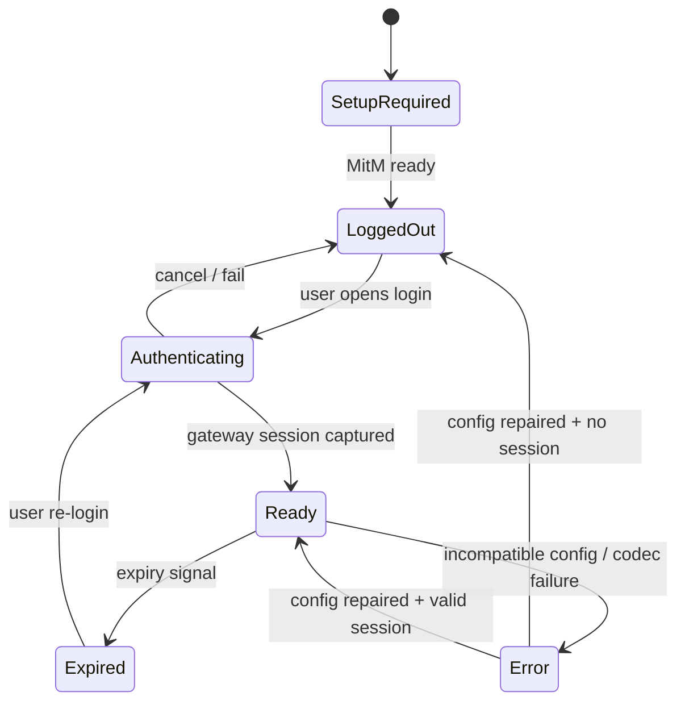

# 交互与 UI/UX 设计：Loon / Stash 插件

> Status: Draft  
> Spec ID: 003  
> Owner: cherrchen  
> Last Reviewed: 2026-09-24

## 1. 设计原则

移动端插件不是一个独立 App，因此 UI 必须遵循宿主客户端已有的交互能力，不伪造一个不存在的“SWUFE App”。

- **官方登录页面原样呈现**：WebVPN/CAS/MFA 页面不重做。
- **最少步骤**：安装 → 信任 MitM → 登录 → 访问。
- **状态比设置更重要**：用户首先需要知道“能不能用、为什么不能用”。
- **危险能力明确**：MitM 的含义必须在首次配置说明中出现。
- **宿主原生优先**：Stash 用 Tile；Loon 用 Plugin Argument/通知/插件信息。
- **降级透明**：若 URL 实际由外部 Safari 打开，不得仍称“应用内登录”。

## 2. 信息架构

用户需要理解的对象只有四个：插件是否启用、MitM 是否就绪、WebVPN 是否登录、allowlist 是否包含目标网站。高级信息（WRD key/iv、debug、通配 allowlist）隐藏在高级设置中。

## 3. Stash 体验

### 3.1 首页 Tile

```text
┌──────────────────────────────┐
│ SWUFE WebVPN                 │
│ ● 已登录                     │
│ 教务：可用                   │
│ 点击：打开 WebVPN / 重新登录 │
└──────────────────────────────┘
```

| 状态 | Title | Content | 点击行为 |
| --- | --- | --- | --- |
| `SETUP_REQUIRED` | SWUFE WebVPN | 需要配置 MitM | 打开说明页或 Override homepage |
| `LOGGED_OUT` | SWUFE WebVPN | 未登录 · 点击登录 | `https://webvpn.swufe.edu.cn` |
| `READY` | SWUFE WebVPN | 已登录 · 教务可用 | 打开 WebVPN 首页或状态说明 |
| `EXPIRED` | SWUFE WebVPN | 登录已失效 · 点击重新登录 | WebVPN 首页 |
| `ERROR` | SWUFE WebVPN | 配置错误 · 查看日志 | 项目故障排查页 |

Tile 不展示 Cookie 名、Cookie 值、WRD token、账户信息。

### 3.2 首次安装

1. 用户点击 Stash 一键安装 Override。
2. Stash 展示 Override 的名称、描述、作者与 homepage。
3. 用户启用 Override。
4. README/描述提示用户配置并信任 Stash MitM CA。
5. 首页出现 Tile。
6. Tile 初始显示“未登录”。

### 3.3 登录

目标体验：

```text
Stash Tile
    ↓ tap
WebVPN 官方页面（优先 App 内）
    ↓
CAS / SSO
    ↓
MFA
    ↓
WebVPN
    ↓
Session Capture
    ↓
关闭网页登录页
    ↓
Tile = 已登录
```

**P0 假设**：Tile `url`/Override `openUrl` 的实际呈现容器必须真机确认。若它打开系统 Safari，流程不变，但产品文案改为“打开网页登录”。

### 3.4 Tile 刷新

Tile Script 读取 `SessionRecord`：无 Session → `LOGGED_OUT`；有 Session且未明确过期 → `READY`；被判定失效 → `EXPIRED`；schema/version 不兼容 → `ERROR`。

Tile 不主动以高频网络请求探测 Session，避免耗电；可以在用户访问 allowlist 服务后更新状态。

## 4. Loon 体验

### 4.1 Plugin 参数

建议 `[Argument]`：

```text
启用插件               [ on ]
SWUFE 通配             [ off ]
调试日志               [ off ]
Gateway                 webvpn.swufe.edu.cn
```

普通用户无需修改 Gateway/key/iv；这些字段如果保留覆盖能力，应归入 Advanced。

### 4.2 登录入口

Loon 当前公开 Script API 提供通知 `openUrl`，但没有公开“脚本主动 present WebView”的 API。因此第一版 UX：

- 安装后/会话失效时发送一次低频通知；
- 通知内容：“SWUFE WebVPN 未登录，点击完成官方 CAS/MFA 登录”；
- `openUrl = https://webvpn.swufe.edu.cn`；
- 插件 homepage 指向项目说明页，而不是伪登录页。

若后续真机发现 Loon 插件页面存在可稳定承载 Web URL 的入口，可将它升级为主入口，但必须先验证。

### 4.3 通知节流

- `login-required` 事件默认 30 分钟内最多一次；
- 用户明确触发“重试登录”可绕过节流；
- Codec/配置错误同一错误码 10 分钟内最多一次；
- debug 开启时只写日志，不提升通知频率。

## 5. MitM 引导

首次使用必须清晰说明：

> 为了把 `jwxt.swufe.edu.cn` 的 HTTPS 请求转换为学校 WebVPN 请求，Loon/Stash 需要在设备本地解密指定域名的 HTTPS。请仅在自己的设备上启用并信任代理客户端的 CA。插件不会上传 CA 私钥，也不会保存学校密码。

不应声称“所有 HTTPS 都会被解密”；实际配置限制为 gateway 与明确 allowlist。

## 6. 登录状态机



`Authenticating` 不要求插件知道 CAS 页面内部步骤；它只描述“用户正在官方 Web 登录流程中”。

## 7. 请求失败时的用户文案

| 错误码 | 用户文案 | 操作 |
| --- | --- | --- |
| `MITM_NOT_READY` | HTTPS 解密未就绪，请检查代理客户端证书配置 | 打开配置说明 |
| `NOT_LOGGED_IN` | 尚未登录 SWUFE WebVPN | 登录 |
| `SESSION_EXPIRED` | WebVPN 登录已失效 | 重新登录 |
| `CODEC_FAILED` | WebVPN 地址转换失败，可能需要更新插件 | 查看更新/日志 |
| `PLUGIN_INCOMPATIBLE` | 当前 Loon/Stash 版本不受支持 | 更新客户端或回退插件 |
| `BODY_TOO_LARGE` | 页面部分链接无法自动改写 | 可继续使用；记录诊断 |
| `CONFLICTING_REWRITE` | 可能存在其它 Rewrite 冲突 | 暂停冲突插件后重试 |

不得出现“账号错误”“密码错误”等插件无法判断的结论。

## 8. Allowlist 交互

第一版默认精确项 `jwxt.swufe.edu.cn`；`*.swufe.edu.cn` 默认关闭。

- Loon：若 `[Argument]` 不适合动态列表，第一版通过发布配置/受控文本参数；复杂管理后置。
- Stash：Override YAML 中维护默认列表；动态编辑后置。

不为了做漂亮的 allowlist 编辑器而引入 Companion App。

## 9. 可访问性与视觉

- 不仅靠颜色表达状态，必须有文字；
- 图标使用宿主支持的原生资源；
- 错误信息一屏能看到下一步操作；
- 中文为主；配置字段名可保留英文技术词；
- 登录页面不注入视觉 CSS。

## 10. 成功体验指标

- 首次用户从插件导入到看到登录入口不超过 3 个宿主内主要操作；
- Session 失效后一个明确入口即可重新进入官方登录；
- 正常访问时用户不需要看到 WRD URL；
- 普通浏览过程中不产生重复登录通知；
- 禁用插件后不残留本项目自建网络配置。
