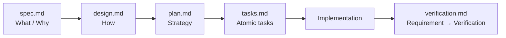

# Spec 模板（_template）

> 本目录是**模板**，不是某一个 Feature 的 Spec。
> 它不参与 `npm run spec:check` 校验，也不占用编号；`**/_template/**` 不强制中英双语。

## 使用方法

1. 复制整个目录：

   ```bash
   cp -r specs/_template specs/<id>-<feature-name>
   ```

2. 替换 `<feature-name>` 等占位符；
3. 按顺序填写：`spec.md` → `design.md` → `plan.md` → `tasks.md` → `verification.md`；
4. 只有当需要时才创建扩展文件（`research.md` / `data-model.md` / `api.md` / `ui-ux.md` / `migration.md`）；
5. 在 [roadmap.md](../../docs/planning/roadmap.md) 注册一行。

## 文件顺序与依赖



**顺序不可颠倒**：没有明确的 `spec.md` 不要写 `design.md`；没有 `design.md` 不要拆 `tasks.md`。

## 填写纪律

| 允许 | 禁止 |
| ---- | ---- |
| 未知信息标 `TBD` | 编造需求或设计 |
| 未决问题写入 `Open Questions` | 用猜测填补空白 |
| 引用 [docs/](../../docs/README.md) 中的长期事实 | 在 Spec 中重新定义长期事实 |
| 引用 ADR | 在 Spec 中记录难以逆转的决策（应建 ADR） |
| 记录本次交付的取舍 | 把聊天过程复制进来 |

## 完成前自检

- [ ] `spec.md` 的验收标准逐条可验证；
- [ ] `design.md` 说明了影响面、备选方案与风险；
- [ ] `plan.md` 包含回滚与文档更新计划；
- [ ] `tasks.md` 每个任务可独立验证，粒度足够小；
- [ ] `verification.md` 矩阵无 `Pending`（或已说明原因）；
- [ ] 长期文档与 ADR 已同步；
- [ ] Spec 状态已推进到 `Implemented` / `Verified`。

## 相关

- Spec 系统说明：[specs/README.md](../README.md)
- 完成标准：[verification-strategy.md](../../docs/verification/verification-strategy.md)
- Agent 工作流：[agent-workflow.md](../../docs/agent/agent-workflow.md)
